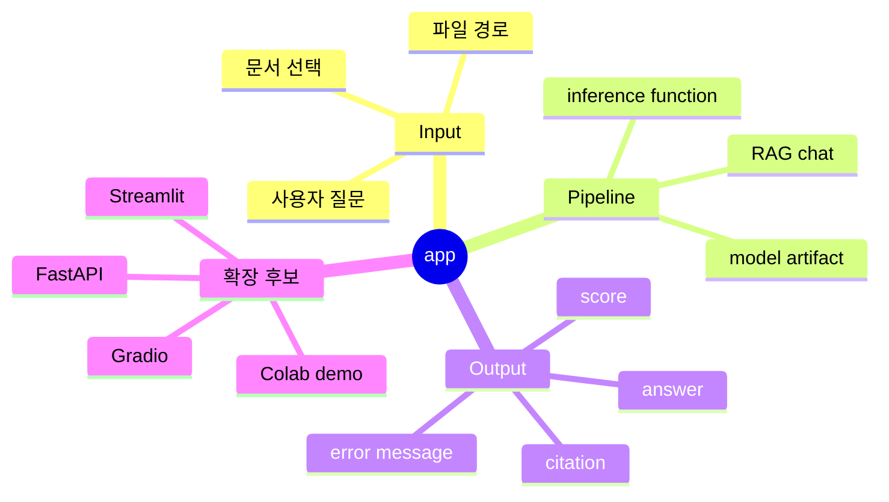

# 데모 앱

앱 영역은 사용자에게 보여줄 데모와 모델 추론 연결을 담당합니다.

## 앱 연결 마인드맵



초기 목표:

```text
input image path/file
-> src.predict 또는 공통 inference function 호출
-> predicted label과 필요한 설명 반환
```

FastAPI로 확장할 때는 모델 입출력 계약을 이 문서에 기록하고, 최종 artifact 경로를 실험 로그와 연결합니다.
