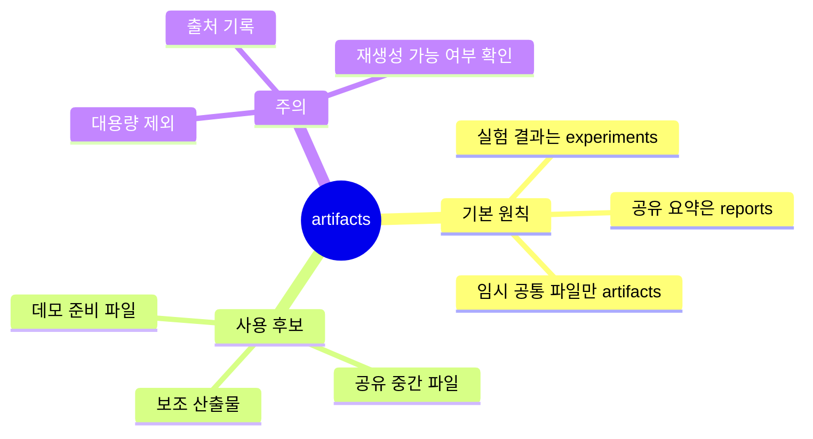

# Artifacts 디렉터리

`artifacts/`는 프로젝트 공통 산출물을 임시로 둘 수 있는 예비 공간입니다.

## Artifact 위치 마인드맵

일반적인 실험 결과는 `experiments/`에 저장합니다.
여기에는 실험에 직접 묶이지 않는 보조 산출물이나 공유용 중간 파일을 둘 수 있습니다.

큰 파일은 Git에 올리지 않는 것을 원칙으로 합니다.
