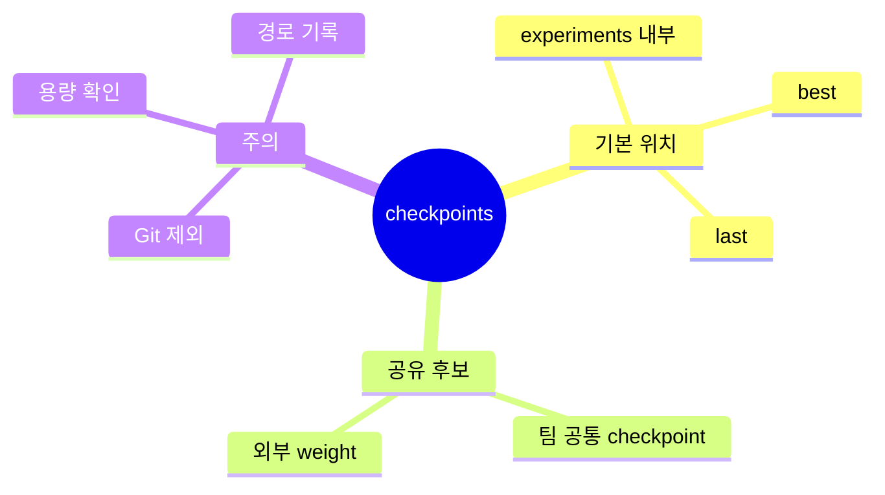

# Checkpoints 디렉터리

`checkpoints/`는 공유 checkpoint를 둘 수 있는 예비 공간입니다.

## Checkpoint 위치 마인드맵

일반 학습 checkpoint는 보통 `experiments/{experiment.name}/` 아래에 저장됩니다.
팀 공통으로 참조할 checkpoint가 있을 때만 이 폴더 사용을 고려합니다.

모델 weight 파일은 용량이 커질 수 있으므로 Git에 올리지 않습니다.
