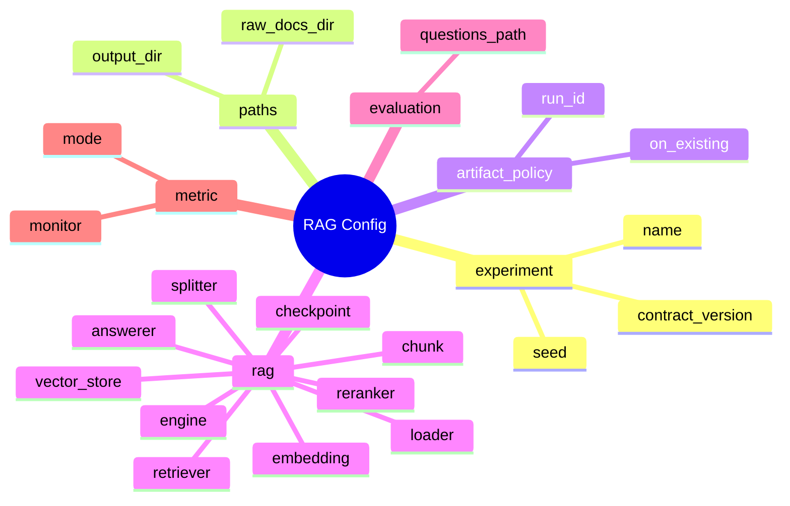

# Config 가이드

`configs/`는 RAG 실험 조건을 코드 밖에서 관리하는 곳입니다.

이 프로젝트의 기본 방향은 RFP/입찰 문서 RAG입니다. 따라서 처음 보는 팀원은 `configs/experiments/rag/` 아래의 config부터 봅니다. HuggingFace 분류/파인튜닝 config는 메인 흐름이 아니라 참고 예제입니다.

## 먼저 볼 RAG Config

| 목적 | config |
| --- | --- |
| semantic retriever 기본 실행 | `configs/experiments/rag/rag_semantic.yaml` |
| keyword retriever 비교 | `configs/experiments/rag/rag_keyword.yaml` |
| keyword + semantic hybrid 비교 | `configs/experiments/rag/rag_hybrid.yaml` |
| HuggingFace LLM answerer 예시 | `configs/examples/rag/rag_hf_llm_answerer.yaml` |
| LangChain + Ollama 실행 예시 | `configs/examples/rag/rag_langchain_ollama.yaml` |

## 디렉터리 구조

```text
configs/
|-- experiments/
|   `-- rag/                    # 실제 프로젝트 RAG 실험 config
|-- examples/
|   |-- rag/                    # RAG 구현체/외부 모델 참고 config
|   `-- classification/         # 분류/HF 파인튜닝 참고 예제
|-- smoke/                      # 예전 ML 파이프라인 검증용 작은 config
|-- preprocess/                 # 데이터 전처리 버전 config
`-- README.md
```

## RAG Config 한 장 보기



## 기본 실행

```bash
python scripts/check_rag_pipeline.py --config configs/experiments/rag/rag_semantic.yaml --project-root .
python scripts/run_rag_ingest.py --config configs/experiments/rag/rag_semantic.yaml --project-root .
python scripts/run_rag_retrieve.py --config configs/experiments/rag/rag_semantic.yaml --project-root . --question "예산은 얼마야?"
python scripts/run_rag_chat.py --config configs/experiments/rag/rag_semantic.yaml --project-root . --question "예산은 얼마야?"
python scripts/run_rag_chat.py --config configs/experiments/rag/rag_semantic.yaml --project-root . --evaluate
```

## 새 RAG 실험 만들기

기존 RAG config를 복사해서 시작합니다.

```text
configs/experiments/rag/rag_semantic.yaml
-> configs/experiments/rag/rag_top5_chunk800.yaml
```

최소한 아래 값은 바꿉니다.

```yaml
experiment:
  name: rag_top5_chunk800

paths:
  output_dir: experiments/rag_top5_chunk800

artifact_policy:
  run_id:
```

같은 `experiment.name`으로 여러 번 실행해야 한다면 `artifact_policy.run_id`를 지정합니다.

```yaml
artifact_policy:
  run_id: run_001
  on_existing: overwrite
```

## 자주 바꾸는 RAG 옵션

### 문서 로딩

```yaml
rag:
  loader:
    file_types: [txt, pdf, docx, hwpx, hwp]
```

실제 RFP 파일 형식에 맞춰 읽을 확장자를 정합니다.

### Chunking

```yaml
rag:
  chunk:
    size: 500
    overlap: 80
    unit: char
```

chunk가 너무 작으면 문맥이 사라지고, 너무 크면 검색 정확도가 떨어질 수 있습니다.

LangChain 엔진에서는 아래처럼 splitter 옵션을 사용합니다.

```yaml
rag:
  engine: langchain
  splitter:
    type: recursive_character
    chunk_size: 800
    chunk_overlap: 120
```

### Embedding

```yaml
rag:
  embedding:
    provider: local
    model_name: hashing-char-ngram-v1
    dimension: 64
    device: auto
    normalize: true
```

- `local`: 빠른 동작 확인용 hashing embedding
- `huggingface`: transformers 기반 mean pooling embedding

### Vector Store

```yaml
rag:
  vector_store:
    type: memory
    path:
    collection_name: rag_semantic
```

현재 기본 구현은 `memory`입니다. FAISS, Chroma, Elasticsearch는 config 계약을 먼저 잡아둔 확장 후보입니다.

### Retriever

```yaml
rag:
  retriever:
    method: semantic
    top_k: 3
    score_threshold: 0.0
```

- `method`: `keyword`, `semantic`, `hybrid`
- `top_k`: 답변 후보로 넘길 근거 chunk 개수
- `score_threshold`: 너무 낮은 점수의 검색 결과를 버리는 기준

### Reranker

```yaml
rag:
  reranker:
    enabled: false
    provider: huggingface
    model_name:
    top_k: 3
```

reranker는 검색 결과를 다시 정렬하는 단계입니다. 현재는 config와 validation 중심으로 준비되어 있고, 실제 프로젝트 요구에 맞춰 붙이는 후보입니다.

### Answerer

```yaml
rag:
  answerer:
    mode: extractive
    provider: local
    model_name:
    fallback_message: 문서에서 확인하지 못했습니다.
```

현재 기본 실행은 `extractive/local`입니다. 검색된 chunk에서 답변 문장을 뽑고 citation을 남깁니다.

HuggingFace LLM 답변 예시는 아래처럼 둡니다.

```yaml
rag:
  answerer:
    mode: llm
    provider: huggingface
    model_name: google/gemma-2-2b-it
    task: text-generation
    device: cpu
    temperature: 0.0
    max_new_tokens: 256
    require_citations: true
```

OpenAI/Ollama도 config 계약은 준비할 수 있지만, 실제 answerer 구현체를 붙인 뒤 사용하는 것이 안전합니다.

### Checkpoint / Resume

```yaml
rag:
  checkpoint:
    enabled: true
    resume: true
```

RAG ingest 산출물인 `parsed_documents.csv`, `chunks.csv`, `embeddings.jsonl`을 단계 단위로 재사용합니다. 문서 내부 offset 단위 resume은 아직 별도 구현 대상입니다.

## 평가 옵션

```yaml
evaluation:
  questions_path: data/rag_sample/eval_questions.csv

metric:
  monitor: retrieval_hit_rate
  mode: max
```

- `questions_path`: 평가 질문 CSV
- `monitor`: 대표 metric
- `mode`: `max` 또는 `min`

RAG에서는 accuracy보다 retrieval hit rate, citation correctness, 실패 질문 목록을 먼저 봅니다.

## 백업 옵션

```yaml
backup:
  enabled: true
  on_finish: true
  on_failure: true
  backup_dir: /content/drive/MyDrive/codeit_rag_project/backups/rag_semantic
  include_logs: true
  include_checkpoints: true
```

Colab에서 실행한다면 `backup_dir`를 Google Drive 경로로 둡니다.

## HuggingFace와 분류 Config의 위치

HuggingFace는 RAG에서도 사용할 수 있습니다. 다만 위치가 다릅니다.

| 목적 | config 위치 |
| --- | --- |
| RAG embedding | `rag.embedding.provider: huggingface` |
| RAG reranker | `rag.reranker.provider: huggingface` |
| RAG answerer | `rag.answerer.provider: huggingface` |
| 텍스트 분류 파인튜닝 | `configs/examples/classification/` |

분류/HuggingFace fine-tuning config는 RAG 프로젝트의 본 실험이 아니라 참고 예제입니다.

## 주의사항

- 새 실험은 `configs/experiments/rag/`에 둡니다.
- 참고 예제는 `configs/examples/`에 둡니다.
- config를 바꿨으면 산출물의 `config.yaml` snapshot도 확인합니다.
- 실제 데이터가 오면 loader, chunking, metric은 반드시 다시 점검합니다.
- RAG 결과는 답변만 보지 말고 retrieval 결과와 citation을 함께 봅니다.
