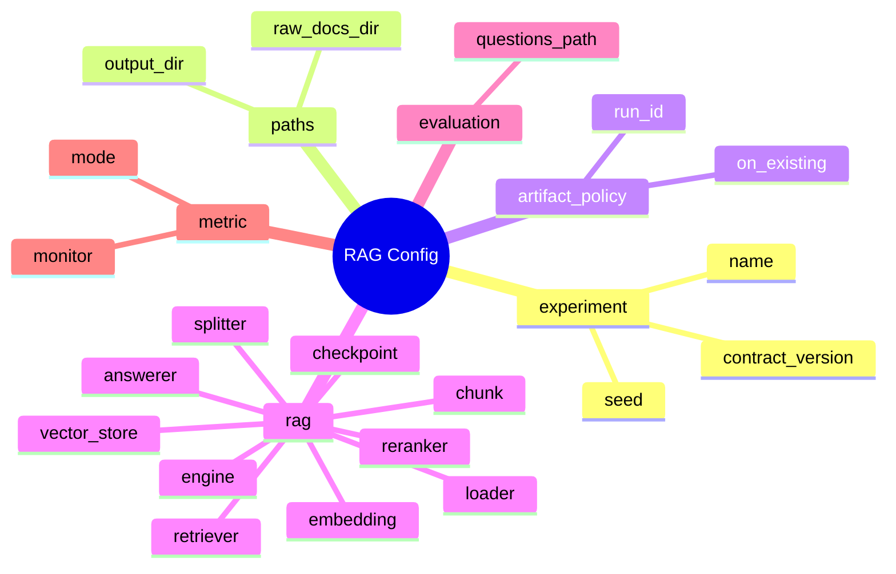

# Config 가이드

`configs/`는 RAG 실험 조건을 코드 밖에서 관리하는 곳입니다.

이 프로젝트의 기본 방향은 RFP/입찰 문서 RAG입니다. 따라서 처음 보는 팀원은 `configs/experiments/rag/` 아래의 config부터 봅니다. HuggingFace 분류/파인튜닝 config는 메인 흐름이 아니라 참고 예제입니다.

## 먼저 볼 RAG Config

| 목적 | config |
| --- | --- |
| LangChain 엔진 기본 실행 | `configs/experiments/rag/rag_langchain.yaml` |
| DOCX/HWPX 문서 형식 검증 | `configs/experiments/rag/rag_realistic_docs.yaml` |
| local semantic retriever 비교 | `configs/experiments/rag/rag_semantic.yaml` |
| keyword retriever 비교 | `configs/experiments/rag/rag_keyword.yaml` |
| keyword + semantic hybrid 비교 | `configs/experiments/rag/rag_hybrid.yaml` |
| HuggingFace LLM answerer 예시 | `configs/examples/rag/rag_hf_llm_answerer.yaml` |
| LangChain + Ollama 실행 예시 | `configs/examples/rag/rag_langchain_ollama.yaml` |
| LangChain + OpenAI 실행 예시 | `configs/examples/rag/rag_langchain_openai.yaml` |

## 자주 바꾸는 Config 옵션

이 항목들만 바꾸면 대부분의 RAG 실험이 가능합니다.

| Config 경로 | 설명 | 예시 값 | 바꾸면 달라지는 것 |
| --- | --- | --- | --- |
| `rag.splitter.chunk_size` | chunk 하나의 최대 글자 수 | 200 / 500 / 800 | 작게→정밀↑, 크게→문맥↑ |
| `rag.splitter.chunk_overlap` | 앞뒤 chunk 중복 글자 수 | 0 / 80 / 150 | 크게→정보잘림 방지, 중복↑ |
| `rag.retriever.method` | 검색 방식 | keyword / semantic / hybrid | keyword=단어매칭, semantic=의미매칭 |
| `rag.retriever.top_k` | 검색 결과 개수 | 3 / 5 / 10 | 늘리면→근거 풍부, 노이즈↑ |
| `rag.answerer.provider` | 답변 생성 방식 | local / ollama / openai | local=추출형(무료), ollama=로컬LLM, openai=API |
| `rag.embedding.provider` | 임베딩 방식 | local / huggingface / openai | local=해시기반(빠름), huggingface=정확 |
| `rag.reranker.enabled` | 검색 재정렬 사용 | true / false | true→Cross-Encoder로 정밀 재정렬 |
| `rag.answerer.memory.enabled` | 멀티턴 대화 | true / false | true→이전 대화 기억 |
| `evaluation.questions_path` | 평가 질문 CSV 경로 | data/rag_sample/eval_questions.csv | 다른 평가셋으로 변경 |

## Config 전체 스펙 (한 장 요약)

| 키 | 필수 | 기본값 | 설명 | 유효한 값 |
| --- | --- | --- | --- | --- |
| `experiment.name` | ✅ | - | 실험 폴더 이름으로 사용됨. 한글 가능 | 문자열 |
| `experiment.seed` | - | 42 | 결과 재현을 위한 시드값 | 정수 |
| `paths.raw_docs_dir` | ✅ | - | 읽을 RFP 문서가 있는 폴더 경로. VM: /shared/data/raw_docs, 로컬: data/rag_sample | 프로젝트 루트 기준 상대/절대 경로 |
| `paths.output_dir` | ✅ | - | 실험 결과 저장 폴더. 보통 experiments/실험이름 | 상대 경로 |
| `rag.engine` | - | langchain | 사용할 엔진. langchain=전체 기능, local=의존성 없는 경량 | `langchain`, `local` |
| `rag.loader.file_types` | - | [txt] | 읽을 파일 확장자 목록 | `txt`, `pdf`, `docx`, `hwpx`, `hwp` |
| `rag.splitter.type` | - | recursive_character | 문서 분할 알고리즘. 보통 recursive_character | `recursive_character` |
| `rag.splitter.chunk_size` | - | 500 | 한 chunk의 최대 글자 수. 200~1000 범위에서 실험 | 정수 |
| `rag.splitter.chunk_overlap` | - | 80 | 앞뒤 chunk가 겹치는 글자 수. 정보가 chunk 경계에 잘리는 걸 방지 | 정수 |
| `rag.embedding.provider` | - | local | 임베딩 생성 방식 | `local`, `huggingface`, `ollama`, `openai` |
| `rag.embedding.model_name` | provider=local 이외에 필요 | - | provider=huggingface면 HF 모델명, ollama면 ollama 모델명, openai면 openai 모델명 | 모델명 문자열 |
| `rag.vector_store.type` | - | memory | 벡터 저장소. memory=휘발성(빠름), chroma=영구 저장 | `memory`, `chroma` |
| `rag.retriever.method` | - | similarity (eng=langchain) / keyword (eng=local) | 검색 방식. 키워드 일치 / 의미 유사도 / 혼합 | `keyword`, `semantic`, `hybrid`, `similarity` |
| `rag.retriever.top_k` | - | 3 | 질문당 검색할 chunk 개수. 늘리면 근거가 풍부해지고 줄면 노이즈가 감소 | 정수 (1~20) |
| `rag.reranker.enabled` | - | false | 1차 검색 후 Cross-Encoder로 재정렬할지 여부. sentence-transformers 필요 | `true`, `false` |
| `rag.reranker.model_name` | enabled=true일 때 필요 | BAAI/bge-reranker-v2-m3 | 재정렬 모델 | HuggingFace 모델명 |
| `rag.reranker.top_k` | - | 3 | 재정렬 후 최종 반환할 결과 개수 | 정수 |
| `rag.answerer.provider` | - | local | 답변 생성 방식. local=추출형(의존성 없음), ollama=로컬LLM, openai=API | `local`, `ollama`, `openai`, `huggingface` |
| `rag.answerer.mode` | - | extractive | 답변 모드. extractive=청크에서 추출, llm=LLM 생성 | `extractive`, `llm` |
| `rag.answerer.model_name` | provider=local 이외에 필요 | - | provider=ollama면 ollama 모델명, openai면 gpt 모델명 | 모델명 문자열 |
| `rag.answerer.temperature` | - | 0.2 | LLM 응답 다양성. 0에 가까울수록 일관적, 1에 가까울수록 창의적 | 0.0 ~ 1.0 |
| `rag.answerer.fallback_message` | - | 문서에서 확인하지 못했습니다. | 검색 결과가 없거나 답변 불가할 때 출력할 메시지 | 문자열 |
| `rag.answerer.memory.enabled` | - | false | 멀티턴 대화 활성화. true면 thread_id로 대화 맥락 유지 | `true`, `false` |
| `rag.checkpoint.enabled` | - | true | ingest 중간 결과 저장. true면 실패 시 재개 가능 | `true`, `false` |
| `evaluation.questions_path` | ✅ | - | 평가 질문 CSV 파일 경로. BM 형식: question,expected_answer,expected_chunk_ids | 상대/절대 경로 |
| `metric.monitor` | - | retrieval_hit_rate | 실험 비교 시 기준이 되는 주요 지표 | `retrieval_hit_rate`, `answer_contains_expected_rate`, `citation_correct_rate`, `not_found_rate` |
| `artifact_policy.on_existing` | - | overwrite | 같은 실험 폴더가 이미 있을 때 처리. overwrite=덮어쓰기 | `overwrite` |

## 디렉터리 구조

```text
configs/
|-- experiments/
|   `-- rag/                    # 실제 프로젝트 RAG 실험 config
|-- examples/
|   |-- rag/                    # RAG 구현체/외부 모델 참고 config
|   `-- classification/         # 분류/HF 파인튜닝과 smoke/preprocess 참고 예제
`-- README.md
```

## RAG Config 한 장 보기



## 기본 실행

```bash
python scripts/check_rag_pipeline.py --config configs/experiments/rag/rag_langchain.yaml --project-root .
python scripts/run_rag_ingest.py --config configs/experiments/rag/rag_langchain.yaml --project-root .
python scripts/run_rag_retrieve.py --config configs/experiments/rag/rag_langchain.yaml --project-root . --question "예산은 얼마야?"
python scripts/run_rag_chat.py --config configs/experiments/rag/rag_langchain.yaml --project-root . --question "예산은 얼마야?"
python scripts/run_rag_chat.py --config configs/experiments/rag/rag_langchain.yaml --project-root . --evaluate
```

## 새 RAG 실험 만들기

기존 RAG config를 복사해서 시작합니다.

```text
configs/experiments/rag/rag_langchain.yaml
-> configs/experiments/rag/rag_top5_chunk800.yaml
```

최소한 아래 값은 바꿉니다.

```yaml
experiment:
  name: rag_top5_chunk800

paths:
  output_dir: experiments/rag_top5_chunk800

artifact_policy:
  run_id:
```

같은 `experiment.name`으로 여러 번 실행해야 한다면 `artifact_policy.run_id`를 지정합니다.

```yaml
artifact_policy:
  run_id: run_001
  on_existing: overwrite
```

## 자주 바꾸는 RAG 옵션

### 문서 로딩

```yaml
rag:
  loader:
    file_types: [txt, pdf, docx, hwpx, hwp]
```

실제 RFP 파일 형식에 맞춰 읽을 확장자를 정합니다.

### Chunking

```yaml
rag:
  chunk:
    size: 500
    overlap: 80
    unit: char
```

chunk가 너무 작으면 문맥이 사라지고, 너무 크면 검색 정확도가 떨어질 수 있습니다.

LangChain 엔진에서는 아래처럼 splitter 옵션을 사용합니다. 현재 기본 RAG 실험은 이 방식을 우선 사용합니다.

```yaml
rag:
  engine: langchain
  splitter:
    type: recursive_character
    chunk_size: 800
    chunk_overlap: 120
```

### Embedding

```yaml
rag:
  embedding:
    provider: local
    model_name: hashing-char-ngram-v1
    dimension: 64
    device: auto
    normalize: true
```

- `local`: 빠른 동작 확인용 hashing embedding
- `huggingface`: LangChain HuggingFaceEmbeddings 후보. 현재 기본 requirements에는 포함하지 않으므로 별도 호환 환경이 필요합니다.
- `ollama`, `openai`: LangChain 엔진에서 실제 운영 후보로 사용할 embedding provider

### Vector Store

```yaml
rag:
  vector_store:
    type: memory
    path:
    collection_name: rag_langchain
```

현재 기본 구현은 `memory`입니다. LangChain 엔진에서는 `chroma`도 사용할 수 있고, FAISS/Elasticsearch는 추후 확장 후보입니다.

### Retriever

```yaml
rag:
  retriever:
    method: semantic
    top_k: 3
    score_threshold: 0.0
```

- `method`: LangChain 엔진에서는 `similarity`, local fallback에서는 `keyword`, `semantic`, `hybrid`
- `top_k`: 답변 후보로 넘길 근거 chunk 개수
- `score_threshold`: 너무 낮은 점수의 검색 결과를 버리는 기준

### Reranker

```yaml
rag:
  reranker:
    enabled: false
    provider: huggingface
    model_name:
    top_k: 3
```

reranker는 검색 결과를 다시 정렬하는 단계입니다. 현재는 config와 validation 중심으로 준비되어 있고, 실제 프로젝트 요구에 맞춰 붙이는 후보입니다.

### Answerer

```yaml
rag:
  answerer:
    mode: extractive
    provider: local
    model_name:
    fallback_message: 문서에서 확인하지 못했습니다.
```

현재 기본 실행은 `extractive/local`입니다. 검색된 chunk에서 답변 문장을 뽑고 citation을 남깁니다.

HuggingFace LLM 답변 예시는 참고 config로만 둡니다. 현재 기본 LangChain runtime의 생성형 답변 후보는 Ollama/OpenAI입니다.

```yaml
rag:
  answerer:
    mode: llm
    provider: huggingface
    model_name: google/gemma-2-2b-it
    task: text-generation
    device: cpu
    temperature: 0.0
    max_new_tokens: 256
    require_citations: true
```

LangChain 엔진에서는 Ollama/OpenAI answerer를 사용할 수 있습니다. 팀원 PC에서 바로 검증할 때는 `local` answerer를 쓰고, 실제 생성형 답변 실험에서 Ollama/OpenAI로 바꿉니다.

```yaml
rag:
  answerer:
    mode: llm
    provider: openai
    model_name: gpt-4.1-mini
    api_key_env: OPENAI_API_KEY
    temperature: 0.2
    max_tokens: 512
    require_citations: true
```

OpenAI는 `api_key_env`에 적은 환경변수가 실제 실행 환경에 있을 때만 호출할 수 있습니다. 예시 config를 저장하거나 validation하는 것만으로는 비용이 발생하지 않습니다.

### Checkpoint / Resume

```yaml
rag:
  checkpoint:
    enabled: true
    resume: true
```

RAG ingest 산출물인 `parsed_documents.csv`, `chunks.csv`, `embeddings.jsonl`을 단계 단위로 재사용합니다. 문서 내부 offset 단위 resume은 아직 별도 구현 대상입니다.

## 평가 옵션

```yaml
evaluation:
  questions_path: data/rag_sample/eval_questions.csv

metric:
  monitor: retrieval_hit_rate
  mode: max
```

- `questions_path`: 평가 질문 CSV
- `monitor`: 대표 metric
- `mode`: `max` 또는 `min`

RAG에서는 accuracy보다 retrieval hit rate, citation correctness, 실패 질문 목록을 먼저 봅니다.

## 백업 옵션

```yaml
backup:
  enabled: true
  on_finish: true
  on_failure: true
  backup_dir: /content/drive/MyDrive/codeit_rag_project/backups/rag_langchain
  include_logs: true
  include_checkpoints: true
```

Colab에서 실행한다면 `backup_dir`를 Google Drive 경로로 둡니다.

## HuggingFace와 분류 Config의 위치

HuggingFace는 RAG에서도 사용할 수 있습니다. 다만 위치가 다릅니다.

| 목적 | config 위치 |
| --- | --- |
| RAG embedding | `rag.embedding.provider: huggingface` |
| RAG reranker | `rag.reranker.provider: huggingface` |
| RAG answerer | `rag.answerer.provider: huggingface` |
| 텍스트 분류 파인튜닝 | `configs/examples/classification/` |

주의: HuggingFace LangChain integration은 현재 기본 `requirements.txt`에 포함하지 않습니다. `transformers` 계열 버전과 충돌할 수 있으므로, HuggingFace provider를 실제로 쓸 때는 별도 branch/env에서 의존성 조합을 먼저 고정합니다.

분류/HuggingFace fine-tuning config는 RAG 프로젝트의 본 실험이 아니라 참고 예제입니다.

## 주의사항

- 새 실험은 `configs/experiments/rag/`에 둡니다.
- 참고 예제는 `configs/examples/`에 둡니다.
- config를 바꿨으면 산출물의 `config.yaml` snapshot도 확인합니다.
- 실제 데이터가 오면 loader, chunking, metric은 반드시 다시 점검합니다.
- RAG 결과는 답변만 보지 말고 retrieval 결과와 citation을 함께 봅니다.
