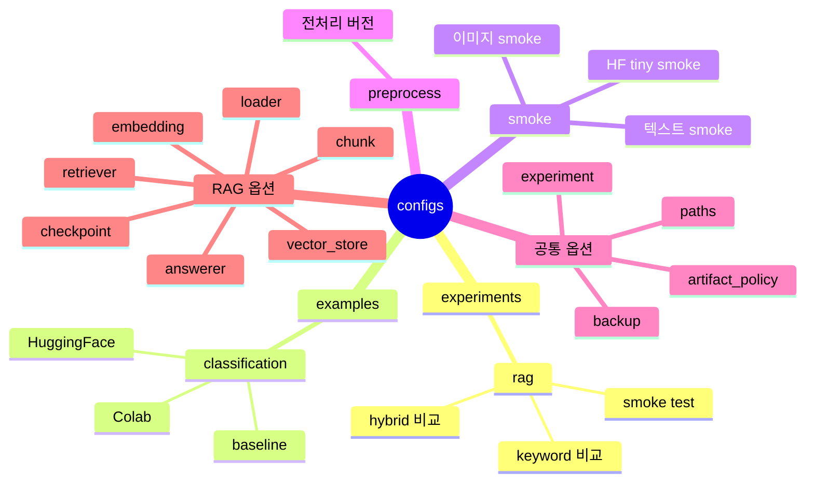

# Config 가이드

`configs/`는 실험 조건을 코드 밖에서 관리하는 곳입니다.

이 프로젝트에서는 가능하면 코드를 직접 고치기보다 config를 복사하고 수정해서 실험을 바꿉니다. 이렇게 하면 누가 어떤 조건으로 실험했는지 `experiments/` 산출물에 함께 남길 수 있습니다.

## Config 구조 마인드맵



## 텍스트 구조

```text
configs/
|-- experiments/
|   `-- rag/
|       |-- rag_smoke_test.yaml      # 기본 semantic RAG 실험
|       |-- rag_smoke_keyword.yaml   # keyword retriever 비교 실험
|       |-- rag_smoke_hybrid.yaml    # hybrid retriever 비교 실험
|       `-- README.md
|-- examples/
|   `-- classification/              # 분류/HuggingFace 참고 예제
|-- smoke/                           # 빠른 환경 검증용 config
|-- preprocess/                      # 전처리 버전 config
`-- README.md
```

## 기본 사용법

```bash
python scripts/run_rag_ingest.py --config configs/experiments/rag/rag_smoke_test.yaml --project-root .
python scripts/run_rag_chat.py --config configs/experiments/rag/rag_smoke_test.yaml --project-root . --evaluate
```

새 실험을 만들 때는 기존 config를 복사해서 시작합니다.

```text
configs/experiments/rag/rag_smoke_test.yaml
-> configs/experiments/rag/rag_hybrid_top5.yaml
```

복사한 뒤에는 최소한 `experiment.name` 또는 `artifact_policy.run_id`를 바꿔 결과가 덮어써지지 않게 합니다.

## 공통 옵션

### `experiment`

```yaml
experiment:
  name: rag_smoke_test
  author: team
  seed: 42
  contract_version: v1.0
```

- `name`: 실험 이름입니다. 기본 출력 폴더 이름으로도 사용됩니다.
- `author`: 실험 작성자 또는 팀 이름입니다.
- `seed`: 재현성을 위한 난수 고정값입니다.
- `contract_version`: 데이터 계약 버전입니다.

### `paths`

```yaml
paths:
  raw_docs_dir: data/rag_smoke
  output_dir: experiments/rag_smoke_test
```

- `raw_docs_dir`: RAG가 읽을 원본 문서 폴더입니다.
- `output_dir`: 실험 산출물을 저장할 폴더입니다.

상대 경로는 `--project-root` 기준으로 해석합니다.

### `artifact_policy`

```yaml
artifact_policy:
  run_id: run_001
  on_existing: overwrite
```

- `run_id`: 같은 실험 이름 아래에서 여러 실행 결과를 나눌 때 사용합니다.
- `on_existing`: 기존 산출물이 있을 때 동작입니다.
  - `overwrite`: 덮어씁니다.
  - `fail`: 이미 결과가 있으면 실패시킵니다.

반복 비교 실험을 할 때는 `run_id`를 적극적으로 사용하는 것이 안전합니다.

## RAG 옵션

RAG 프로젝트에서 가장 자주 바꾸는 영역입니다.

### `rag.loader`

```yaml
rag:
  loader:
    file_types: [txt, pdf, docx, hwpx, hwp]
```

읽을 문서 확장자를 지정합니다.

### `rag.chunk`

```yaml
rag:
  chunk:
    size: 500
    overlap: 80
    unit: char
```

- `size`: chunk 하나의 크기입니다.
- `overlap`: 앞뒤 chunk가 겹치는 길이입니다.
- `unit`: 현재는 `char` 기준입니다.

chunk가 너무 작으면 맥락이 사라지고, 너무 크면 검색 정확도가 떨어질 수 있습니다.

### `rag.embedding`

```yaml
rag:
  embedding:
    provider: local
    model_name: hashing-char-ngram-v1
    dimension: 64
```

지원 구현:

- `local`: 빠른 smoke test용 hashing embedding
- `huggingface`: transformers 기반 mean pooling embedding

### `rag.vector_store`

```yaml
rag:
  vector_store:
    type: memory
    path:
    collection_name: rag_smoke_test
```

현재 실제 구현은 `memory`입니다. FAISS, Chroma, Elasticsearch는 확장 계약만 열어둔 상태입니다.

### `rag.retriever`

```yaml
rag:
  retriever:
    method: hybrid
    top_k: 3
    score_threshold: 0.0
```

- `method`: `keyword`, `semantic`, `hybrid`
- `top_k`: 검색 결과 개수입니다.
- `score_threshold`: 너무 낮은 점수의 검색 결과를 버릴 때 사용합니다.

### `rag.answerer`

```yaml
rag:
  answerer:
    mode: extractive
    provider: local
    fallback_message: 문서에서 확인하지 못했습니다.
```

현재 실제 구현은 `extractive/local`입니다. 검색된 chunk에서 답변 문장을 추출합니다.

LLM 답변 생성은 아직 실제 호출 구현을 붙이지 않고, 나중에 adapter를 추가하기 쉽도록 config 계약만 열어둡니다.

```yaml
rag:
  answerer:
    mode: llm
    provider: openai
    model_name: gpt-4o-mini
    temperature: 0.2
    max_tokens: 512
    api_key_env: OPENAI_API_KEY
    require_citations: true
```

```yaml
rag:
  answerer:
    mode: llm
    provider: ollama
    model_name: llama3.1
    base_url: http://localhost:11434
    temperature: 0.2
    max_tokens: 512
    require_citations: true
```

- `mode`: `extractive`, `llm`
- `provider`: `local`, `openai`, `huggingface`, `ollama`
- `model_name`: LLM provider를 사용할 때 필요한 모델 이름입니다.
- `temperature`: 생성 답변의 변동성을 조정합니다.
- `max_tokens`: 생성 답변 최대 길이입니다. HuggingFace 계열에서는 `max_new_tokens`로도 쓸 수 있습니다.
- `api_key_env`: OpenAI API key를 읽을 환경 변수 이름입니다.
- `base_url`: Ollama 같은 로컬 LLM 서버 주소입니다.
- `require_citations`: 답변에 근거 chunk citation을 요구하는 정책입니다.

주의: `llm/openai`, `llm/huggingface`, `llm/ollama`는 validation 계약만 준비되어 있으며, smoke runtime의 실제 답변 생성 구현은 아직 없습니다.

### `rag.checkpoint`

```yaml
rag:
  checkpoint:
    enabled: true
    resume: true
```

RAG ingest 산출물인 `parsed_documents.csv`, `chunks.csv`, `embeddings.jsonl`을 재사용합니다.

현재는 stage 단위 resume입니다. 문서별 offset resume은 아직 구현하지 않았습니다.

## 분류 모델 참고 옵션

### `data`

```yaml
data:
  task: text_classification
  train_csv: train.csv
  valid_csv: valid.csv
  test_csv: test.csv
```

- `task`: 데이터 작업 종류입니다. 예: `text_classification`, `image_classification`
- `train_csv`, `valid_csv`, `test_csv`: split 파일 이름입니다.

### `model`

```yaml
model:
  name: keyword_text_classifier
```

또는 HuggingFace 모델을 사용할 수 있습니다.

```yaml
model:
  name: huggingface_sequence_classifier
  model_name: distilbert-base-multilingual-cased
```

- `name`: `src/models/registry.py`에서 찾는 모델 구현체 이름입니다.
- `model_name`: HuggingFace base model 이름입니다.

### `train`

```yaml
train:
  epochs: 3
  batch_size: 8
  learning_rate: 0.00005
```

학습 반복 수, batch size, learning rate 등을 조정합니다.

## 학습 제어 옵션

### `checkpoint`

```yaml
checkpoint:
  enabled: true
  dir: checkpoints
  save_best: true
  save_last: true
  save_every_epoch: false
  resume_from:
```

- `save_best`: 가장 좋은 metric의 checkpoint를 저장합니다.
- `save_last`: 마지막 checkpoint를 저장합니다.
- `resume_from`: 이어 학습할 checkpoint 경로입니다.

### `early_stopping`

```yaml
early_stopping:
  enabled: true
  patience: 3
  min_delta: 0.0
```

성능 개선이 일정 기간 없으면 학습을 멈춥니다.

### `scheduler`

```yaml
scheduler:
  enabled: true
  name: linear
  warmup_ratio: 0.1
  warmup_steps:
```

learning rate schedule을 조정합니다.

## 평가 옵션

```yaml
evaluation:
  questions_path: data/rag_smoke/eval_questions.csv

metric:
  monitor: retrieval_hit_rate
  mode: max
```

- `questions_path`: RAG 평가 질문 파일입니다.
- `monitor`: 대표 metric입니다.
- `mode`: `max` 또는 `min`입니다.

## 백업 옵션

```yaml
backup:
  enabled: true
  on_finish: true
  on_failure: true
  backup_dir: /content/drive/MyDrive/codeit_ml_project/backups/exp001
  include_logs: true
  include_checkpoints: true
```

Colab에서는 `backup_dir`를 Drive 경로로 두는 것을 권장합니다.

## 자주 쓰는 실험 변경 예시

### RAG 검색 방식만 바꾸기

```yaml
experiment:
  name: rag_smoke_hybrid

rag:
  retriever:
    method: hybrid
    top_k: 3
```

### 검색 결과 개수 늘리기

```yaml
artifact_policy:
  run_id: top_k_5

rag:
  retriever:
    top_k: 5
```

### chunk 크기 바꾸기

```yaml
artifact_policy:
  run_id: chunk_800_overlap_120

rag:
  chunk:
    size: 800
    overlap: 120
```

### Colab에서 결과를 Drive에 저장하기

```yaml
paths:
  output_dir: /content/drive/MyDrive/codeit_ml_project/experiments/exp002

backup:
  enabled: true
  backup_dir: /content/drive/MyDrive/codeit_ml_project/backups/exp002
```

## 주의사항

- config를 바꿨으면 실험 산출물의 `config.yaml`도 함께 확인합니다.
- 같은 `experiment.name`을 반복 실행하면 결과가 덮어써질 수 있습니다.
- 비교 실험은 `artifact_policy.run_id`로 구분하는 것이 안전합니다.
- 실제 데이터가 오면 loader, chunking, metric은 반드시 다시 점검합니다.
