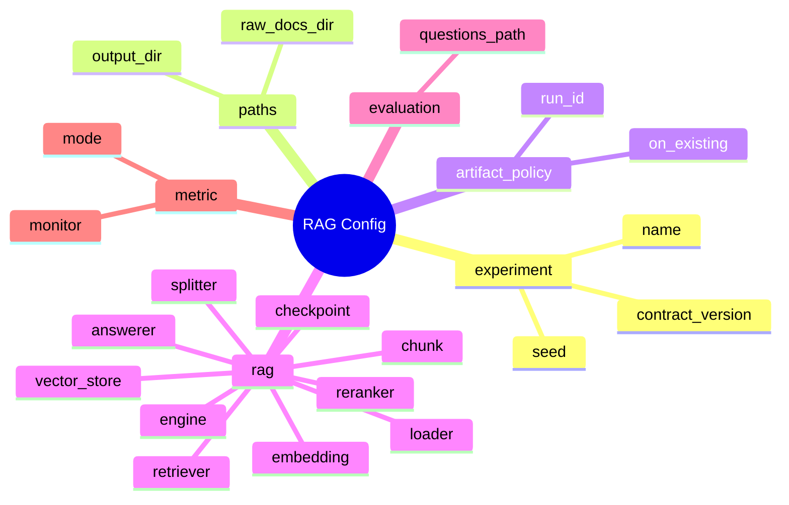

# Config 가이드

`configs/`는 RAG 실험 조건을 코드 밖에서 관리하는 곳입니다.

이 프로젝트의 기본 방향은 RFP/입찰 문서 RAG입니다. 따라서 처음 보는 팀원은 `configs/experiments/rag/` 아래의 config부터 봅니다. HuggingFace 분류/파인튜닝 config는 메인 흐름이 아니라 참고 예제입니다.

## 먼저 볼 RAG Config

| 목적 | config |
| --- | --- |
| LangChain 엔진 기본 실행 | `configs/experiments/rag/rag_langchain.yaml` |
| DOCX/HWPX 문서 형식 검증 | `configs/experiments/rag/rag_realistic_docs.yaml` |
| local semantic retriever 비교 | `configs/experiments/rag/rag_semantic.yaml` |
| keyword retriever 비교 | `configs/experiments/rag/rag_keyword.yaml` |
| keyword + semantic hybrid 비교 | `configs/experiments/rag/rag_hybrid.yaml` |
| HuggingFace LLM answerer 예시 | `configs/examples/rag/rag_hf_llm_answerer.yaml` |
| LangChain + Ollama 실행 예시 | `configs/examples/rag/rag_langchain_ollama.yaml` |
| LangChain + OpenAI 실행 예시 | `configs/examples/rag/rag_langchain_openai.yaml` |

## 디렉터리 구조

```text
configs/
|-- experiments/
|   `-- rag/                    # 실제 프로젝트 RAG 실험 config
|-- examples/
|   |-- rag/                    # RAG 구현체/외부 모델 참고 config
|   `-- classification/         # 분류/HF 파인튜닝과 smoke/preprocess 참고 예제
`-- README.md
```

## RAG Config 한 장 보기



## 자주 바꾸는 Config 옵션

| Config 경로 | 설명 | 예시 값 | 바꾸면 달라지는 것 |
| --- | --- | --- | --- |
| `rag.splitter.chunk_size` | chunk 하나의 최대 글자 수 | 200 / 500 / 800 | 작게→정밀↑, 크게→문맥↑ |
| `rag.splitter.chunk_overlap` | 앞뒤 chunk 중복 글자 수 | 0 / 80 / 150 | 크게→정보잘림 방지, 중복↑ |
| `rag.retriever.method` | 검색 방식 | keyword / semantic / hybrid | keyword=단어매칭, semantic=의미매칭 |
| `rag.retriever.top_k` | 검색 결과 개수 | 3 / 5 / 10 | 늘리면→근거 풍부, 노이즈↑ |
| `rag.answerer.provider` | 답변 생성 방식 | local / ollama / openai | local=추출형(무료), ollama=로컬LLM, openai=API |
| `rag.embedding.provider` | 임베딩 방식 | local / huggingface / openai | local=해시기반(빠름), huggingface=정확 |
| `rag.reranker.enabled` | 검색 재정렬 사용 | true / false | true→Cross-Encoder로 정밀 재정렬 |
| `rag.answerer.memory.enabled` | 멀티턴 대화 | true / false | true→이전 대화 기억 |
| `evaluation.questions_path` | 평가 질문 CSV 경로 | data/rag_sample/eval_questions.csv | 다른 평가셋으로 변경 |

## 새 RAG 실험 만들기

기존 RAG config를 복사해서 시작합니다.

```text
configs/experiments/rag/rag_langchain.yaml
-> configs/experiments/rag/rag_top5_chunk800.yaml
```

최소한 아래 값은 바꿉니다.

```yaml
experiment:
  name: rag_top5_chunk800

paths:
  output_dir: experiments/rag_top5_chunk800

artifact_policy:
  run_id:
```

---

# 전체 Config 옵션

## experiment

실험 식별 정보

```yaml
experiment:
  name: rag_langchain
  author: team
  seed: 42
  contract_version: rag-v0.2
```

| 파라미터 | 필수 | 기본값 | 설명 |
| --- | --- | --- | --- |
| `name` | ✅ | - | 실험 폴더 이름. `experiments/실험이름/`으로 결과 저장 |
| `author` | - | - | 작성자 이름. 추적용 |
| `seed` | - | 42 | Python/NumPy 랜덤 시드. 재현성 확보 |
| `contract_version` | - | - | 산출물 계약 버전. 현재 rag-v0.2 |

## paths

입출력 경로

```yaml
paths:
  raw_docs_dir: /shared/data/raw_docs   # VM 경로
  output_dir: experiments/rag_langchain
```

| 파라미터 | 필수 | 기본값 | 설명 |
| --- | --- | --- | --- |
| `raw_docs_dir` | ✅ | - | 읽을 RFP 문서 폴더. VM은 `/shared/data/raw_docs`, 로컬은 `data/rag_sample` |
| `output_dir` | ✅ | - | 실험 결과 저장 폴더. `experiments/실험이름` 권장 |

## rag.engine

사용할 RAG 엔진

```yaml
rag:
  engine: langchain
```

| 파라미터 | 기본값 | 설명 |
| --- | --- | --- |
| `engine` | langchain | `langchain`=전체 기능(Ollama/OpenAI/Chroma), `local`=의존성 없는 경량 모드 |

## rag.loader

문서 파일 읽기

```yaml
rag:
  loader:
    file_types: [txt, pdf, docx, hwpx, hwp, csv]
```

| 파라미터 | 기본값 | 설명 |
| --- | --- | --- |
| `file_types` | [txt] | 읽을 파일 확장자 목록. HWP/HWPX/PKG 포함 가능 |

## rag.splitter (Chunking)

문서를 검색 가능한 조각으로 분할

```yaml
rag:
  splitter:
    type: recursive_character
    chunk_size: 500
    chunk_overlap: 80
```

문서가 너무 길면 LLM이 한 번에 처리할 수 없고, 검색 정확도도 떨어집니다. splitter가 문서를 적당한 크기로 자릅니다.

| 파라미터 | 기본값 | 설명 |
| --- | --- | --- |
| `type` | recursive_character | 분할 알고리즘. `recursive_character`=문단→문장→단어 순으로 최적 크기 찾기, `langchain`/`recursive`도 동일하게 동작 | `recursive_character`, `langchain`, `recursive` |
| `chunk_size` | 500 | 한 chunk의 최대 글자 수. 작게=정밀도↑/문맥↓, 크게=반대 |
| `chunk_overlap` | 80 | 앞뒤 chunk가 겹치는 글자 수. 정보가 chunk 경계에서 잘리는 걸 방지 |

## rag.embedding

텍스트를 숫자 벡터로 변환 (검색용)

```yaml
rag:
  embedding:
    provider: local
    model_name: hashing-char-ngram-v1
    dimension: 64
```

| 파라미터 | 기본값 | 설명 |
| --- | --- | --- |
| `provider` | local | `local`=의존성 없는 해시 기반, `huggingface`=HuggingFace 모델, `ollama`=Ollama 모델, `openai`=OpenAI API |
| `model_name` | - | provider가 local이 아닐 때 필수. HF 모델명 또는 Ollama 모델명 |
| `dimension` | 64 | provider=local 일 때 벡터 차원 수 |

## rag.vector_store

임베딩 벡터를 저장하고 검색하는 저장소

```yaml
rag:
  vector_store:
    type: memory
    collection_name: rag_langchain
```

| 파라미터 | 기본값 | 설명 |
| --- | --- | --- |
| `type` | memory | `memory`=프로세스 메모리(빠름, 휘발성), `chroma`=파일 기반 영구 저장 |
| `collection_name` | - | 벡터 저장소 내 컬렉션 이름. 실험별로 구분 |

## rag.retriever

질문과 가장 유사한 chunk를 찾는 검색기

```yaml
rag:
  retriever:
    method: similarity
    top_k: 3
    score_threshold: 0.0
```

| 파라미터 | 기본값 | 설명 |
| --- | --- | --- |
| `method` | similarity (langchain) / keyword (local) | `keyword`=단어 일치 개수, `semantic`=벡터 유사도, `hybrid`=keyword+semantic 가중평균, `similarity`=LangChain 기본 검색 | `keyword`, `semantic`, `hybrid`, `similarity` |
| `top_k` | 3 | 검색 결과 개수. 늘리면 근거 풍부, 줄이면 노이즈 감소 |
| `score_threshold` | 0.0 | 이 점수 미만인 결과는 버림. 노이즈 필터링 |

## rag.reranker

1차 검색 결과를 정밀 재정렬

```yaml
rag:
  reranker:
    enabled: false
    provider: huggingface
    model_name: BAAI/bge-reranker-v2-m3
    top_k: 3
```

검색 결과 중에서 진짜 질문과 관련된 chunk만 상위로 올립니다. `sentence-transformers` 패키지 필요.

| 파라미터 | 기본값 | 설명 |
| --- | --- | --- |
| `enabled` | false | `true`로 바꾸면 1차 검색 결과를 Cross-Encoder로 재정렬 |
| `provider` | huggingface | 현재 huggingface만 지원 |
| `model_name` | BAAI/bge-reranker-v2-m3 | 재정렬에 사용할 HuggingFace 모델 |
| `top_k` | 3 | 재정렬 후 최종 반환할 결과 개수 |

## rag.answerer

검색된 chunk를 바탕으로 답변 생성

```yaml
rag:
  answerer:
    mode: extractive
    provider: local
    model_name:
    fallback_message: 문서에서 확인하지 못했습니다.
    temperature: 0.2
    memory:
      enabled: false
```

| 파라미터 | 기본값 | 설명 |
| --- | --- | --- |
| `mode` | extractive | `extractive`=chunk에서 문장 추출(무료), `llm`=LLM 생성 |
| `provider` | local | `local`=추출형, `ollama`=로컬 LLM, `openai`=OpenAI API |
| `model_name` | - | provider가 local이 아닐 때 필수. Ollama 모델명 또는 GPT 모델명 |
| `fallback_message` | 문서에서 확인하지 못했습니다. | 검색 결과 없을 때 출력할 메시지 |
| `temperature` | 0.2 | LLM 응답 다양성. 0=일관적, 1=창의적 |
| `memory.enabled` | false | `true`=멀티턴 대화. 이전 질문/답변을 기억하고 맥락 유지 |

## rag.checkpoint

ingest 중간 결과 저장 및 재개

```yaml
rag:
  checkpoint:
    enabled: true
    resume: true
```

| 파라미터 | 기본값 | 설명 |
| --- | --- | --- |
| `enabled` | true | 중간 산출물 저장 활성화 |
| `resume` | true | 이미 저장된 문서/chunk/embedding이 있으면 다시 계산하지 않고 재사용 |

## evaluation

평가 질문 CSV 기반 자동 평가

```yaml
evaluation:
  questions_path: data/rag_sample/eval_questions.csv
```

| 파라미터 | 필수 | 설명 |
| --- | --- | --- |
| `questions_path` | ✅ | 평가 질문 CSV 경로. 컬럼: question, expected_answer, expected_chunk_ids |

## metric

실험 비교 시 기준 지표

```yaml
metric:
  monitor: retrieval_hit_rate
  mode: max
```

| 파라미터 | 기본값 | 설명 |
| --- | --- | --- |
| `monitor` | retrieval_hit_rate | 기준 지표. `retrieval_hit_rate`, `answer_contains_expected_rate`, `citation_correct_rate`, `not_found_rate` |
| `mode` | max | `max`=높을수록 좋음, `min`=낮을수록 좋음 (not_found_rate는 min 권장) |

## artifact_policy

실험 산출물 저장 정책

```yaml
artifact_policy:
  run_id:
  on_existing: overwrite
```

| 파라미터 | 기본값 | 설명 |
| --- | --- | --- |
| `run_id` | - | 같은 실험을 여러 번 돌릴 때 구분자 (예: run_001) |
| `on_existing` | overwrite | 이미 결과 폴더가 있을 때 `overwrite`=덮어쓰기, `fail`=에러 발생 |

## 평가 옵션

```yaml
evaluation:
  questions_path: data/rag_sample/eval_questions.csv

metric:
  monitor: retrieval_hit_rate
  mode: max
```

- `questions_path`: 평가 질문 CSV
- `monitor`: 대표 metric
- `mode`: `max` 또는 `min`

RAG에서는 accuracy보다 retrieval hit rate, citation correctness, 실패 질문 목록을 먼저 봅니다.

## 백업 옵션

```yaml
backup:
  enabled: true
  on_finish: true
  on_failure: true
  backup_dir: /content/drive/MyDrive/codeit_rag_project/backups/rag_langchain
  include_logs: true
  include_checkpoints: true
```

백업은 `scripts/sync_data.sh push` 또는 crontab으로 자동 실행합니다.

## HuggingFace와 분류 Config의 위치

HuggingFace는 RAG에서도 사용할 수 있습니다. 다만 위치가 다릅니다.

| 목적 | config 위치 |
| --- | --- |
| RAG embedding | `rag.embedding.provider: huggingface` |
| RAG reranker | `rag.reranker.provider: huggingface` |
| RAG answerer | `rag.answerer.provider: huggingface` |
| 텍스트 분류 파인튜닝 | `configs/examples/classification/` |

주의: HuggingFace LangChain integration은 현재 기본 `requirements.txt`에 포함하지 않습니다. `transformers` 계열 버전과 충돌할 수 있으므로, HuggingFace provider를 실제로 쓸 때는 별도 branch/env에서 의존성 조합을 먼저 고정합니다.

분류/HuggingFace fine-tuning config는 RAG 프로젝트의 본 실험이 아니라 참고 예제입니다.

## 주의사항

- 새 실험은 `configs/experiments/rag/`에 둡니다.
- 참고 예제는 `configs/examples/`에 둡니다.
- config를 바꿨으면 산출물의 `config.yaml` snapshot도 확인합니다.
- 실제 데이터가 오면 loader, chunking, metric은 반드시 다시 점검합니다.
- RAG 결과는 답변만 보지 말고 retrieval 결과와 citation을 함께 봅니다.
