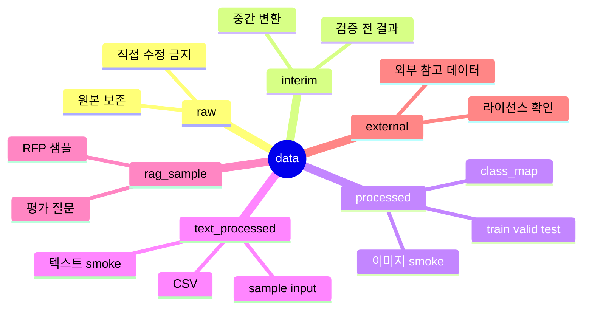

# Data 디렉터리

`data/`는 원본 데이터와 처리된 데이터를 나누어 보관하는 곳입니다.

## Data 구조 마인드맵



## 구조

```text
data/
|-- raw/             # 원본 데이터
|-- interim/         # 중간 처리 데이터
|-- processed/       # 이미지 동작 확인용 처리 데이터
|-- text_processed/  # 텍스트 동작 확인용 처리 데이터
|-- rag_sample/      # RAG config 실행용 샘플 문서와 평가 질문
`-- external/        # 외부에서 받은 참고 데이터
```

## 운영 원칙

- `raw/`에는 원본 데이터를 보존합니다.
- `processed/`와 `text_processed/`에는 모델이 바로 읽을 수 있는 최소 전처리 결과를 둡니다.
- 실제 프로젝트 데이터는 용량과 라이선스를 확인한 뒤 Git에 올릴지 결정합니다.
- 큰 데이터는 Drive, Kaggle, HuggingFace Dataset, 별도 스토리지 사용을 우선 고려합니다.

## 현재 포함된 샘플

- `processed/`: 이미지 분류 동작 확인용 작은 PPM 이미지
- `text_processed/`: 텍스트 분류 동작 확인용 CSV와 샘플 txt
- `rag_sample/`: RAG 문서 검색 동작 확인용 RFP 샘플과 평가 질문
