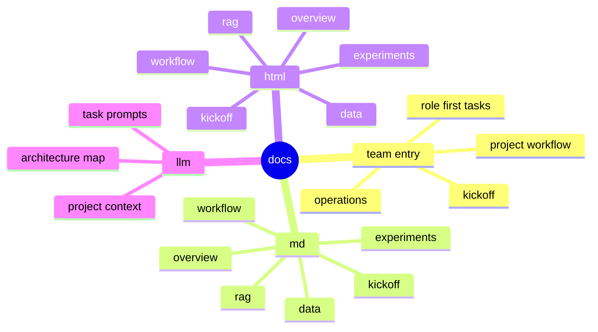

# Docs

이 디렉터리는 팀 공유 문서와 세부 참고 문서를 함께 관리하는 곳입니다.

처음 보는 팀원에게는 모든 문서를 한 번에 읽히지 않습니다. 먼저 [TEAM_DOCS_ENTRY.md](TEAM_DOCS_ENTRY.md)만 열고, 필요한 문서로 이동하게 안내합니다.

## 팀원에게 먼저 보여줄 문서

| 구분 | 문서 | 목적 |
| --- | --- | --- |
| 문서 입구 | [TEAM_DOCS_ENTRY.md](TEAM_DOCS_ENTRY.md) | 처음 읽을 문서와 읽는 순서 |
| 킥오프 설명 | [TEAM_BRIEFING_FLOW.md](md/kickoff/TEAM_BRIEFING_FLOW.md) | 프로젝트가 무엇인지, 역할을 어떻게 나눌지 설명 |
| 운영 방식 | [GITHUB_OPERATIONS.md](md/workflow/GITHUB_OPERATIONS.md) | Issue, PR, Daily Report, Kanban 운영 방식 |
| 작업 흐름 | [PROJECT_WORKFLOW_GUIDE.md](md/workflow/PROJECT_WORKFLOW_GUIDE.md) | Data 준비부터 발표까지 역할 간 산출물 기준선 |
| 역할별 초기 작업 | [ROLE_FOCUS_GUIDE.md](md/workflow/ROLE_FOCUS_GUIDE.md) | 각 역할이 처음 무엇을 하면 되는지 |

## 문서 지도



## 디렉터리 설명

```text
docs/
|-- TEAM_DOCS_ENTRY.md  팀원이 처음 볼 문서 입구
|-- md/                 수정과 관리가 쉬운 Markdown 원본
|-- html/               설명과 공유에 쓰기 좋은 HTML 문서
`-- llm/                LLM에게 작업을 맡길 때 읽히는 컨텍스트 문서
```

## 세부 참고 문서

| 필요 상황 | 문서 |
| --- | --- |
| 전체 파이프라인 구조 확인 | [PIPELINE_OVERVIEW.md](md/overview/PIPELINE_OVERVIEW.md) |
| 모듈 관계 확인 | [MODULE_ARCHITECTURE.md](md/overview/MODULE_ARCHITECTURE.md) |
| RAG 입출력 계약 확인 | [RAG_PIPELINE_SPEC.md](md/rag/RAG_PIPELINE_SPEC.md) |
| 데이터 제공 형식 확인 | [DATA_CONTRACT.md](md/data/DATA_CONTRACT.md) |
| 실험 실행 방법 확인 | [EXPERIMENT_GUIDE.md](md/experiments/EXPERIMENT_GUIDE.md) |
| 노트북 사용 방법 확인 | [NOTEBOOK_USAGE_CHECKLIST.md](md/experiments/NOTEBOOK_USAGE_CHECKLIST.md) |
| LLM 작업 문맥 확인 | [docs/llm README](llm/README.md) |

## HTML 문서

HTML은 Markdown과 1:1로 반드시 대응하지 않습니다. 발표, 설명, 시각화에 직접 도움이 되는 문서만 따로 관리합니다.

- [pipeline_explainer.html](html/overview/pipeline_explainer.html): 비전공자에게 설명하기 쉬운 파이프라인 소개
- [module_architecture.html](html/overview/module_architecture.html): 모듈 관계와 RAG 구조 다이어그램
- [kickoff.html](html/kickoff/kickoff.html): 킥오프 공유용 HTML 문서

## 관리 원칙

- 팀원에게는 `TEAM_DOCS_ENTRY.md`에서 시작하게 안내합니다.
- 세부 구현 문서는 필요한 역할만 찾아보게 합니다.
- 문서를 옮기거나 이름을 바꾸면 관련 README 링크와 테스트 기준도 함께 확인합니다.
- 코드 구조, 실행 방식, 산출물 위치가 바뀌면 `docs/llm/` 문서도 함께 확인합니다.
