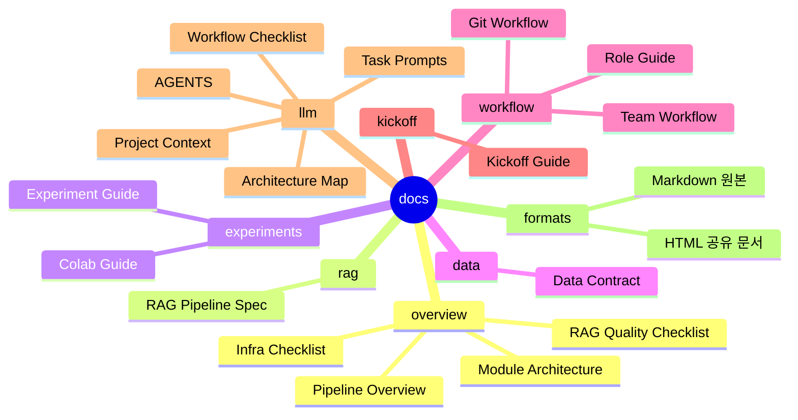

# Docs Mind Map

`docs/`는 프로젝트를 설명하고 팀원이 같은 방식으로 일하기 위한 문서 허브입니다.

처음 보는 사람은 **Overview -> RAG -> Experiments -> Workflow -> Kickoff** 순서로 보면 됩니다. HTML 문서는 공유와 설명용, Markdown 문서는 수정과 리뷰용 원본입니다. LLM 기반 작업자는 `llm/` 문서를 먼저 읽으면 됩니다.

## 문서 지도



```text
docs/
|-- overview/        프로젝트 큰 그림
|   |-- Pipeline Overview
|   |-- Module Architecture
|   `-- Infra Checklist
|-- rag/             RAG 입력/출력 계약
|   `-- RAG Pipeline Spec
|-- experiments/     실험 실행과 Colab 운영
|   |-- Experiment Guide
|   `-- Colab Guide
|-- data/            데이터 계약
|   `-- Data Contract
|-- workflow/        협업 규칙
|   |-- Git Workflow
|   |-- Role Guide
|   `-- Team Workflow
|-- kickoff/         팀 설명 자료
|   `-- Kickoff Guide
`-- llm/             LLM 작업자용 압축 문맥
    |-- PROJECT_CONTEXT
    |-- ARCHITECTURE_MAP
    |-- WORKFLOW_CHECKLIST
    `-- TASK_PROMPTS
```

## 빠른 링크

| 목적 | Markdown 원본 | HTML 문서 |
| --- | --- | --- |
| 프로젝트 전체 흐름 보기 | [PIPELINE_OVERVIEW.md](md/overview/PIPELINE_OVERVIEW.md) | [PIPELINE_OVERVIEW.html](html/overview/PIPELINE_OVERVIEW.html) |
| 모듈 관계와 구조 보기 | [MODULE_ARCHITECTURE.md](md/overview/MODULE_ARCHITECTURE.md) | [module_architecture.html](html/overview/module_architecture.html) |
| 구현된 인프라 확인 | [PIPELINE_INFRA_CHECKLIST.md](md/overview/PIPELINE_INFRA_CHECKLIST.md) | [PIPELINE_INFRA_CHECKLIST.html](html/overview/PIPELINE_INFRA_CHECKLIST.html) |
| RAG 품질 게이트 확인 | [RAG_QUALITY_CHECKLIST.md](md/overview/RAG_QUALITY_CHECKLIST.md) | 별도 HTML 없음 |
| RAG 계약 확인 | [RAG_PIPELINE_SPEC.md](md/rag/RAG_PIPELINE_SPEC.md) | [RAG_PIPELINE_SPEC.html](html/rag/RAG_PIPELINE_SPEC.html) |
| 데이터 형식 확인 | [DATA_CONTRACT.md](md/data/DATA_CONTRACT.md) | [DATA_CONTRACT.html](html/data/DATA_CONTRACT.html) |
| 실험 실행 방법 확인 | [EXPERIMENT_GUIDE.md](md/experiments/EXPERIMENT_GUIDE.md) | [EXPERIMENT_GUIDE.html](html/experiments/EXPERIMENT_GUIDE.html) |
| Colab/Drive 실행 확인 | [COLAB_GUIDE.md](md/experiments/COLAB_GUIDE.md) | [COLAB_GUIDE.html](html/experiments/COLAB_GUIDE.html) |
| Git/PR 규칙 확인 | [GIT_WORKFLOW.md](md/workflow/GIT_WORKFLOW.md) | [GIT_WORKFLOW.html](html/workflow/GIT_WORKFLOW.html) |
| 역할 분배 확인 | [ROLE_GUIDE.md](md/workflow/ROLE_GUIDE.md) | [ROLE_GUIDE.html](html/workflow/ROLE_GUIDE.html) |
| 팀 운영 규칙 확인 | [TEAM_WORKFLOW.md](md/workflow/TEAM_WORKFLOW.md) | [TEAM_WORKFLOW.html](html/workflow/TEAM_WORKFLOW.html) |
| 킥오프 설명 원본 확인 | [KICKOFF_GUIDE.md](md/kickoff/KICKOFF_GUIDE.md) | [KICKOFF_GUIDE.html](html/kickoff/KICKOFF_GUIDE.html) |
| LLM 작업 문맥 확인 | [docs/llm README](llm/README.md) | 별도 HTML 없음 |

## 설명용 HTML

아래 문서는 Markdown 변환본이 아니라, 팀원 설명을 위해 직접 구성한 HTML입니다.

- [pipeline_explainer.html](html/overview/pipeline_explainer.html): 비전공자도 이해하기 쉬운 파이프라인 설명
- [module_architecture.html](html/overview/module_architecture.html): 모듈 관계와 RAG 구조 다이어그램
- [kickoff.html](html/kickoff/kickoff.html): 킥오프 발표/공유용 문서

## 읽는 순서

1. 프로젝트의 전체 구조를 파악하려면 [Pipeline Overview](html/overview/PIPELINE_OVERVIEW.html)를 봅니다.
2. 코드와 폴더 관계를 설명해야 하면 [Module Architecture](html/overview/module_architecture.html)를 봅니다.
3. RAG 실험을 설계할 때는 [RAG Pipeline Spec](html/rag/RAG_PIPELINE_SPEC.html)을 봅니다.
4. 실제 실행 전에는 [Experiment Guide](html/experiments/EXPERIMENT_GUIDE.html)와 [Config Guide](../configs/README.md)를 봅니다.
5. 팀원에게 처음 설명할 때는 [Pipeline Explainer](html/overview/pipeline_explainer.html)와 [Kickoff](html/kickoff/kickoff.html)를 사용합니다.
6. LLM에게 작업을 맡길 때는 [LLM 작업 문서](llm/README.md)와 루트 [AGENTS.md](../AGENTS.md)를 함께 읽힙니다.

## 관리 원칙

- 문서를 수정할 때는 가능하면 `docs/md/`의 Markdown 원본을 먼저 수정합니다.
- 팀 공유용 HTML 문서가 따로 있는 주제라면 `docs/html/`도 함께 확인합니다.
- LLM 작업 규칙이나 프로젝트 구조가 바뀌면 `docs/llm/`과 루트 `AGENTS.md`도 확인합니다.
- 파일을 이동하면 README 링크와 테스트 기대 경로를 함께 수정합니다.
