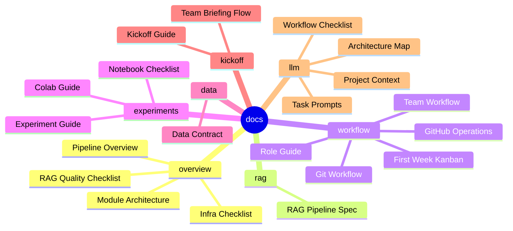

# Docs Mind Map

`docs/`는 프로젝트를 설명하고 팀원이 같은 방식으로 일하기 위한 문서 허브입니다.

처음 보는 사람은 **Overview -> RAG -> Workflow -> Experiments -> Kickoff** 순서로 보면 됩니다. HTML 문서는 공유와 설명용이고, Markdown 문서는 수정과 리뷰가 쉬운 원본입니다. LLM 기반 작업자는 `llm/` 문서와 루트 `AGENTS.md`를 먼저 확인합니다.

## 문서 지도

## 빠른 링크

| 목적 | 문서 |
| --- | --- |
| 프로젝트 전체 흐름 보기 | [PIPELINE_OVERVIEW.md](md/overview/PIPELINE_OVERVIEW.md) |
| 모듈 관계와 구조 보기 | [MODULE_ARCHITECTURE.md](md/overview/MODULE_ARCHITECTURE.md) |
| RAG 계약 확인 | [RAG_PIPELINE_SPEC.md](md/rag/RAG_PIPELINE_SPEC.md) |
| GitHub 운영 준비 | [GITHUB_OPERATIONS.md](md/workflow/GITHUB_OPERATIONS.md) |
| 첫 주 Kanban 초안 | [FIRST_WEEK_KANBAN.md](md/workflow/FIRST_WEEK_KANBAN.md) |
| 역할 분배 확인 | [ROLE_GUIDE.md](md/workflow/ROLE_GUIDE.md) |
| 실험 실행 방법 확인 | [EXPERIMENT_GUIDE.md](md/experiments/EXPERIMENT_GUIDE.md) |
| 노트북 사용성 점검 | [NOTEBOOK_USAGE_CHECKLIST.md](md/experiments/NOTEBOOK_USAGE_CHECKLIST.md) |
| 팀 설명 흐름 확인 | [TEAM_BRIEFING_FLOW.md](md/kickoff/TEAM_BRIEFING_FLOW.md) |
| LLM 작업 문맥 확인 | [docs/llm README](llm/README.md) |

## 설명용 HTML

아래 문서는 Markdown 변환본이 아니라 팀 설명을 위해 직접 구성한 HTML입니다.

- [pipeline_explainer.html](html/overview/pipeline_explainer.html): 비전공자도 이해하기 쉬운 파이프라인 설명
- [module_architecture.html](html/overview/module_architecture.html): 모듈 관계와 RAG 구조 다이어그램
- [kickoff.html](html/kickoff/kickoff.html): 킥오프 발표/공유용 문서

## 관리 원칙

- 문서를 수정할 때는 가능하면 `docs/md/`의 Markdown 원본을 먼저 수정합니다.
- 팀 공유용 HTML 문서가 따로 있는 주제라면 `docs/html/`도 함께 확인합니다.
- LLM 작업 규칙이나 프로젝트 구조가 바뀌면 `docs/llm/`과 루트 `AGENTS.md`를 함께 확인합니다.
- 파일을 이동하면 README 링크와 테스트 기준 경로를 함께 수정합니다.
