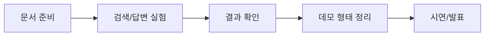

# 팀원이 처음 볼 문서

이 문서는 많은 문서 중에서 팀원이 처음 봐야 할 것만 정리한 입구입니다.

세부 구현 문서는 모두 참고용입니다. 처음부터 전부 읽을 필요는 없습니다.

## 이 프로젝트는 무엇인가

RFP/입찰 문서를 읽고, 질문과 관련 있는 근거를 찾은 뒤, 답변과 citation을 함께 남기는 RAG 프로젝트입니다.

최종 목표는 거대한 서비스를 완성하는 것이 아니라, **문서를 근거로 질문에 답하는 흐름을 만들고 발표에서 설명 가능한 결과를 남기는 것**입니다.

## 팀원이 먼저 볼 문서 4개

| 순서 | 문서 | 목적 |
| --- | --- | --- |
| 1 | `docs/md/kickoff/TEAM_BRIEFING_FLOW.md` | 프로젝트가 무엇이고 어떻게 설명할지 |
| 2 | `docs/md/workflow/GITHUB_OPERATIONS.md` | Issue, PR, Daily Report를 어떻게 쓸지 |
| 3 | `docs/md/workflow/PROJECT_WORKFLOW_GUIDE.md` | Data 준비부터 발표까지 어떻게 이어지는지 |
| 4 | `docs/md/workflow/ROLE_FOCUS_GUIDE.md` | 내 역할이 처음 무엇을 하면 되는지 |

## 설명할 때의 큰 흐름

## 역할별 핵심만 보기

| 역할 | 핵심 책임 | 먼저 볼 곳 |
| --- | --- | --- |
| PM | 일정, 보드, 역할 배정, 막힘 관리 | `ROLE_FOCUS_GUIDE.md`의 PM |
| Data Engineer | 문서 확보, 로딩 확인, 평가 질문 준비 | `ROLE_FOCUS_GUIDE.md`의 Data Engineer |
| Experiment Lead / Model Engineer | config 실험, 검색/답변 결과 확인, metric 해석 | `ROLE_FOCUS_GUIDE.md`의 Experiment Lead / Model Engineer |
| Application Engineer | 데모/API 후보, 입출력 형태, citation 표시 방식 | `ROLE_FOCUS_GUIDE.md`의 Application Engineer |
| Presentation Lead | 문제 설명, 쉬운 용어, 발표 흐름과 시각 자료 | `ROLE_FOCUS_GUIDE.md`의 Presentation Lead |

## 세부 문서는 언제 보는가

| 필요 상황 | 참고 문서 |
| --- | --- |
| RAG 입력/출력 계약이 필요할 때 | `docs/md/rag/RAG_PIPELINE_SPEC.md` |
| 데이터 형식을 맞춰야 할 때 | `docs/md/data/DATA_CONTRACT.md` |
| 실험 실행 방법이 필요할 때 | `docs/md/experiments/EXPERIMENT_GUIDE.md` |
| 첫 주 보드를 만들 때 | `docs/md/workflow/FIRST_WEEK_KANBAN.md` |
| 노트북 설명을 보강할 때 | `docs/md/experiments/NOTEBOOK_USAGE_CHECKLIST.md` |
| LLM에게 작업을 맡길 때 | `docs/llm/README.md` |

## 처음 설명할 때 하지 않을 것

- 모든 문서를 읽으라고 하지 않습니다.
- FastAPI나 앱 구현을 최종 목표처럼 말하지 않습니다.
- 실제 데이터가 없는 상태에서 parser 품질을 확정된 것처럼 말하지 않습니다.
- 실험을 오래 반복하는 장기 운영 프로젝트처럼 설명하지 않습니다.

## 발표까지 남기면 되는 것

- 사용한 문서와 질문 예시
- 검색된 근거 chunk
- 답변과 citation
- metric 또는 실패 사례
- 한계와 개선 가능성
