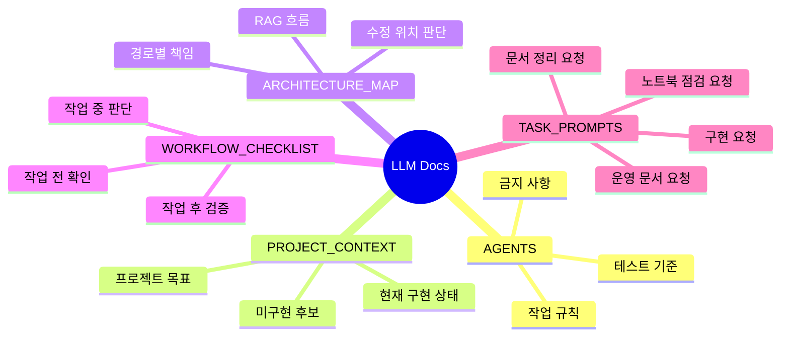

# LLM 작업 문서

`docs/llm/`은 ChatGPT, Codex, Claude 같은 LLM 기반 작업자가 프로젝트 구조를 빠르게 이해하고 일관된 방식으로 수정하도록 돕는 문서 모음입니다.

## 문서 지도

## 추천 사용법

LLM에게 작업을 맡길 때는 먼저 루트 `AGENTS.md`를 읽게 합니다. 그 다음 작업 성격에 따라 아래 문서를 추가로 읽게 합니다.

| 상황 | 읽을 문서 |
| --- | --- |
| 프로젝트 전체 맥락 설명 | `PROJECT_CONTEXT.md` |
| 어떤 파일을 고칠지 판단 | `ARCHITECTURE_MAP.md` |
| 작업 전후 체크 | `WORKFLOW_CHECKLIST.md` |
| 요청 프롬프트 작성 | `TASK_PROMPTS.md` |
| 팀 공유 문서 보강 | `docs/team/README.md` |
| GitHub 운영 문서 보강 | `docs/team/operations.md` |
| 첫 주 태스크 정리 | `docs/team/first-week.md` |
| 노트북 사용성 점검 | `docs/md/experiments/NOTEBOOK_USAGE_CHECKLIST.md` |

## 관리 원칙

- 실제 코드 구조가 바뀌면 `ARCHITECTURE_MAP.md`를 함께 갱신합니다.
- 구현 상태가 바뀌면 `PROJECT_CONTEXT.md`의 구현/미구현 목록을 갱신합니다.
- LLM에게 자주 맡길 작업이 생기면 `TASK_PROMPTS.md`에 요청 예시를 추가합니다.
- 운영 방식이나 첫 주 태스크가 바뀌면 `docs/team/` 문서를 먼저 확인합니다.
- 팀원이 처음 볼 문서와 LLM용 내부 문서는 섞지 않습니다.
