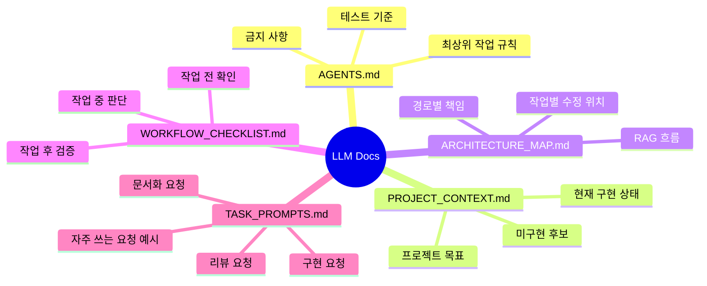

# LLM 작업 문서

`docs/llm/`은 ChatGPT, Codex, Claude 같은 LLM 기반 작업자가 저장소를 빠르게 이해하고 일관된 방식으로 수정하도록 돕는 문서 묶음입니다.

## 문서 지도

## 추천 사용법

LLM에게 작업을 맡길 때는 먼저 루트의 `AGENTS.md`를 읽게 한 뒤, 작업 성격에 따라 아래 문서를 추가로 읽게 합니다.

| 상황 | 읽힐 문서 |
| --- | --- |
| 프로젝트 전체 맥락 설명 | `PROJECT_CONTEXT.md` |
| 어떤 파일을 고쳐야 할지 판단 | `ARCHITECTURE_MAP.md` |
| 작업 누락 방지 | `WORKFLOW_CHECKLIST.md` |
| 프롬프트 작성 | `TASK_PROMPTS.md` |

## 관리 원칙

- 사람에게 설명하는 문서는 `docs/md/`, LLM 작업자용 압축 문맥은 `docs/llm/`에 둡니다.
- 실제 코드 구조가 바뀌면 `ARCHITECTURE_MAP.md`를 함께 갱신합니다.
- 구현 상태가 바뀌면 `PROJECT_CONTEXT.md`의 구현/미구현 목록을 갱신합니다.

