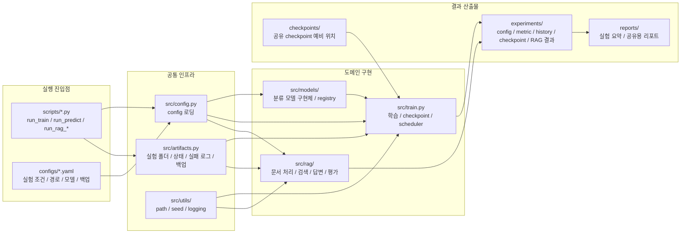

# 모듈 구조 설명

이 문서는 팀원이 저장소를 처음 봤을 때 “어디를 실행하고, 어디를 수정하고, 결과가 어디에 남는지” 빠르게 이해하도록 만든 구조 설명서입니다.

## 한 줄 요약

`configs/`가 실험 조건을 정하고, `scripts/`가 실행 진입점이 되며, `src/`가 실제 구현을 담당하고, `experiments/`와 `reports/`가 결과를 기록합니다.

```text
configs/*.yaml
    |
    v
scripts/*.py
    |
    v
src/
    |
    v
experiments/ + reports/
```

## 디렉터리 역할

| 경로 | 역할 | 팀원이 주로 보는 시점 |
|---|---|---|
| `configs/` | 실험 조건, 경로, 모델, RAG 옵션, 백업 정책 | 실험을 바꿀 때 |
| `scripts/` | 공식 실행 명령 | 학습, 예측, RAG 실행할 때 |
| `src/` | 실제 파이프라인 구현 | 기능을 추가하거나 버그를 고칠 때 |
| `data/` | 원본/중간/처리 데이터 | 데이터 계약을 맞출 때 |
| `experiments/` | 실험별 산출물 | 결과를 비교하고 재현할 때 |
| `reports/` | 실험 요약과 팀 보고 자료 | 공유용 결과를 만들 때 |
| `docs/md/` | 원본/관리용 Markdown 문서 | 문서를 수정하고 버전 관리할 때 |
| `docs/html/` | 공유/설명용 HTML 문서 | 킥오프, 온보딩, 발표 때 |
| `tests/` | 회귀 방지 테스트 | 수정 후 안전 확인할 때 |

## 핵심 모듈

| 모듈 | 책임 |
|---|---|
| `src/config.py` | YAML config 로딩, JSON 저장 |
| `src/artifacts.py` | 실험 폴더, run status, failure log, backup 관리 |
| `src/data.py` | 분류 모델용 데이터 로딩 |
| `src/train.py` | 분류 모델 학습, checkpoint, scheduler, early stopping |
| `src/predict.py` | 저장된 모델로 단건 예측 |
| `src/metrics.py` | 평가 지표 계산 |
| `src/experiments.py` | 여러 실험 결과 요약 |
| `src/models/` | 분류 모델 registry와 구현체 |
| `src/rag/` | RAG 문서 처리, 검색, 답변, 평가 |
| `src/utils/` | path, seed, logging 같은 공통 유틸 |

## 분류 모델 흐름

```text
run_validate.py
    -> validate_data.py
    -> data contract 확인

run_train.py
    -> config.py
    -> data.py
    -> models/registry.py
    -> train.py
    -> artifacts.py
    -> experiments/{name}/

run_predict.py
    -> config.py
    -> predict.py
    -> experiments/{name}/predictions.csv
```

분류 모델은 현재 이미지 smoke model, 텍스트 keyword model, HuggingFace sequence classifier를 지원합니다.

## RAG 흐름

```text
run_rag_ingest.py
    -> document_loader.py
    -> chunker.py
    -> adapters.py
    -> embeddings.jsonl
    -> rag_ingest_checkpoint.json

run_rag_retrieve.py
    -> adapters.py
    -> retriever.py
    -> retrieval_results.jsonl

run_rag_chat.py
    -> retrieve
    -> answerer.py
    -> answers.jsonl

run_rag_chat.py --evaluate
    -> evaluation_results.csv
    -> bad_retrievals.csv
    -> unsupported_answers.csv
    -> failed_questions.csv
```

RAG는 “문서 읽기 -> chunk 나누기 -> embedding 만들기 -> 검색하기 -> 답변하기 -> 평가하기” 순서로 나뉩니다.

## 모듈 관계 다이어그램



핵심은 `scripts/`가 직접 모든 일을 하지 않는다는 점입니다. script는 config를 읽고, 공통 artifact 정책을 적용한 뒤, ML 또는 RAG 구현체에 일을 위임합니다.

## RAG 내부 관계 다이어그램

```mermaid
flowchart LR
  docs["raw docs<br/>txt / pdf / docx / hwpx / hwp"]
  loader["document_loader<br/>표준 document row"]
  chunker["chunker<br/>검색 단위 chunk 생성"]
  embedding["embedding adapter<br/>local / huggingface"]
  vectors["embeddings.jsonl"]
  retriever["retriever adapter<br/>keyword / semantic / hybrid"]
  answerer["answerer adapter<br/>extractive/local"]
  eval["evaluation<br/>hit rate / citation / 실패 분석"]
  answer["answers + citations"]

  docs --> loader
  loader --> chunker
  chunker --> embedding
  embedding --> vectors
  vectors --> retriever
  chunker --> retriever
  retriever --> answerer
  answerer --> answer
  answer --> eval
```



RAG에서 새 구현체를 붙일 때는 pipeline 전체를 바꾸기보다 adapter factory와 필요한 하위 모듈만 확장하는 것이 기본 방향입니다.

## RAG Adapter 구조

RAG 쪽은 실제 구현체를 config로 갈아 끼우기 쉽도록 adapter registry 형태로 둡니다.

| 영역 | 현재 실제 구현 | 계약만 있는 확장 후보 |
|---|---|---|
| embedding | `local`, `huggingface` | OpenAI embedding 등 |
| vector store | `memory` | `faiss`, `chroma`, `elasticsearch` |
| retriever | `keyword`, `semantic`, `hybrid` | reranker 결합 검색 |
| answerer | `extractive/local` | `openai`, `huggingface` LLM 답변 |

따라서 지금 구조는 “인터페이스만 있는 상태”가 아니라, smoke test와 기본 RAG 실험은 실제로 돌 수 있고, 더 무거운 외부 도구는 나중에 adapter를 붙이는 형태입니다.

## Checkpoint와 Resume

분류 모델:

- best checkpoint 저장
- last checkpoint 저장
- HuggingFace trainer state 기반 resume
- scheduler와 early stopping config 제어

RAG:

- `parsed_documents.csv`가 있으면 문서 파싱 단계를 재사용합니다.
- `chunks.csv`가 있으면 chunking 단계를 재사용합니다.
- `embeddings.jsonl`이 있으면 embedding 단계를 재사용합니다.
- `rag_ingest_checkpoint.json`에 마지막 완료 stage와 count를 기록합니다.

현재 RAG resume은 단계 단위 resume입니다. 문서 100개 중 57번째 문서부터 이어 가는 수준의 offset resume은 아직 구현하지 않았습니다.

## 어디를 수정하면 되나

| 하고 싶은 일 | 주로 수정할 위치 |
|---|---|
| 실험 조건 변경 | `configs/*.yaml` |
| 새 분류 모델 추가 | `src/models/`, `src/models/registry.py` |
| 새 RAG embedding 추가 | `src/rag/adapters.py` |
| 새 vector store 추가 | `src/rag/adapters.py`, 필요시 `src/rag/vector_store.py` |
| 새 문서 포맷 추가 | `src/rag/document_loader.py` |
| 평가 지표 추가 | `src/metrics.py` 또는 `src/rag/pipeline.py` |
| 실행 명령 추가 | `scripts/` |
| 팀 설명 자료 추가 | `docs/md/` 또는 `docs/html/` |
