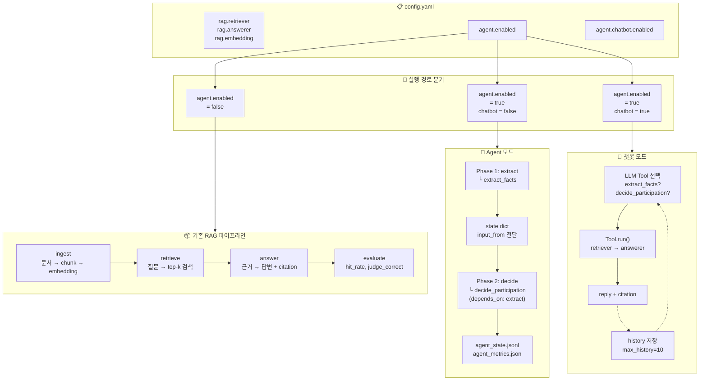
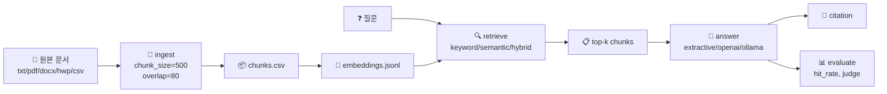
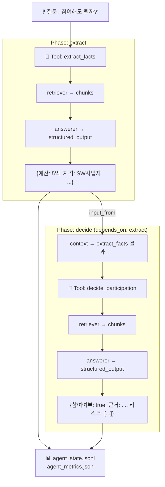
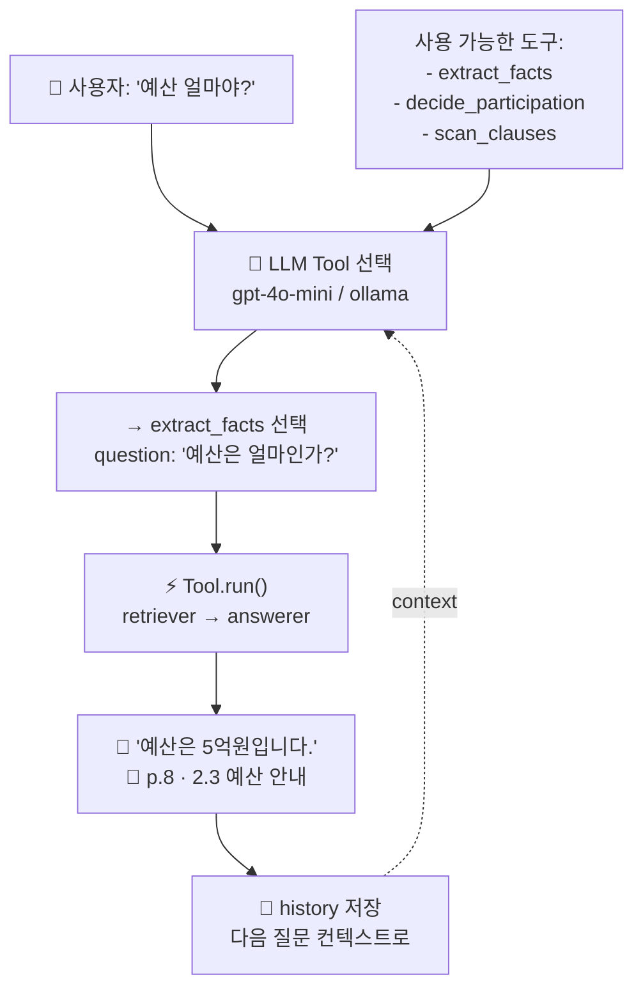
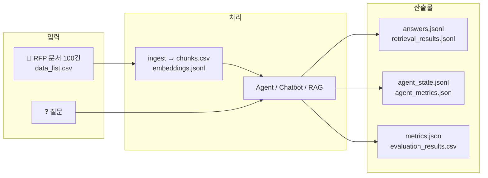

# RAG + Agent 파이프라인 전체 흐름도

> 2026-06-26 | `feature/agent-polish` 기준

## 전체 아키텍처



## RAG 파이프라인 (agent.enabled = false)



## Agent 모드 (agent.enabled = true, chatbot = false)



## 챗봇 모드 (agent.enabled = true, chatbot = true)



## 데이터 흐름 요약



## 실행 명령어

```bash
# RAG 기본
python scripts/run_rag_chat.py --config rag_langchain.yaml --question "예산?"

# Agent 모드 (Phase DAG)
python scripts/run_rag_agent.py --config agent/agent_lplus.yaml --question "참여해도 될까?"

# 챗봇 모드 (대화형)
python scripts/run_rag_agent.py --config agent/agent_lplus.yaml

# Agent 평가
python scripts/run_rag_agent.py --config agent/agent_lplus.yaml --evaluate
```
