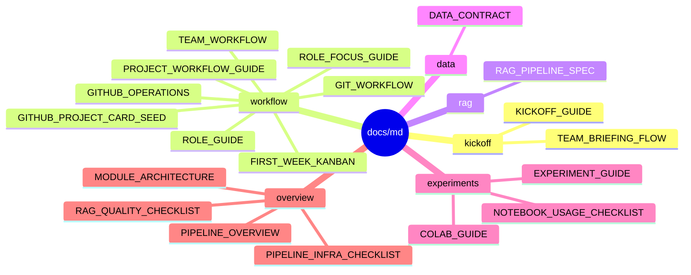

# Markdown Docs

`docs/md/`는 수정과 관리가 쉬운 Markdown 원본 문서를 모아두는 곳입니다.

팀원에게 모든 Markdown 문서를 한 번에 안내하지 않습니다. 처음 안내는 [../TEAM_DOCS_ENTRY.md](../TEAM_DOCS_ENTRY.md)에서 시작하고, 이 문서는 세부 문서를 찾을 때 사용합니다.

## 먼저 볼 문서

| 상황 | 문서 |
| --- | --- |
| 프로젝트와 역할을 설명해야 할 때 | [kickoff/TEAM_BRIEFING_FLOW.md](kickoff/TEAM_BRIEFING_FLOW.md) |
| GitHub 운영 방식을 설명해야 할 때 | [workflow/GITHUB_OPERATIONS.md](workflow/GITHUB_OPERATIONS.md) |
| 작업 흐름과 역할 간 산출물 기준을 맞출 때 | [workflow/PROJECT_WORKFLOW_GUIDE.md](workflow/PROJECT_WORKFLOW_GUIDE.md) |
| 역할별 첫 작업을 나눌 때 | [workflow/ROLE_FOCUS_GUIDE.md](workflow/ROLE_FOCUS_GUIDE.md) |
| 첫 주 보드 카드를 만들 때 | [workflow/FIRST_WEEK_KANBAN.md](workflow/FIRST_WEEK_KANBAN.md) |

## 문서 지도



## 디렉터리 설명

```text
docs/md/
|-- kickoff/      킥오프 설명과 팀 공유 흐름
|-- workflow/     GitHub 운영, 역할, 작업 흐름, 첫 주 카드
|-- rag/          RAG 입력/출력, 검색, 답변, 평가 계약
|-- data/         데이터 제공 형식과 원본 데이터 관리 기준
|-- experiments/  실험 실행, Colab, 노트북 사용법
`-- overview/     전체 구조, 모듈 관계, 인프라 체크리스트
```

## 참고 문서로 보는 기준

| 역할 | 먼저 확인할 세부 문서 |
| --- | --- |
| PM | `workflow/GITHUB_OPERATIONS.md`, `workflow/FIRST_WEEK_KANBAN.md` |
| Data Engineer | `workflow/PROJECT_WORKFLOW_GUIDE.md`, `data/DATA_CONTRACT.md`, `rag/RAG_PIPELINE_SPEC.md` |
| Experiment Lead / Model Engineer | `workflow/PROJECT_WORKFLOW_GUIDE.md`, `experiments/EXPERIMENT_GUIDE.md`, `overview/RAG_QUALITY_CHECKLIST.md` |
| Application Engineer | `rag/RAG_PIPELINE_SPEC.md`, `overview/MODULE_ARCHITECTURE.md` |
| Presentation Lead | `kickoff/TEAM_BRIEFING_FLOW.md`, `overview/PIPELINE_OVERVIEW.md` |

## HTML 문서와의 관계

HTML은 설명용 산출물입니다. 모든 Markdown을 HTML로 만들 필요는 없습니다.

발표나 팀 설명에 직접 쓰는 문서는 `docs/html/`에 따로 둘 수 있고, 세부 구현 기준은 Markdown을 원본으로 관리합니다.
