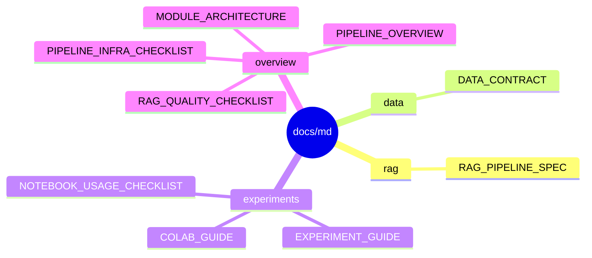

# Markdown Reference Docs

`docs/md/`는 세부 참고 문서를 모아두는 곳입니다.

팀원이 처음 읽을 문서는 [../team/README.md](../team/README.md)에 있습니다. 이 디렉터리는 RAG 계약, 데이터 형식, 실험 실행, 인프라 구조처럼 필요할 때 찾아보는 문서만 둡니다.

## 문서 지도



## 디렉터리 설명

```text
docs/md/
|-- rag/          RAG 입력/출력, 검색, 답변, 평가 계약
|-- data/         데이터 제공 형식과 원본 데이터 관리 기준
|-- experiments/  실험 실행, Colab, 노트북 사용법
|-- overview/     전체 구조, 모듈 관계, 인프라 체크리스트
`-- rag/          RAG 입력/출력, 검색, 답변, 평가 계약
```

## 역할별로 찾을 참고 문서

| 역할 | 참고 문서 |
| --- | --- |
| Data Engineer | [data/DATA_CONTRACT.md](data/DATA_CONTRACT.md), [rag/RAG_PIPELINE_SPEC.md](rag/RAG_PIPELINE_SPEC.md) |
| Experiment Lead / Model Engineer | [experiments/EXPERIMENT_GUIDE.md](experiments/EXPERIMENT_GUIDE.md), [overview/RAG_QUALITY_CHECKLIST.md](overview/RAG_QUALITY_CHECKLIST.md) |
| Application Engineer | [rag/RAG_PIPELINE_SPEC.md](rag/RAG_PIPELINE_SPEC.md), [overview/MODULE_ARCHITECTURE.md](overview/MODULE_ARCHITECTURE.md) |
| Presentation Lead | [overview/PIPELINE_OVERVIEW.md](overview/PIPELINE_OVERVIEW.md), [../html/overview/pipeline_explainer.html](../html/overview/pipeline_explainer.html) |

## HTML 문서와의 관계

HTML은 설명용 산출물입니다. 모든 Markdown을 HTML로 만들 필요는 없습니다.

발표나 팀 설명에 직접 쓰는 문서는 `docs/html/`에 따로 두고, 세부 구현 기준은 Markdown을 원본으로 관리합니다.
