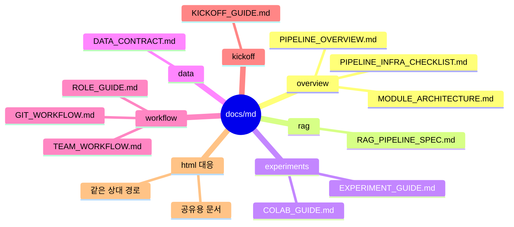

# Markdown Docs Mind Map

`docs/md/`는 수정과 리뷰가 쉬운 원본 Markdown 문서를 두는 곳입니다.

HTML로 공유할 문서는 같은 상대 경로의 `docs/html/` 문서와 함께 관리합니다.

## 문서 지도



```text
docs/md/
|-- overview/        프로젝트 큰 그림
|   |-- PIPELINE_OVERVIEW.md
|   |-- MODULE_ARCHITECTURE.md
|   `-- PIPELINE_INFRA_CHECKLIST.md
|-- rag/             RAG 입력/출력 계약
|   `-- RAG_PIPELINE_SPEC.md
|-- experiments/     실험 실행과 Colab 운영
|   |-- EXPERIMENT_GUIDE.md
|   `-- COLAB_GUIDE.md
|-- data/            데이터 계약
|   `-- DATA_CONTRACT.md
|-- workflow/        협업 규칙
|   |-- GIT_WORKFLOW.md
|   |-- ROLE_GUIDE.md
|   `-- TEAM_WORKFLOW.md
`-- kickoff/         팀 설명 자료
    `-- KICKOFF_GUIDE.md
```

## 추천 읽는 순서

1. [overview/PIPELINE_OVERVIEW.md](overview/PIPELINE_OVERVIEW.md): 프로젝트 전체 실행 흐름
2. [overview/MODULE_ARCHITECTURE.md](overview/MODULE_ARCHITECTURE.md): 코드와 폴더 관계
3. [rag/RAG_PIPELINE_SPEC.md](rag/RAG_PIPELINE_SPEC.md): RAG 입력, chunk, 검색, 답변, 평가 계약
4. [experiments/EXPERIMENT_GUIDE.md](experiments/EXPERIMENT_GUIDE.md): 실험 실행과 결과 확인
5. [workflow/TEAM_WORKFLOW.md](workflow/TEAM_WORKFLOW.md): 팀 운영 규칙
6. [kickoff/KICKOFF_GUIDE.md](kickoff/KICKOFF_GUIDE.md): 킥오프 설명 원본

## HTML 대응

각 Markdown 문서는 `docs/html/`에 같은 상대 경로의 HTML 파일을 가집니다.

```text
docs/md/overview/PIPELINE_OVERVIEW.md
-> docs/html/overview/PIPELINE_OVERVIEW.html
```

직접 디자인한 설명용 HTML은 Markdown 원본과 1:1 대응하지 않을 수 있습니다.

- `docs/html/overview/pipeline_explainer.html`
- `docs/html/overview/module_architecture.html`
- `docs/html/kickoff/kickoff.html`
