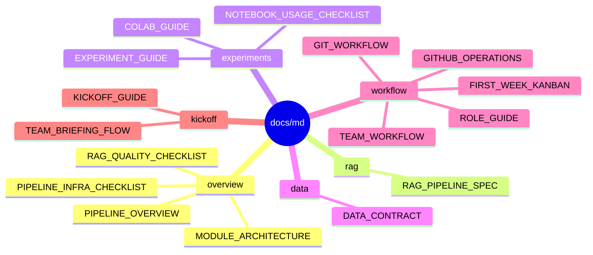

# Markdown Docs Mind Map

`docs/md/`는 수정과 리뷰가 쉬운 원본 Markdown 문서를 두는 곳입니다.

HTML로 공유할 문서는 `docs/html/`에서 따로 관리합니다. 모든 Markdown 문서가 반드시 HTML과 1:1로 대응할 필요는 없습니다.

## 문서 지도



```text
docs/md/
|-- overview/        프로젝트 큰 그림과 인프라 상태
|-- rag/             RAG 입력/출력 계약
|-- experiments/     실험 실행, Colab, 노트북 사용성
|-- data/            데이터 계약
|-- workflow/        Git, 팀 운영, 첫 주 Kanban
`-- kickoff/         팀 설명과 킥오프 원본
```

## 추천 읽는 순서

1. [overview/PIPELINE_OVERVIEW.md](overview/PIPELINE_OVERVIEW.md): 프로젝트 전체 실행 흐름
2. [overview/MODULE_ARCHITECTURE.md](overview/MODULE_ARCHITECTURE.md): 코드와 폴더 관계
3. [rag/RAG_PIPELINE_SPEC.md](rag/RAG_PIPELINE_SPEC.md): RAG 입력, chunk, 검색, 답변, 평가 계약
4. [workflow/GITHUB_OPERATIONS.md](workflow/GITHUB_OPERATIONS.md): GitHub 운영 준비
5. [workflow/FIRST_WEEK_KANBAN.md](workflow/FIRST_WEEK_KANBAN.md): 첫 주 작업 카드 초안
6. [experiments/EXPERIMENT_GUIDE.md](experiments/EXPERIMENT_GUIDE.md): 실험 실행과 결과 확인
7. [experiments/NOTEBOOK_USAGE_CHECKLIST.md](experiments/NOTEBOOK_USAGE_CHECKLIST.md): 노트북 사용성 점검
8. [kickoff/TEAM_BRIEFING_FLOW.md](kickoff/TEAM_BRIEFING_FLOW.md): 팀원 설명 흐름

## HTML 문서

일부 Markdown 문서는 설명과 공유를 위해 `docs/html/`에 HTML 버전을 함께 둡니다.

```text
docs/md/overview/PIPELINE_OVERVIEW.md
-> docs/html/overview/PIPELINE_OVERVIEW.html
```

HTML은 설명용 산출물입니다. 모든 Markdown 문서를 HTML로 만들 필요는 없고, 발표나 온보딩에 직접 쓰는 문서만 선별해서 관리합니다.
