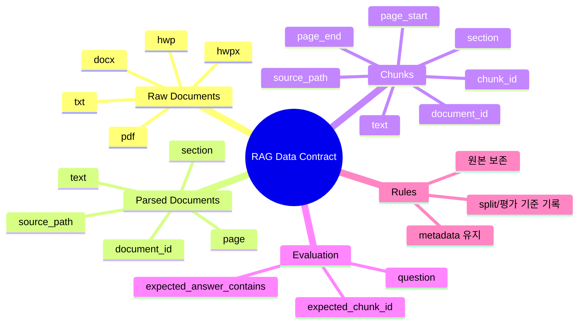

# RAG Data Contract v1.0

이 문서는 RFP/입찰 공고 RAG 프로젝트에서 데이터가 어떤 형태로 들어오고, 어떤 산출물로 이어져야 하는지 정의합니다.

기본 원칙은 간단합니다.

- 원본 문서는 직접 수정하지 않습니다.
- loader가 읽은 문서는 표준 document row로 변환합니다.
- chunk에는 나중에 citation으로 되돌아갈 수 있는 metadata를 반드시 남깁니다.
- 평가 질문은 검색과 답변을 검증할 수 있는 기대값을 포함합니다.

## 데이터 계약 마인드맵



## 권장 디렉터리 구조

```text
data/
|-- raw/
|   `-- rfp/
|       |-- sample_001.pdf
|       |-- sample_002.hwpx
|       `-- sample_003.docx
|-- interim/
|   `-- README.md
|-- external/
|   `-- README.md
|-- rag_sample/
|   |-- rfp_sample.txt
|   `-- eval_questions.csv
|-- rag_realistic/
|   |-- rfp_realistic_sample.docx
|   |-- rfp_realistic_sample.hwpx
|   `-- eval_questions.csv
`-- examples/
    `-- classification/
```

실험 config에서는 보통 아래 경로를 지정합니다.

```yaml
paths:
  raw_docs_dir: data/rag_sample

evaluation:
  questions_path: data/rag_sample/eval_questions.csv
```

## Raw Document 규칙

지원 대상:

| 확장자 | 용도 |
| --- | --- |
| `.txt` | 가장 빠른 로컬 검증 |
| `.pdf` | 실제 공고 문서 후보 |
| `.docx` | Word 기반 문서 |
| `.hwpx` | 한글 XML 기반 문서 |
| `.hwp` | 한글 바이너리 문서 |

규칙:

- 원본 파일명은 가능한 한 의미 있게 유지합니다.
- 원본 파일은 `data/raw/` 또는 config가 지정한 원본 폴더에 둡니다.
- 원본 파일을 직접 편집하지 않습니다.
- 전처리가 필요하면 별도 산출물로 만들고, 어떤 처리를 했는지 README나 report에 남깁니다.

## Parsed Document 계약

loader가 문서를 읽으면 내부적으로 아래 필드를 가진 document row로 변환합니다.

| 필드 | 의미 |
| --- | --- |
| `document_id` | 문서를 식별하는 ID |
| `title` | 문서 제목 또는 파일명 기반 제목 |
| `source_path` | 원본 파일 경로 |
| `page` | 페이지 또는 페이지에 준하는 위치 |
| `section` | 문서 내 섹션명 |
| `text` | 검색과 답변에 사용할 본문 |

이 정보는 `parsed_documents.csv`로 저장됩니다.

## Chunk 계약

chunk는 검색과 citation의 최소 단위입니다.

| 필드 | 의미 |
| --- | --- |
| `chunk_id` | chunk 고유 ID |
| `document_id` | 원본 document ID |
| `source_path` | 원본 파일 경로 |
| `page_start` | chunk 시작 페이지 |
| `page_end` | chunk 종료 페이지 |
| `section` | 섹션명 |
| `text` | chunk 본문 |
| `token_count` | 대략적인 길이 정보 |

이 정보는 `chunks.csv`로 저장됩니다.

중요한 점은 `chunk_id`, `document_id`, `source_path`, `page_start/page_end`가 답변 citation과 실패 분석에 그대로 쓰인다는 것입니다. 이 metadata가 빠지면 retrieval 결과를 사람이 검증하기 어렵습니다.

## 평가 질문 계약

평가 질문 CSV는 최소한 아래 컬럼을 사용합니다.

```csv
question,expected_answer,expected_chunk_ids
예산은 얼마인가요?,,5천만 원
참가 자격은 무엇인가요?,,중소기업
```

권장 컬럼:

| 컬럼 | 의미 |
| --- | --- |
| `question` | 사용자가 물어볼 질문 |
| `expected_chunk_id` | 검색 결과 top-k 안에 들어와야 하는 기대 chunk |
| `expected_answer_contains` | 답변에 포함되면 좋은 핵심 표현 |
| `category` | 예산, 자격, 일정, 제출 서류 같은 질문 유형 |
| `note` | 사람이 검토할 때 필요한 메모 |

## 검증 규칙

RAG 데이터 준비가 끝났다면 아래를 확인합니다.

- config의 `paths.raw_docs_dir`가 존재한다.
- 원본 문서 확장자가 loader 지원 범위에 들어간다.
- 평가 질문 CSV가 존재한다.
- 평가 질문에 `question` 컬럼이 있다.
- 기대 chunk를 쓰는 경우 `expected_chunk_id`가 실제 chunk와 연결된다.
- chunk metadata가 citation에 필요한 정보를 포함한다.

실행 전 점검:

```bash
python scripts/check_rag_pipeline.py --config configs/experiments/rag/rag_langchain.yaml --project-root .
```

전체 흐름 검증:

```bash
python scripts/run_rag_ingest.py --config configs/experiments/rag/rag_langchain.yaml --project-root .
python scripts/run_rag_chat.py --config configs/experiments/rag/rag_langchain.yaml --project-root . --evaluate
```

## 변경 규칙

Data Contract를 바꿀 때는 아래 내용을 기록합니다.

- 무엇이 바뀌었는가
- 왜 바뀌었는가
- 어떤 역할이 영향을 받는가
- 기존 실험과 비교 가능한가
- 산출물 컬럼이나 config key가 바뀌었는가

## 참고: 기존 분류 데이터 계약

예전 ML 파이프라인 검증용으로 `data/examples/classification/image_processed/train.csv`, `valid.csv`, `test.csv`, `class_map.json`, `dataset_info.json` 구조를 사용할 수 있습니다.

이 구조는 RAG 본 실험의 기본 계약이 아닙니다. 분류/HuggingFace fine-tuning 예제는 `configs/examples/classification/` 아래의 참고 config와 함께 봅니다.
