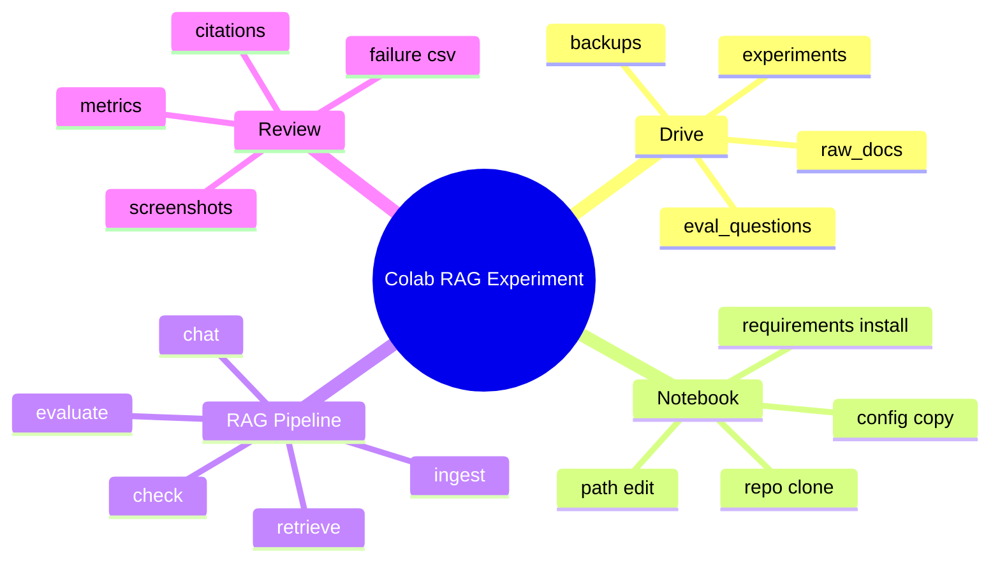

# Colab / Drive RAG 실행 가이드

이 문서는 Colab에서 RAG 실험을 실행하고, 결과를 Google Drive에 남기는 방법을 설명합니다.
RAG smoke test와 기본 검색/답변 검증은 로컬 Jupyter로도 충분합니다.

현재 프로젝트의 기본 실험은 분류 모델 학습이 아니라 RAG 문서 처리, 검색, 답변, 평가입니다.

## 언제 Colab으로 돌리는가

- 원본 문서와 실험 결과를 Google Drive에서 공유해야 할 때
- 로컬 환경 세팅이 불안정해서 동일한 실행 환경이 필요할 때
- HuggingFace embedding, reranker, LLM answerer처럼 모델 다운로드와 추론 자원이 필요한 옵션을 확인할 때
- Drive 백업 흐름까지 한 번에 검증하고 싶을 때

## Colab 실행 흐름



## 권장 Drive 구조

```text
MyDrive/codeit_rag_project/
|-- data/
|   |-- raw_docs/
|   |   `-- sample_rfp.pdf
|   `-- eval_questions.csv
|-- experiments/
|-- backups/
`-- reports/
```

원본 문서는 직접 수정하지 않습니다. 전처리나 변환 결과가 필요하면 별도 폴더에 둡니다.

## Colab 시작 셀

```python
from google.colab import drive
drive.mount("/content/drive")
```

```bash
git clone <repo-url>
cd <repo-name>
pip install -r requirements.txt
```

## RAG Config 복사

Colab 전용 config는 기존 RAG config를 복사해서 경로만 Drive 기준으로 바꿉니다.

```text
configs/experiments/rag/rag_smoke_test.yaml
-> configs/experiments/rag/rag_colab_drive.yaml
```

예시:

```yaml
experiment:
  name: rag_colab_drive

paths:
  raw_docs_dir: /content/drive/MyDrive/codeit_rag_project/data/raw_docs
  output_dir: /content/drive/MyDrive/codeit_rag_project/experiments/rag_colab_drive

evaluation:
  questions_path: /content/drive/MyDrive/codeit_rag_project/data/eval_questions.csv

backup:
  enabled: true
  on_finish: true
  on_failure: true
  backup_dir: /content/drive/MyDrive/codeit_rag_project/backups/rag_colab_drive
  include_logs: true
  include_checkpoints: true
```

## 실행 전 점검

```bash
python scripts/check_rag_pipeline.py \
  --config configs/experiments/rag/rag_colab_drive.yaml \
  --project-root .
```

먼저 이 명령이 통과하는지 확인합니다. 여기서 실패하면 문서 경로, 질문 CSV 경로, config 값을 먼저 고칩니다.

## RAG 실행

```bash
python scripts/run_rag_ingest.py \
  --config configs/experiments/rag/rag_colab_drive.yaml \
  --project-root .
```

```bash
python scripts/run_rag_retrieve.py \
  --config configs/experiments/rag/rag_colab_drive.yaml \
  --project-root . \
  --question "예산은 얼마야?"
```

```bash
python scripts/run_rag_chat.py \
  --config configs/experiments/rag/rag_colab_drive.yaml \
  --project-root . \
  --evaluate
```

## 결과 확인

Drive의 `experiments/rag_colab_drive/`에서 아래 파일을 확인합니다.

```text
config.yaml
parsed_documents.csv
chunks.csv
embeddings.jsonl
retrieval_results.jsonl
answers.jsonl
metrics.json
bad_retrievals.csv
unsupported_answers.csv
failed_questions.csv
run_status.json
README.md
```

## Colab 결과에서 먼저 볼 것

1. `metrics.json`: 전체 점수
2. `bad_retrievals.csv`: 검색 실패 질문
3. `unsupported_answers.csv`: 근거 부족 답변
4. `answers.jsonl`: 답변과 citation
5. `chunks.csv`: 검색 근거가 실제 문서 내용과 맞는지

## HuggingFace 사용 시 주의

RAG에서 HuggingFace를 사용할 수 있는 위치는 세 곳입니다.

```yaml
rag:
  embedding:
    provider: huggingface
  reranker:
    provider: huggingface
  answerer:
    provider: huggingface
```

Colab에서 HuggingFace 모델을 쓰면 모델 다운로드와 추론 시간이 발생합니다. 먼저 `local` provider 기반 RAG smoke test를 통과시킨 뒤 바꾸는 것을 권장합니다.

## 공유할 때 남길 것

- 사용한 config 경로
- Drive 결과 폴더
- `metrics.json` 요약
- 성공 질문 1개와 실패 질문 1개
- 답변과 citation 캡처
- 다음에 바꿔볼 config 옵션

## 참고

예전 분류/HuggingFace fine-tuning config는 `configs/examples/classification/`에 남아 있습니다. 현재 RAG 프로젝트의 기본 실험 흐름은 RAG smoke walkthrough이며, Colab에서 돌릴 사람은 위 흐름을 사용합니다.
