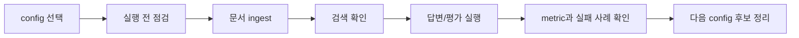

# RAG 실험 가이드

이 문서는 RAG 프로젝트에서 config를 바꿔가며 실험하고 결과를 확인하는 방법을 설명합니다.

분류 모델 학습이나 HuggingFace fine-tuning은 현재 프로젝트의 본 실험이 아닙니다. 기본 실험은 RAG 문서 처리, 검색, 답변, citation, 평가 산출물을 확인하는 흐름입니다.

## 실험 흐름



## 1. 기본 Config 선택

처음에는 아래 config로 시작합니다.

```text
configs/experiments/rag/rag_langchain.yaml
```

비교 실험은 기존 config를 복사해서 만듭니다.

```text
configs/experiments/rag/rag_langchain.yaml
-> configs/experiments/rag/rag_top5_chunk800.yaml
```

새 config에서는 최소한 아래 값을 확인합니다.

```yaml
experiment:
  name: rag_top5_chunk800

paths:
  output_dir: experiments/rag_top5_chunk800

artifact_policy:
  run_id:
```

## 2. 실행 전 점검

```bash
python scripts/check_rag_pipeline.py --config configs/experiments/rag/rag_langchain.yaml --project-root .
```

이 단계에서 확인하는 것:

- `paths.raw_docs_dir`가 존재하는지
- `evaluation.questions_path`가 존재하는지
- loader가 지원하는 파일 형식인지
- chunk, retriever, answerer config 값이 유효한지
- output 경로 정책이 충돌하지 않는지

## 3. 문서 Ingest

```bash
python scripts/run_rag_ingest.py --config configs/experiments/rag/rag_langchain.yaml --project-root .
```

생성되는 주요 산출물:

```text
experiments/rag_langchain/
|-- parsed_documents.csv
|-- chunks.csv
`-- embeddings.jsonl
```

확인할 것:

- 문서가 몇 개 읽혔는지
- chunk가 비정상적으로 너무 많거나 적지 않은지
- source path, page, section 같은 근거 추적 정보가 남았는지
- embedding 산출물이 chunk와 연결되는지

## 4. 검색 확인

```bash
python scripts/run_rag_retrieve.py \
  --config configs/experiments/rag/rag_langchain.yaml \
  --project-root . \
  --question "예산은 얼마야?"
```

확인할 것:

- top-k 안에 질문과 관련 있는 chunk가 들어오는지
- score가 너무 낮은 결과만 나오지는 않는지
- `source_path`, `page`, `chunk_id`가 답변 근거로 쓸 수 있는지

## 5. 답변과 평가 실행

단일 질문:

```bash
python scripts/run_rag_chat.py \
  --config configs/experiments/rag/rag_langchain.yaml \
  --project-root . \
  --question "예산은 얼마야?"
```

평가 질문 세트:

```bash
python scripts/run_rag_chat.py \
  --config configs/experiments/rag/rag_langchain.yaml \
  --project-root . \
  --evaluate
```

생성되는 주요 산출물:

```text
experiments/rag_langchain/
|-- retrieval_results.jsonl
|-- answers.jsonl
|-- metrics.json
|-- bad_retrievals.csv
|-- unsupported_answers.csv
|-- failed_questions.csv
|-- run_status.json
`-- README.md
```

## 6. Metric과 실패 사례 확인

RAG에서는 답변 문장만 보지 않습니다. 아래 순서로 봅니다.

1. `retrieval_results.jsonl`: 정답 근거 후보가 검색되었는지
2. `answers.jsonl`: 답변이 검색된 근거에 기반하는지
3. `metrics.json`: 대표 지표가 개선되었는지
4. `bad_retrievals.csv`: 기대 chunk를 못 찾은 질문
5. `unsupported_answers.csv`: 근거 없이 답한 질문
6. `failed_questions.csv`: 실행 중 실패한 질문

대표 metric:

| metric | 의미 |
| --- | --- |
| `retrieval_hit_rate` | 기대 근거 chunk가 top-k 안에 들어온 비율 |
| `citation_correct_rate` | citation이 기대 근거와 맞는 비율 |
| `unsupported_answer_rate` | 근거 부족 답변 비율 |

## 주로 바꿔볼 Config 옵션

| 옵션 | 실험 질문 |
| --- | --- |
| `rag.chunk.size` | chunk를 크게/작게 하면 근거 검색이 좋아지는가? |
| `rag.chunk.overlap` | 앞뒤 문맥을 더 겹치면 답변 근거가 안정적인가? |
| `rag.retriever.method` | keyword, semantic, hybrid 중 어떤 방식이 맞는가? |
| `rag.retriever.top_k` | 근거 개수를 늘리면 답변 품질이 좋아지는가? |
| `rag.embedding.provider` | local과 HuggingFace embedding 차이가 있는가? |
| `rag.reranker.enabled` | 재정렬을 붙일 가치가 있는가? |
| `rag.answerer.mode` | extractive 답변으로 충분한가, LLM 답변이 필요한가? |

## 실험 이름 규칙

RAG 실험 이름은 바꾼 조건이 보이게 짓습니다.

```text
rag_semantic
rag_keyword_top3
rag_hybrid_top5
rag_chunk800_overlap120
rag_hf_answerer_gemma
```

좋은 이름은 나중에 `experiments/` 폴더만 봐도 어떤 조건인지 짐작할 수 있어야 합니다.

## 비교 리포트

retriever 비교는 아래 스크립트로 실행합니다.

```bash
python scripts/compare_rag_retrievers.py --project-root .
```

결과:

```text
reports/rag_retriever_comparison.csv
reports/rag_retriever_comparison.json
```

## 백업

Colab이나 Drive 백업이 필요하면 config의 `backup` 블록을 사용합니다.

```yaml
backup:
  enabled: true
  on_finish: true
  on_failure: true
  backup_dir: /content/drive/MyDrive/codeit_rag_project/backups/rag_semantic
  include_logs: true
  include_checkpoints: true
```

## HuggingFace는 어디에 쓰는가

RAG에서 HuggingFace는 분류 모델 파인튜닝이 아니라 아래 위치에서 사용합니다.

| 목적 | config |
| --- | --- |
| embedding 모델 교체 | `rag.embedding.provider: huggingface` |
| reranker 후보 | `rag.reranker.provider: huggingface` |
| LLM 답변 생성 후보 | `rag.answerer.provider: huggingface` |

분류/HuggingFace fine-tuning 예시는 `configs/examples/classification/`에 남겨둔 참고 자료입니다. RAG 실험을 시작할 때는 그 config를 복사하지 않습니다.

## 실험 리뷰 체크리스트

- 실행한 config 경로를 기록했는가?
- 산출물의 `config.yaml` snapshot을 확인했는가?
- 답변뿐 아니라 retrieval 결과와 citation을 확인했는가?
- 실패 질문 CSV를 봤는가?
- 바꾼 옵션이 하나 또는 소수로 제한되어 비교 가능한가?
- 발표에서 설명할 성공 사례와 실패 사례를 남겼는가?
