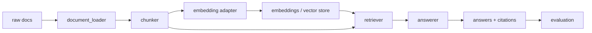

# RAG 모듈 구조

이 문서는 RAG 프로젝트 기준으로 어떤 파일이 어떤 책임을 가지는지 설명합니다.

기존 분류/HuggingFace 학습 코드는 참고용으로 남아 있지만, 새 작업의 기본 위치는 `src/rag/`, `scripts/run_rag_*`, `configs/experiments/rag/`입니다.

## 큰 흐름

```text
configs/experiments/rag/*.yaml
    |
    v
scripts/run_rag_*.py
    |
    v
src/rag/
    |
    v
experiments/{experiment.name}/
```

## 주요 디렉터리

| 경로 | 책임 |
| --- | --- |
| `configs/experiments/rag/` | RAG 실험 조건 |
| `scripts/` | 사람이 실행하는 명령 |
| `src/rag/` | RAG 구현체 |
| `src/artifacts.py` | 산출물, status, failure log, backup |
| `experiments/` | 실험별 결과 |
| `reports/` | 비교 리포트와 공유 자료 |
| `docs/team/` | 팀원이 처음 볼 문서 |
| `docs/md/` | 세부 참고 문서 |
| `docs/html/` | 발표/설명용 HTML |

## RAG 내부 흐름



## RAG 모듈 책임

| 모듈 | 책임 |
| --- | --- |
| `document_loader.py` | 원본 문서를 document row로 변환 |
| `chunker.py` | document row를 검색 가능한 chunk로 변환 |
| `embedder.py` | chunk 또는 질문을 vector로 변환 |
| `vector_store.py` | embedding 기반 top-k 검색 |
| `retriever.py` | keyword/semantic/hybrid 검색 |
| `answerer.py` | 검색된 근거로 답변과 citation 생성 |
| `adapters.py` | config에 따라 구현체 선택 |
| `pipeline.py` | ingest, retrieve, chat, evaluate 오케스트레이션 |
| `validation.py` | config와 입력 경로 검증 |
| `comparison.py` | retriever 비교 결과 생성 |

## Config로 바꾸는 영역

| 영역 | config |
| --- | --- |
| 문서 확장자 | `rag.loader.file_types` |
| chunk 크기 | `rag.chunk.size`, `rag.chunk.overlap` |
| embedding | `rag.embedding.provider`, `rag.embedding.model_name` |
| vector store | `rag.vector_store.type` |
| 검색 방식 | `rag.retriever.method`, `rag.retriever.top_k` |
| reranker | `rag.reranker.enabled`, `rag.reranker.model_name` |
| 답변 방식 | `rag.answerer.mode`, `rag.answerer.provider` |
| 평가 질문 | `evaluation.questions_path` |

## RAG Artifact

```text
experiments/{experiment.name}/
|-- config.yaml
|-- parsed_documents.csv
|-- chunks.csv
|-- embeddings.jsonl
|-- retrieval_results.jsonl
|-- answers.jsonl
|-- metrics.json
|-- bad_retrievals.csv
|-- unsupported_answers.csv
|-- failed_questions.csv
|-- run_status.json
`-- rag_ingest_checkpoint.json
```

RAG에서 artifact는 모델 weight보다 근거 흐름을 재현하기 위한 기록입니다.

## 참고용 ML 코드

| 경로 | 현재 위치 |
| --- | --- |
| `src/train.py` | 분류/HuggingFace 학습 참고 |
| `src/predict.py` | 분류 예측 참고 |
| `src/models/` | 분류 모델 구현 참고 |
| `configs/examples/classification/` | 분류/HF config 참고 |
| `scripts/run_train.py`, `scripts/run_predict.py` | 기존 동작 확인 유지용 |

새 RAG 작업에서 위 파일들을 먼저 수정하지 않습니다. RAG 기능은 `src/rag/`와 `configs/experiments/rag/`를 기준으로 추가합니다.
