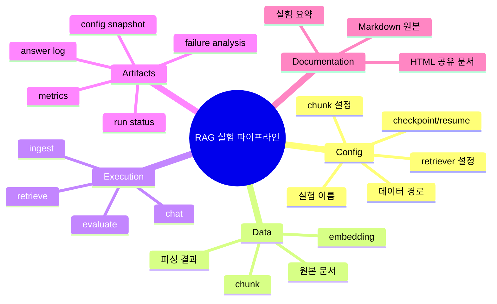

# 파이프라인 설명서

이 문서는 팀원에게 현재 프로젝트 파이프라인을 설명하기 위한 개요 문서입니다.
세부 명령어는 `README.md`, 실험 규칙은 `experiments/EXPERIMENT_GUIDE.md`, Colab 실행은 `experiments/COLAB_GUIDE.md`를 참고합니다.
운영 기능의 현재 상태와 남은 보강 항목은 `PIPELINE_INFRA_CHECKLIST.md`에서 관리합니다.

## 한 줄 요약

현재 파이프라인은 **config 하나를 기준으로 RAG 문서 처리, 검색, 답변, 평가, 실험 산출물 저장, 실험 요약까지 재현 가능하게 실행하는 구조**입니다.

## 전체 구조 마인드맵



```text
config
  -> document loading
  -> chunking
  -> embedding
  -> retrieval
  -> answer + citations
  -> evaluation
  -> experiment artifacts
  -> experiment summary
```

## 왜 이렇게 나누는가

팀 프로젝트에서는 “내 컴퓨터에서는 됐는데 다른 사람은 안 됨”이 자주 생깁니다.
그래서 실행 방식과 산출물 위치를 고정해두면 다음 장점이 있습니다.

- 팀원이 같은 명령어로 같은 흐름을 실행할 수 있습니다.
- 실험 결과가 흩어지지 않고 `experiments/` 아래에 모입니다.
- 모델, 데이터, metric, 실행 환경을 나중에 다시 확인할 수 있습니다.
- 발표 자료를 만들 때 실험 근거를 찾기 쉬워집니다.

## 주요 폴더 역할

```text
configs/      실험 설정 파일
data/         원본/중간/처리 데이터
scripts/      사람이 직접 실행하는 명령어 진입점
src/          재사용 가능한 파이프라인 코드
experiments/  실험 결과 자동 저장 위치
reports/      실험 요약과 팀 공유용 리포트
docs/md/      원본/관리용 Markdown 문서
docs/html/    공유/설명용 HTML 문서
tests/        파이프라인이 깨졌는지 확인하는 테스트
```

## Config 중심 실행

실험은 config에서 시작합니다.

예시:

```yaml
experiment:
  name: rag_smoke_test
  seed: 42

paths:
  raw_docs_dir: data/rag_smoke
  output_dir: experiments/rag_smoke_test

rag:
  chunk:
    size: 500
    overlap: 80
  retriever:
    method: semantic
    top_k: 3
```

config에는 다음 정보가 들어갑니다.

- 어떤 문서 폴더를 읽을지
- 문서를 어떻게 chunk로 나눌지
- 어떤 embedding과 retriever를 쓸지
- 결과를 어디에 저장할지
- 어떤 metric을 기준으로 볼지
- checkpoint/resume, backup 같은 실행 정책

## 실행 단계

### 1. RAG 실행 전 점검

```bash
python scripts/check_rag_pipeline.py --config configs/experiments/rag/rag_smoke_test.yaml --project-root .
```

확인하는 것:

- raw document 폴더가 있는지
- 지원하는 문서 확장자인지
- 평가 질문 CSV가 있는지
- chunk, retriever, answerer config 값이 유효한지

### 2. 문서 ingest

```bash
python scripts/run_rag_ingest.py --config configs/experiments/rag/rag_smoke_test.yaml --project-root .
```

ingest 단계에서 하는 일:

- config 로드
- 문서 로드
- chunk 생성
- embedding 생성
- `parsed_documents.csv`, `chunks.csv`, `embeddings.jsonl` 저장
- `rag_ingest_checkpoint.json` 저장

### 3. 질문 검색과 답변

```bash
python scripts/run_rag_chat.py \
  --config configs/experiments/rag/rag_smoke_test.yaml \
  --project-root . \
  --question "예산은 얼마야?"
```

답변 단계에서 하는 일:

- 질문과 관련된 chunk 검색
- 답변 생성
- citation 연결
- `retrieval_results.jsonl`, `answers.jsonl` 저장

### 4. RAG 평가와 실험 요약

```bash
python scripts/run_rag_chat.py --config configs/experiments/rag/rag_smoke_test.yaml --project-root . --evaluate
python scripts/summarize_experiments.py --project-root .
```

평가 질문 세트를 실행한 뒤 여러 실험의 `metrics.json`, `config.yaml`, `run_info.json`을 모아 다음 파일을 만듭니다.

```text
reports/experiment_summary.csv
reports/experiment_summary.json
```

## 실험 산출물

각 실험은 `experiments/{experiment.name}/` 아래에 저장됩니다.

```text
experiments/rag_smoke_test/
|-- config.yaml
|-- parsed_documents.csv
|-- chunks.csv
|-- embeddings.jsonl
|-- retrieval_results.jsonl
|-- answers.jsonl
|-- evaluation_results.csv
|-- metrics.json
|-- README.md
|-- run_status.json
|-- run_info.json
`-- rag_ingest_checkpoint.json
```

실행이 실패하면 같은 실험 폴더에 `failure.log`를 남깁니다.

## Smoke Test와 실제 실험

현재 파이프라인에는 두 종류의 실험이 있습니다.

```text
smoke test: 파이프라인이 정상 동작하는지 빠르게 확인
real experiment: 실제 모델 성능을 확인하는 실험
```

RAG 예시:

- `configs/experiments/rag/rag_smoke_test.yaml`: semantic retriever 기본 실험
- `configs/experiments/rag/rag_smoke_keyword.yaml`: keyword retriever 비교 실험
- `configs/experiments/rag/rag_smoke_hybrid.yaml`: hybrid retriever 비교 실험

분류 모델과 HuggingFace fine-tuning config는 현재 RAG 프로젝트의 본 실험이 아니라 `configs/examples/classification/`에 참고용으로 보관합니다.

## RAG 프로젝트 기준으로 무엇을 본다

구체적인 RAG 입력/출력 계약은 `rag/RAG_PIPELINE_SPEC.md`에서 관리합니다.

```text
document -> chunk -> embedding -> retrieve -> answer + citations
```

현재 RAG smoke pipeline은 외부 모델 없이 hashing embedding 기반 semantic retrieval로 구현되어 있습니다.
loader는 `txt`, `pdf`, `docx`, `hwpx`, `hwp` 확장자를 대상으로 하며, 형식이 달라도 같은 document/chunk 계약으로 변환합니다.
목표는 성능이 아니라 다음 항목을 빠르게 검증하는 것입니다.

- txt 문서를 section 단위로 읽을 수 있는가
- chunk metadata가 유지되는가
- embedding 산출물이 저장되는가
- 질문에 맞는 chunk를 top-k로 찾을 수 있는가
- 답변에 citation을 붙일 수 있는가
- `metrics.json`과 `evaluation_results.csv`를 남길 수 있는가
- 실험 요약에서 RAG metric을 볼 수 있는가

RAG smoke 산출물:

```text
experiments/rag_smoke_test/
|-- parsed_documents.csv
|-- chunks.csv
|-- embeddings.jsonl
|-- retrieval_results.jsonl
|-- answers.jsonl
|-- evaluation_results.csv
|-- bad_retrievals.csv
|-- unsupported_answers.csv
|-- failed_questions.csv
`-- metrics.json
```

다음 확장 후보는 `sentence-transformers embedding -> vector index -> semantic retrieval 고도화`입니다.
현재는 `scripts/compare_rag_retrievers.py`로 keyword와 semantic retriever 결과를 비교할 수 있습니다.

## 아직 보강하면 좋은 부분

현재 파이프라인은 기본 실행과 실험 기록 중심입니다.
실제 프로젝트에서 더 단단하게 만들려면 다음 항목을 추가할 수 있습니다.

- macro f1, class별 precision/recall/f1
- confusion matrix
- `eval_predictions.csv`
- `wrong_predictions.csv`
- best model과 last model 구분
- config validation
- 실패한 실험의 `failure.log`
- RAG embedding/vector store
- RAG PDF parser
- RAG unsupported answer 분석 리포트

이 항목들은 프로젝트 주제가 확정된 뒤 우선순위를 정해 추가하는 것이 좋습니다.
