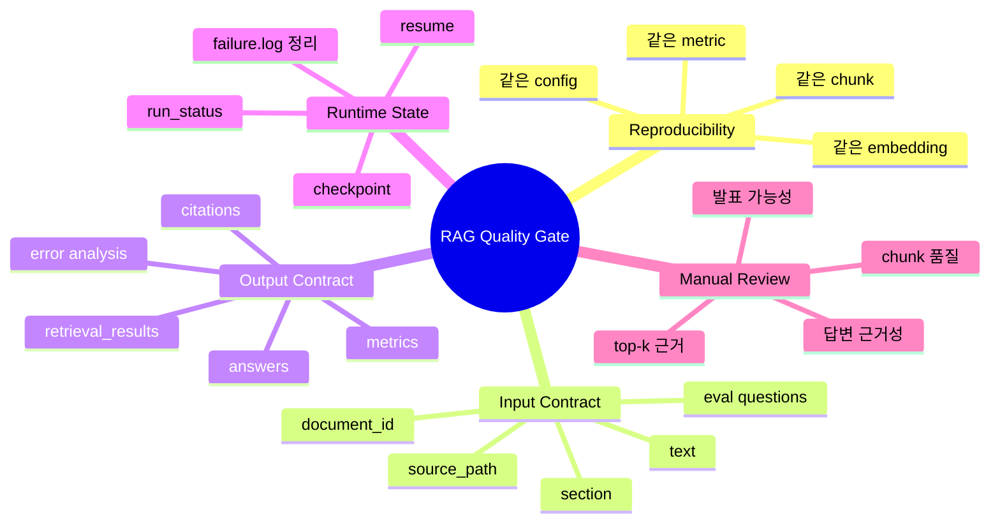

# RAG 품질 체크리스트

이 문서는 RAG 파이프라인이 "돌아간다"를 넘어, 실제 프로젝트에서 믿고 반복 실행할 수 있는지 확인하기 위한 체크리스트입니다.

## 품질 게이트 마인드맵



## 자동 체크 항목

아래 항목은 테스트로 확인합니다.

| 항목 | 확인 내용 | 테스트 |
| --- | --- | --- |
| 재현성 | 같은 config를 두 번 실행해도 ingest count, chunk, embedding, metric이 유지되는가 | `tests/test_rag_quality_gate.py` |
| 입력 계약 | parsed document와 chunk에 필수 column이 있는가 | `tests/test_rag_quality_gate.py` |
| 출력 계약 | retrieval payload, answer payload, citation payload가 기대 key를 갖는가 | `tests/test_rag_quality_gate.py` |
| citation 연결 | answer citation이 검색된 chunk 안에서 나오는가 | `tests/test_rag_quality_gate.py` |
| 평가 산출물 | evaluation과 error analysis CSV가 항상 생성되는가 | `tests/test_rag_quality_gate.py` |
| 실패 로그 상태 | 성공 재실행 후 오래된 `failure.log`가 남지 않는가 | `tests/test_experiments.py` |
| CSV 호환성 | UTF-8 BOM이 있는 평가/데이터 CSV도 읽히는가 | `tests/test_rag_pipeline.py`, `tests/test_validate_data.py` |

실행:

```bash
python -m pytest tests/test_rag_quality_gate.py
```

전체 회귀 확인:

```bash
python -m pytest
```

## 수동 체크 항목

실제 RFP 문서를 넣었을 때는 아래를 사람이 눈으로 확인합니다.

| 항목 | 확인 질문 |
| --- | --- |
| 문서 로딩 | 페이지/섹션/본문이 비어 있지 않은가? |
| chunk 품질 | chunk가 너무 길거나 짧지 않은가? 표/목록이 과하게 깨지지 않았는가? |
| 검색 품질 | 질문별 top-1 또는 top-k 안에 근거 chunk가 들어오는가? |
| 답변 품질 | 답변이 검색된 근거에서 나온 문장인가? |
| citation 품질 | citation의 `source_path`, `page`, `section`, `chunk_id`가 발표/보고에 쓸 수 있는가? |
| 실패 분석 | 실패 질문이 `bad_retrievals.csv`, `unsupported_answers.csv`, `failed_questions.csv`로 분리되는가? |
| 재실행 안전성 | 같은 config를 다시 실행했을 때 산출물이 예측 가능한 위치에 남는가? |

## 실제 문서 E2E 확인 순서

```bash
python scripts/check_rag_pipeline.py --config <config.yaml> --project-root .
python scripts/run_rag_ingest.py --config <config.yaml> --project-root .
python scripts/run_rag_retrieve.py --config <config.yaml> --project-root . --question "예산이 얼마야?"
python scripts/run_rag_chat.py --config <config.yaml> --project-root . --question "예산이 얼마야?"
python scripts/run_rag_chat.py --config <config.yaml> --project-root . --evaluate
```

확인할 산출물:

```text
experiments/{experiment_name}/
|-- parsed_documents.csv
|-- chunks.csv
|-- embeddings.jsonl
|-- retrieval_results.jsonl
|-- answers.jsonl
|-- evaluation_results.csv
|-- bad_retrievals.csv
|-- unsupported_answers.csv
|-- failed_questions.csv
|-- metrics.json
|-- run_status.json
`-- rag_ingest_checkpoint.json
```

## 통과 기준

smoke 데이터 기준:

- `retrieval_hit_rate == 1.0`
- `citation_correct_rate == 1.0`
- `not_found_rate == 0.0`
- `failure.log`가 남아 있지 않음
- `bad_retrievals.csv`, `unsupported_answers.csv`, `failed_questions.csv`가 header라도 생성됨

실제 RFP 데이터 기준:

- 첫 검증에서는 metric 1.0보다 실패 유형을 확인하는 것이 우선입니다.
- 실패가 있으면 retriever 문제인지, chunk 문제인지, answerer 문제인지 분리해서 기록합니다.
