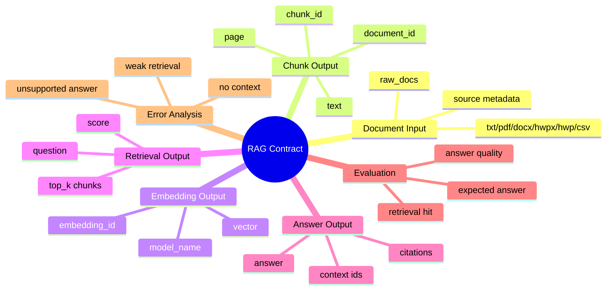

# RAG 파이프라인 스펙

이 문서는 RFP 분석 챗봇을 만들 때 사용할 RAG 파이프라인의 입력/출력 계약을 정리합니다.
목표는 구현을 바로 시작하기 전에, 각 단계가 무엇을 받고 무엇을 남겨야 하는지 먼저 맞추는 것입니다.

## 한 줄 요약

RAG 파이프라인은 **문서를 작은 근거 단위로 쪼개고, 질문과 관련 있는 근거를 검색한 뒤, 그 근거를 바탕으로 답변과 출처를 함께 반환하는 구조**입니다.

## RAG 계약 마인드맵



```text
raw document
  -> parsed document
  -> chunks
  -> embeddings
  -> retrieved chunks
  -> answer + citations
```

현재 config 기반 pipeline은 여기까지 구현되어 있습니다.
기본 config는 `memory` vector store를 사용해 `embeddings.jsonl` 기반 in-memory 검색을 수행합니다.
LangChain 엔진에서는 `vector_store.type: chroma`를 선택해 Chroma index를 저장/로드할 수 있습니다.
FAISS와 Elasticsearch는 아직 확장 후보입니다.

## 왜 계약이 필요한가

RAG는 단순히 LLM에게 문서를 넣고 답하게 만드는 작업이 아닙니다.
문서 파싱, chunking, embedding, 검색, 답변 생성이 모두 연결되어야 합니다.

계약이 없으면 다음 문제가 생깁니다.

- chunk가 어떤 문서/페이지에서 왔는지 추적하기 어렵습니다.
- 검색 결과가 답변에 제대로 쓰였는지 확인하기 어렵습니다.
- 답변의 출처를 발표나 데모에서 보여주기 어렵습니다.
- 모델이 모르는 내용을 꾸며냈는지 판단하기 어렵습니다.

그래서 RAG에서는 **답변 자체보다 답변의 근거를 남기는 것**이 중요합니다.

## 폴더 구조 초안

```text
data/
|-- raw_docs/              # 원본 RFP 문서
|-- processed_docs/        # 파싱/청킹 결과
`-- rag_sample/            # 작은 txt 기반 샘플 문서

experiments/
`-- rag_langchain/         # 검색/답변 실험 산출물
    `-- vector_store/      # Chroma 같은 선택형 index 저장 위치

src/
`-- rag/
    |-- document_loader.py
    |-- chunker.py
    |-- embedder.py
    |-- vector_store.py
    |-- retriever.py
    |-- answerer.py
    `-- pipeline.py

scripts/
|-- run_rag_ingest.py
|-- run_rag_retrieve.py
`-- run_rag_chat.py
```

처음 sample 데이터는 작은 `.txt` 문서이지만, loader 자체는 `txt`, `pdf`, `docx`, `hwpx`, `hwp`, `csv`를 대상으로 합니다.

## 현재 구현된 config 기반 pipeline

현재 구현은 LangChain 엔진을 기본으로 두고, 외부 모델이나 별도 vector index 없이도 RAG 운영 흐름을 검증할 수 있게 구성되어 있습니다.
기본 config는 local hashing embedding과 local extractive answerer를 사용하므로 팀원 PC에서도 빠르게 산출물 계약을 확인할 수 있습니다.
필요하면 config에서 Chroma, Ollama, OpenAI 같은 LangChain provider를 선택해 실제 운영 후보를 검증할 수 있습니다.

실행 config:

```text
configs/experiments/rag/rag_langchain.yaml
```

샘플 데이터:

```text
data/rag_sample/
|-- rfp_sample.txt
`-- eval_questions.csv
```

실행 명령:

```bash
python scripts/run_rag_ingest.py --config configs/experiments/rag/rag_langchain.yaml --project-root .
python scripts/run_rag_retrieve.py --config configs/experiments/rag/rag_langchain.yaml --project-root . --question "예산이 얼마야?"
python scripts/run_rag_chat.py --config configs/experiments/rag/rag_langchain.yaml --project-root . --question "예산이 얼마야?"
python scripts/run_rag_chat.py --config configs/experiments/rag/rag_langchain.yaml --project-root . --evaluate
```

현재 구현된 단계:

- `document_loader.py`: txt/pdf/docx/hwpx/hwp 문서를 document row로 변환
- `engines/langchain.py`: LangChain 기반 chunking, embedding, retrieval, answer 실행과 표준 artifact 변환
- `engines/local.py`: dependency-free smoke/fallback 실행
- `chunker.py`: local fallback에서 document row를 검색 가능한 chunk row로 변환
- `embedder.py`: local hashing embedding으로 smoke/fallback embedding 생성
- `vector_store.py`: local fallback에서 질문 embedding과 chunk embedding을 비교해 top-k 검색
- `retriever.py`: local keyword/semantic/hybrid 검색
- `answerer.py`: 검색된 chunk에서 답변 문장 추출 및 citation 생성
- `pipeline.py`: ingest/retrieve/chat/evaluation 실행과 산출물 저장

현재 산출물:

```text
experiments/rag_langchain/
|-- parsed_documents.csv
|-- chunks.csv
|-- embeddings.jsonl
|-- retrieval_results.jsonl
|-- answers.jsonl
|-- evaluation_results.csv
|-- bad_retrievals.csv
|-- unsupported_answers.csv
|-- failed_questions.csv
|-- metrics.json
|-- config.yaml
|-- run_status.json
|-- failure.log         # 실패한 경우
`-- run_info.json
```

현재 metric:

- `retrieval_hit_rate`
- `answer_contains_expected_rate`
- `citation_correct_rate`
- `not_found_rate`

검색 방식 비교:

```bash
python scripts/compare_rag_retrievers.py --project-root .
```

기본 비교 대상은 `rag_keyword.yaml`, `rag_semantic.yaml`, `rag_hybrid.yaml`, `rag_langchain.yaml`입니다.
비교 결과는 `reports/rag_retriever_comparison.csv`와 `reports/rag_retriever_comparison.json`에 저장됩니다.

이 구현의 목적은 성능이 아니라, RAG 프로젝트에서도 config 기반 실행, embedding 산출물 저장, citation 추적, 평가 산출물 저장, 실험 요약이 끝까지 이어지는지 확인하는 것입니다.
실행 상태는 `run_status.json`에 남기고, 실패한 경우 `failure.log`에 traceback과 에러 메시지를 남깁니다.

## 1. Document Input

원본 문서를 파싱한 뒤에는 최소한 아래 정보를 보존합니다.

```csv
document_id,title,source_path,page,section,text
rfp_sample,샘플 RFP,data/rag_sample/rfp_sample.txt,1,사업 개요,"본 사업의 예산은 5천만 원입니다."
```

필수 컬럼:

- `document_id`: 문서를 구분하는 id
- `title`: 문서 제목
- `source_path`: 원본 파일 경로
- `page`: 페이지 번호 또는 없으면 1
- `section`: 문서 안의 구역명
- `text`: 파싱된 본문

원칙:

- 답변에 출처를 붙이려면 `document_id`, `source_path`, `page`를 잃지 않아야 합니다.
- 파일 형식이 달라도 downstream에서는 같은 document row 형태를 사용합니다.
- PDF는 페이지 단위, txt/docx/hwpx는 섹션/본문 단위로 시작합니다.
- HWP는 `olefile` 기반 best-effort 추출이라 실제 문서에 따라 추가 보정이 필요할 수 있습니다.

지원 파일 형식:

| 형식 | 현재 처리 방식 |
|---|---|
| txt | `#`, `##` heading을 기준으로 section 분리 |
| pdf | `pypdf`로 페이지별 text 추출 |
| docx | zip 내부 `word/document.xml`에서 paragraph 추출 |
| hwpx | zip 내부 XML에서 paragraph 추출 |
| hwp | `olefile`로 BodyText section을 best-effort 추출 |
| csv | 각 행을 하나의 document로 읽고 공고번/사업명/텍스트 등 컬럼 매핑, 나머지 컬럼은 `meta_*`로 보존 |

## 2. Chunk Output

검색은 문서 전체가 아니라 chunk 단위로 수행합니다.

```csv
chunk_id,document_id,source_path,page_start,page_end,section,text,token_count
rfp_sample_chunk_0001,rfp_sample,data/rag_sample/rfp_sample.txt,1,1,사업 개요,"본 사업의 예산은 5천만 원입니다.",18
```

필수 컬럼:

- `chunk_id`: chunk 고유 id
- `document_id`: 원본 문서 id
- `source_path`: 원본 파일 경로
- `page_start`: chunk 시작 페이지
- `page_end`: chunk 끝 페이지
- `section`: 문서 구역명
- `text`: 검색과 답변 생성에 사용할 본문
- `token_count`: 대략적인 token 또는 단어 수

config 후보:

```yaml
rag:
  splitter:
    type: recursive_character
    chunk_size: 500
    chunk_overlap: 80
```

LangChain 기본 엔진에서는 `rag.splitter`를 우선 사용합니다.
local fallback이나 예전 config는 `rag.chunk.size`, `rag.chunk.overlap` 형태도 읽을 수 있습니다.
실제 RFP 문서에서는 문단/섹션 기준 chunking을 우선 검토합니다.

## 3. Embedding / Vector Store Output

chunk를 embedding으로 바꾼 뒤에는 vector와 metadata가 함께 관리되어야 합니다.
기본 config에서는 `hashing-char-ngram-v1` local embedding을 사용합니다.
이 방식은 외부 모델 없이 vector retrieval 계약을 검증하기 위한 것입니다.
LangChain 엔진에서는 config로 HuggingFace, Ollama, OpenAI embedding provider를 선택할 수 있습니다.

파일 예시:

```text
experiments/rag_langchain/
|-- chunks.csv
|-- embeddings.jsonl
`-- vector_store/          # Chroma 사용 시 생성되는 선택형 index
```

`embeddings.jsonl` 예시:

```json
{"chunk_id":"rfp_sample_chunk_0001","embedding_model":"sentence-transformers/paraphrase-multilingual-MiniLM-L12-v2","vector":[0.01,0.02,0.03]}
```

필수 정보:

- `chunk_id`
- `embedding_model`
- `vector`

원칙:

- vector store가 무엇이든 chunk metadata와 다시 연결되어야 합니다.
- embedding model 이름을 남겨야 나중에 검색 결과를 비교할 수 있습니다.
- `vector_store.type: memory`는 `embeddings.jsonl`을 읽어 in-memory 검색을 수행합니다.
- `vector_store.type: chroma`는 LangChain Chroma provider를 통해 index를 저장하고 다시 로드합니다.
- FAISS/Elasticsearch는 config 계약 후보이지만 아직 runtime adapter는 없습니다.

## 4. Retrieval Output

질문을 넣으면 top-k chunk를 반환합니다.

```json
{
  "question": "예산이 얼마야?",
  "top_k": 3,
  "retrieved_chunks": [
    {
      "rank": 1,
      "chunk_id": "rfp_sample_chunk_0001",
      "score": 0.87,
      "document_id": "rfp_sample",
      "source_path": "data/rag_sample/rfp_sample.txt",
      "page": 1,
      "section": "사업 개요",
      "text": "본 사업의 예산은 5천만 원입니다."
    }
  ]
}
```

필수 정보:

- `question`
- `top_k`
- `rank`
- `chunk_id`
- `score`
- `document_id`
- `source_path`
- `page`
- `section`
- `text`

검색 결과는 `retrieval_results.jsonl`로 저장합니다.

## 5. Answer Output

답변은 반드시 근거와 함께 저장합니다.

```json
{
  "question": "예산이 얼마야?",
  "answer": "이 사업의 예산은 5천만 원입니다.",
  "citations": [
    {
      "chunk_id": "rfp_sample_chunk_0001",
      "document_id": "rfp_sample",
      "source_path": "data/rag_sample/rfp_sample.txt",
      "page": 1,
      "section": "사업 개요"
    }
  ],
  "status": "answered"
}
```

필수 정보:

- `question`
- `answer`
- `citations`
- `status`

status 후보:

```text
answered: 근거를 찾고 답변함
not_found: 관련 근거가 부족함
needs_review: 답변은 했지만 사람이 확인해야 함
error: 실행 중 오류 발생
```

중요한 원칙:

- 검색된 근거가 없거나 약하면 답을 꾸며내지 않습니다.
- 이 경우 `status: not_found`와 함께 “문서에서 확인하지 못했습니다”라고 답합니다.

## 6. Evaluation Input

RAG 평가는 label이 있는 질문 세트가 있을 때 가능합니다.

```csv
question,expected_answer,expected_chunk_ids
예산이 얼마야?,5천만 원,rfp_sample_chunk_0001
마감일은 언제야?,2026년 7월 10일,rfp_sample_chunk_0002
참가 자격은 뭐야?,최근 3년 이내 유사 사업 수행 경험,rfp_sample_chunk_0003
```

필수 컬럼:

- `question`
- `expected_answer`
- `expected_chunk_ids`

처음에는 사람이 만든 작은 평가 질문 5~10개로 시작합니다.

## 7. Evaluation Output

평가 결과는 질문별 결과와 전체 metric을 나눠 저장합니다.

질문별 결과:

```csv
question,retrieval_hit,answer_contains_expected,citation_correct,status
예산이 얼마야?,true,true,true,answered
```

전체 metric:

```json
{
  "retrieval_hit_rate": 1.0,
  "answer_contains_expected_rate": 1.0,
  "citation_correct_rate": 1.0,
  "not_found_rate": 0.0
}
```

초기 metric 후보:

- `retrieval_hit_rate`: 기대 chunk가 검색 결과 top-k 안에 있는 비율
- `answer_contains_expected_rate`: 답변에 기대 답변 문자열이 포함된 비율
- `citation_correct_rate`: citation이 기대 chunk와 맞는 비율
- `not_found_rate`: 답변하지 못한 질문 비율

LLM judge 기반 평가는 나중에 추가합니다.
초기에는 사람이 이해하기 쉬운 rule 기반 평가부터 시작합니다.

## 8. Error Analysis

분류 프로젝트의 `wrong_predictions.csv`에 대응되는 RAG 오답노트입니다.

후보 산출물:

```text
failed_questions.csv
bad_retrievals.csv
unsupported_answers.csv
```

의미:

- `failed_questions.csv`: 답변하지 못했거나 에러가 난 질문
- `bad_retrievals.csv`: 기대 chunk를 검색하지 못한 질문
- `unsupported_answers.csv`: 답변은 했지만 citation 근거가 약한 질문

RAG에서는 “답변이 그럴듯한가”보다 “문서 근거로 지지되는가”를 우선 봅니다.
현재 config 기반 pipeline은 평가 실행 시 위 세 파일을 자동 생성합니다.
실패가 없더라도 header만 있는 빈 CSV를 남겨, 다음 실험과 산출물 구조를 항상 같게 유지합니다.

## 9. Config 초안

```yaml
experiment:
  name: rag_langchain
  seed: 42

paths:
  raw_docs_dir: data/rag_sample
  output_dir: experiments/rag_langchain

artifact_policy:
  run_id:
  on_existing: overwrite

rag:
  engine: langchain
  loader:
    file_types: [txt, pdf, docx, hwpx, hwp, csv]
  splitter:
    type: recursive_character
    chunk_size: 500
    chunk_overlap: 80
  checkpoint:
    enabled: true
    resume: true
  embedding:
    provider: local
    model_name: hashing-char-ngram-v1
    dimension: 64
  vector_store:
    type: memory
    path:
    collection_name: rag_langchain
  retriever:
    method: similarity
    top_k: 3
    score_threshold: 0.0
  reranker:
    enabled: false
    provider: huggingface
    model_name:
    top_k: 3
  answerer:
    mode: extractive
    provider: local
    fallback_message: 문서에서 확인하지 못했습니다.

evaluation:
  questions_path: data/rag_sample/eval_questions.csv

metric:
  monitor: retrieval_hit_rate
  mode: max
```

현재 기본 config는 `answerer.mode: extractive`, `answerer.provider: local`로 시작합니다.
즉 LLM 답변 생성 전에, 검색된 chunk에서 문장을 찾아 반환하는 방식으로 파이프라인과 산출물 계약을 먼저 검증합니다.

## 10. Smoke Test 목표

처음 RAG config 실행의 목표는 성능이 아닙니다.

목표:

- txt 문서를 읽을 수 있다.
- chunk를 만들 수 있다.
- embedding 산출물을 만들 수 있다.
- 질문과 관련 있는 chunk를 찾을 수 있다.
- 답변에 citation을 붙일 수 있다.
- 실험 산출물을 저장할 수 있다.
- summary에 RAG metric을 포함할 수 있다.

샘플 질문:

```text
예산이 얼마야?
마감일은 언제야?
참가 자격은 뭐야?
```

예상 답변:

```text
이 사업의 예산은 5천만 원입니다. [source: rfp_sample, page 1]
```

## 11. 구현 순서

1. `configs/experiments/rag/rag_langchain.yaml` 작성
2. `data/rag_sample/rfp_sample.txt` 작성
3. `src/rag/document_loader.py` 작성
4. `src/rag/engines/base.py` 작성
5. `src/rag/engines/local.py` 작성
6. `src/rag/engines/langchain.py` 작성
7. local fallback용 `chunker.py`, `embedder.py`, `vector_store.py`, `retriever.py` 작성
8. `scripts/run_rag_ingest.py` 작성
9. `scripts/run_rag_retrieve.py` 작성
10. `scripts/run_rag_chat.py` 작성
11. RAG config 실행 검증 추가
12. 실험 summary에 RAG metric 연결

현재는 LangChain 엔진, local fallback, in-memory retrieval, Chroma vector store, local extractive answerer, Ollama/OpenAI answerer provider까지 구현되어 있습니다.
그 다음 단계에서는 실제 운영 embedding/LLM provider를 검증하고, 필요해지면 reranker를 별도 구현체로 붙입니다.
## 실전형 RAG Config 계약

현재 기본 runtime은 `langchain` engine, `local` embedding, `memory` vector store,
`similarity` retriever, `extractive/local` answerer를 실제 실행합니다.
Ollama/OpenAI 같은 생성형 답변은 LangChain 엔진에서 config로 선택할 수 있습니다.

```yaml
rag:
  engine: langchain

  embedding:
    provider: openai
    model_name: text-embedding-3-small
    dimension: 768

  vector_store:
    type: chroma
    path: vector_store
    collection_name: rfp_docs

  retriever:
    method: similarity
    top_k: 5
    score_threshold: 0.2

  reranker:
    enabled: false
    provider: huggingface
    model_name:
    top_k: 3

  answerer:
    mode: llm
    provider: openai
    model_name: gpt-4.1-mini
    temperature: 0.2
    max_tokens: 512
    api_key_env: OPENAI_API_KEY
    require_citations: true
    fallback_message: 문서에서 확인하지 못했습니다.
```

위 예시는 LangChain runtime에서 실제로 선택 가능한 provider를 기준으로 작성한 운영 후보입니다.
HuggingFace embedding은 `provider: huggingface`로 바꿔 실험할 수 있지만, LLM answerer의 HuggingFace provider와 reranker는 아직 확장 후보입니다.

지원 후보:

- `rag.engine`: `langchain`, `local`
- `rag.embedding.provider`: `local`, `huggingface`, `ollama`, `openai`
- `rag.vector_store.type`: `memory`, `chroma`
- `rag.retriever.method`: `similarity` for LangChain, `keyword`/`semantic`/`hybrid` for local fallback
- `rag.reranker.provider`: `local`, `huggingface` as config contract only
- `rag.answerer.mode`: `extractive`, `llm`
- `rag.answerer.provider`: `local`, `openai`, `ollama` in LangChain runtime; `huggingface` is an extension/example candidate

LLM answerer 확장 계약:

```yaml
rag:
  answerer:
    mode: llm
    provider: ollama
    model_name: llama3.1
    base_url: http://localhost:11434
    temperature: 0.2
    max_tokens: 512
    require_citations: true
```

주의: `faiss`, `elasticsearch`, `reranker`, `answerer.provider: huggingface`는 아직 확장 후보입니다.
`hybrid` retriever는 local fallback에서 keyword + semantic 점수 결합 방식으로 동작합니다.

## RAG Adapter 구현 상태

RAG runtime은 engine registry를 통해 config에 맞는 구현체를 선택합니다.

실제 구현된 adapter:

- `rag.engine: langchain`: LangChain 기반 splitter/embedding/vector store/answerer 실행
- `rag.engine: local`: dependency-free smoke/fallback 실행
- `embedding.provider: local`: hashing-char-ngram 기반 local embedding
- `embedding.provider: huggingface`: LangChain HuggingFaceEmbeddings 기반 embedding
- `embedding.provider: ollama`: LangChain OllamaEmbeddings 기반 embedding
- `embedding.provider: openai`: LangChain OpenAIEmbeddings 기반 embedding
- `vector_store.type: memory`: `embeddings.jsonl`을 읽어 in-memory retrieval 수행
- `vector_store.type: chroma`: LangChain 엔진에서 Chroma vector store 사용
- `retriever.method: similarity`: LangChain/vector 기반 similarity 검색
- `retriever.method: keyword`: token overlap 기반 검색
- `retriever.method: semantic`: local hashing vector 기반 의미 검색
- `retriever.method: hybrid`: keyword 점수와 semantic 점수의 weighted merge
- `answerer.mode: extractive`, `answerer.provider: local`: 검색 chunk에서 문장 추출
- `answerer.mode: llm`, `answerer.provider: ollama/openai`: LangChain 엔진에서 생성형 답변 호출

계약만 있고 아직 runtime 구현은 없는 adapter:

- `vector_store.type: faiss`
- `vector_store.type: elasticsearch`
- `reranker.enabled: true`
- `answerer.mode: llm`, `answerer.provider: huggingface`

새 구현체를 붙일 때는 `src/rag/engines/` 또는 `src/rag/adapters.py`의 builder를 갱신하고,
`scripts/check_rag_pipeline.py` validation 계약과 artifact 변환 테스트를 함께 갱신합니다.

## RAG Ingest Checkpoint / Resume

RAG ingest는 단계별 산출물을 checkpoint처럼 재사용합니다.

```yaml
rag:
  checkpoint:
    enabled: true
    resume: true
```

현재 resume 단위:

- `parsed_documents.csv`: 문서 로딩 완료 산출물
- `chunks.csv`: chunking 완료 산출물
- `embeddings.jsonl`: embedding 완료 산출물
- `rag_ingest_checkpoint.json`: 마지막 완료 단계와 row count 기록

`resume: true`이면 이미 존재하는 단계 산출물을 다시 계산하지 않고 다음 단계로 넘어갑니다.
예를 들어 `parsed_documents.csv`, `chunks.csv`가 있고 `embeddings.jsonl`만 없으면 embedding 단계만 다시 실행합니다.

주의: 현재 구현은 단계별 artifact resume입니다. 문서 수천 개를 처리하다가 한 문서 중간에서 끊겼을 때
그 문서 내부 위치까지 이어가는 세밀한 resume은 아직 구현하지 않았습니다.
