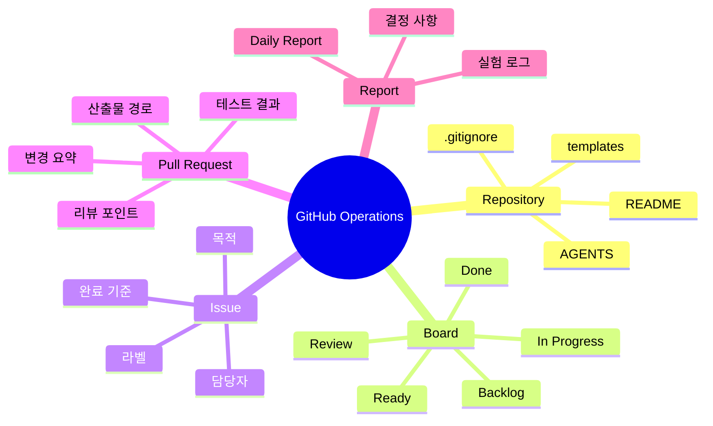

# GitHub 운영 준비 가이드

이 문서는 프로젝트를 GitHub에 올린 뒤 팀원이 같은 방식으로 일할 수 있게 만드는 운영 기준입니다.

## 운영 마인드맵



## GitHub에 올리기 전 확인

- `README.md`가 현재 프로젝트 방향을 설명합니다.
- `AGENTS.md`가 LLM 작업 규칙을 설명합니다.
- `.gitignore`가 원본 데이터, checkpoint, 대용량 산출물을 제외합니다.
- `.github/ISSUE_TEMPLATE/`와 `.github/pull_request_template.md`가 있습니다.
- `configs/`, `scripts/`, `src/`, `docs/`, `tests/`의 README가 기본 역할을 설명합니다.
- `python -m pytest`가 통과합니다.

## Repository 설정 추천

초기 공유 전에는 main 중심으로 작업해도 괜찮습니다. 팀 작업이 시작되면 아래 규칙을 켭니다.

| 항목 | 추천 설정 | 이유 |
| --- | --- | --- |
| default branch | `main` | 제출 가능한 기준선을 명확히 둡니다. |
| branch protection | main 직접 push 제한 | 실수로 안정 버전을 덮어쓰지 않게 합니다. |
| required review | 1명 이상 | 서로 작업 맥락을 확인합니다. |
| required checks | 가능하면 `python -m pytest` | 최소한의 회귀를 막습니다. |
| squash merge | 허용 | 작은 커밋이 많아도 히스토리를 읽기 쉽게 정리합니다. |

## Kanban 컬럼

```text
Backlog -> Ready -> In Progress -> Review -> Done
```

- `Backlog`: 언젠가 할 수 있지만 아직 시작 조건이 정리되지 않은 일
- `Ready`: 목적, 담당자, 완료 기준이 정리되어 바로 시작할 수 있는 일
- `In Progress`: 담당자가 실제 작업 중인 일
- `Review`: PR, 문서, 실험 결과 확인이 필요한 일
- `Done`: 완료 기준을 만족하고 필요한 문서/산출물이 남은 일

## 라벨 규칙

| 라벨 | 의미 |
| --- | --- |
| `task` | 일반 작업 |
| `data` | 데이터 수집, 전처리, 검증 |
| `rag` | RAG 문서 처리, 검색, 답변, 평가 |
| `experiment` | 실험 config, 실행, 결과 분석 |
| `docs` | 문서, 발표 자료, README |
| `app` | 데모, API, UI |
| `bug` | 오류 수정 |
| `blocked` | 결정, 권한, 데이터가 필요해 멈춘 일 |

## Issue 작성 기준

Issue에는 최소한 아래 항목이 있어야 합니다.

- 목적: 왜 하는 일인지
- 작업 내용: 무엇을 바꿀지
- 완료 기준: 어떤 상태면 끝인지
- 확인 방법: 어떤 명령, 문서, 산출물로 확인할지
- 담당자: 누가 책임지고 마무리할지

## PR 작성 기준

PR에는 아래를 남깁니다.

- 변경 요약
- 실행한 테스트와 결과
- 생성된 산출물 경로
- 리뷰어가 특히 봐야 하는 부분
- 문서 갱신 여부

RAG 작업이면 답변만 보지 말고 retrieval 결과와 citation도 함께 확인합니다.

## Daily Report 운영

Daily Report는 감시용 문서가 아니라 막힘을 빨리 발견하기 위한 문서입니다.

- 어제 한 일
- 오늘 할 일
- 막힌 점
- 공유 링크
- 다음 액션

작성 위치는 `reports/daily_report_template.md`를 기준으로 합니다.
