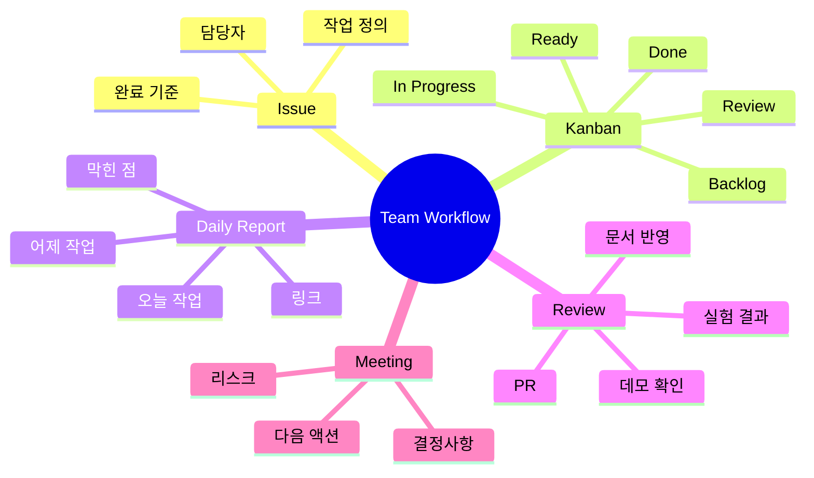

# 팀 운영 가이드

이 문서는 킥오프 이후 팀원이 실제로 어떻게 일하면 되는지 설명하기 위한 운영 가이드입니다.

## 팀 운영 마인드맵



## 기본 원칙

- 모든 작업은 Issue에서 시작합니다.
- 작업자는 브랜치를 만들고 PR로 공유합니다.
- 실험은 config와 결과 경로를 남깁니다.
- 막힌 일은 혼자 오래 붙잡지 않고 Daily Report나 회의에서 공유합니다.
- 발표 자료에는 주장보다 근거를 먼저 남깁니다.

## Kanban 보드

권장 컬럼:

```text
Backlog -> Ready -> In Progress -> Review -> Done
```

컬럼 의미:

- `Backlog`: 언젠가 해야 할 일
- `Ready`: 지금 바로 시작 가능한 일
- `In Progress`: 누군가 작업 중인 일
- `Review`: PR, 결과 확인, 발표 반영 대기
- `Done`: 완료 기준을 만족한 일

## Issue 라벨

```text
task: 일반 작업
experiment: 모델/실험 작업
data: 데이터 수집, 정제, 검증
docs: 문서, 발표 자료
app: 데모 앱, API, 화면
bug: 오류 수정
blocked: 외부 도움이나 결정이 필요한 상태
```

## 역할별 첫 작업 예시

PM:
- GitHub 보드와 Issue를 정리합니다.
- 일정과 완료 기준을 관리합니다.
- 막힌 일을 확인하고 우선순위를 조정합니다.

Data Engineer:
- 데이터 구조를 확인합니다.
- Data Contract를 맞춥니다.
- `dataset_info.json`, `class_map.json`을 관리합니다.

Experiment Lead:
- smoke test를 통과시킵니다.
- baseline 실험을 실행합니다.
- 실험 결과와 다음 액션을 기록합니다.

Application Engineer:
- 추론 입력/출력 형태를 확인합니다.
- 데모 앱 또는 간단한 인터페이스를 준비합니다.
- 모델 artifact 사용 방법을 정리합니다.

Presentation Lead:
- 문제 정의와 평가 기준을 정리합니다.
- 실험 결과를 발표 스토리로 연결합니다.
- 데모 흐름과 스크린샷을 관리합니다.

## Daily Report

매일 짧게 작성합니다. 목적은 감시가 아니라 막힌 일을 빨리 발견하는 것입니다.

템플릿 위치:

```text
.github/ISSUE_TEMPLATE/daily_report.md
```

작성 기준:

- 어제/이전 작업
- 오늘 할 작업
- 막힌 점
- 공유할 링크
- 다음 액션

## 회의 흐름

1. 각자 어제 한 일과 오늘 할 일을 말합니다.
2. 막힌 점을 먼저 확인합니다.
3. 실험 결과는 metric과 다음 액션 중심으로 공유합니다.
4. 새 작업은 Issue로 만들고 담당자를 정합니다.
5. 회의 후 Kanban 상태를 갱신합니다.
