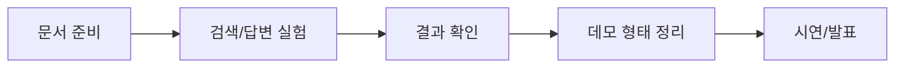

# 팀원이 처음 볼 문서

이 디렉터리는 킥오프와 첫 작업 안내에 필요한 핵심 문서만 모아둔 곳입니다.

세부 구현 문서는 `docs/md/`에 남겨둡니다. 처음부터 전부 읽을 필요는 없습니다.

## 먼저 볼 문서 6개

| 순서 | 문서 | 목적 |
| --- | --- | --- |
| 1 | [kickoff.md](kickoff.md) | 프로젝트가 무엇이고 어떻게 설명할지 |
| 2 | [operations.md](operations.md) | Issue, PR, Daily Report를 어떻게 쓸지 |
| 3 | [workflow.md](workflow.md) | Data 준비부터 발표까지 어떻게 이어지는지 |
| 4 | [roles.md](roles.md) | 내 역할이 처음 무엇을 하면 되는지 |
| 5 | [first-week.md](first-week.md) | 첫 주에 어떤 작업부터 할지 |
| 6 | [rehearsal.md](rehearsal.md) | 공유 전 RAG 파이프라인을 어떻게 검증할지 |

## 큰 흐름

## 역할별 핵심만 보기

| 역할 | 핵심 책임 | 먼저 볼 곳 |
| --- | --- | --- |
| PM | 일정, 보드, 역할 배정, 막힘 관리 | [roles.md](roles.md)의 PM |
| Data Engineer | 문서 확보, 로딩 확인, 평가 질문 준비 | [roles.md](roles.md)의 Data Engineer |
| Experiment Lead / Model Engineer | config 실험, 검색/답변 결과 확인, metric 해석 | [roles.md](roles.md)의 Experiment Lead / Model Engineer |
| Application Engineer | 데모/API 후보, 입출력 형태, citation 표시 방식 | [roles.md](roles.md)의 Application Engineer |
| Presentation Lead | 문제 설명, 쉬운 용어, 발표 흐름과 시각 자료 | [roles.md](roles.md)의 Presentation Lead |

## 세부 문서는 언제 보는가

| 필요 상황 | 참고 문서 |
| --- | --- |
| RAG 입력/출력 계약이 필요할 때 | [../md/rag/RAG_PIPELINE_SPEC.md](../md/rag/RAG_PIPELINE_SPEC.md) |
| 데이터 형식을 맞춰야 할 때 | [../md/data/DATA_CONTRACT.md](../md/data/DATA_CONTRACT.md) |
| 실험 실행 방법이 필요할 때 | [../md/experiments/EXPERIMENT_GUIDE.md](../md/experiments/EXPERIMENT_GUIDE.md) |
| 공유 전 전체 리허설이 필요할 때 | [rehearsal.md](rehearsal.md) |
| 노트북 설명을 보강할 때 | [../md/experiments/NOTEBOOK_USAGE_CHECKLIST.md](../md/experiments/NOTEBOOK_USAGE_CHECKLIST.md) |
| LLM에게 작업을 맡길 때 | [../llm/README.md](../llm/README.md) |

## 처음 설명할 때 하지 않을 것

- 모든 문서를 읽으라고 하지 않습니다.
- FastAPI나 앱 구현을 최종 목표처럼 말하지 않습니다.
- 실제 데이터가 없는 상태에서 parser 품질을 확정된 것처럼 말하지 않습니다.
- 실험을 오래 반복하는 장기 운영 프로젝트처럼 설명하지 않습니다.

## 발표까지 남기면 되는 것

- 사용한 문서와 질문 예시
- 검색된 근거 chunk
- 답변과 citation
- metric 또는 실패 사례
- 한계와 개선 가능성
