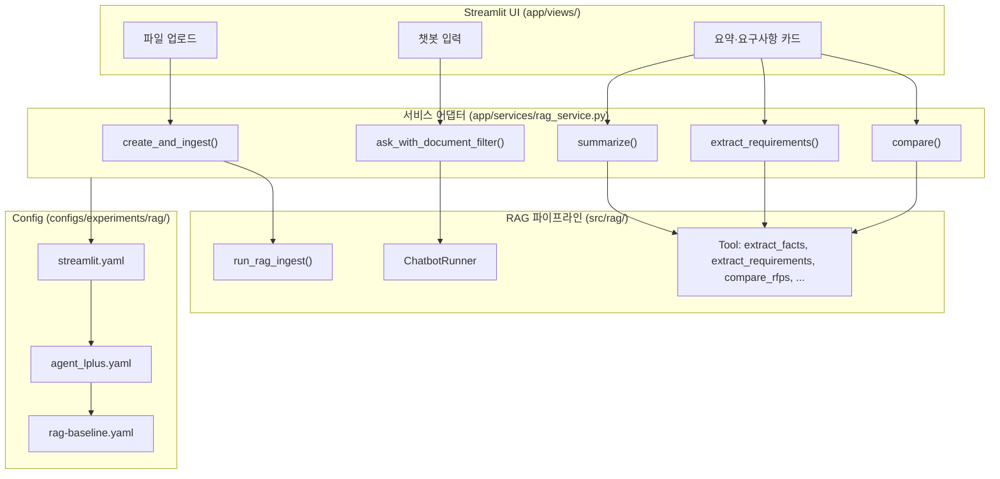
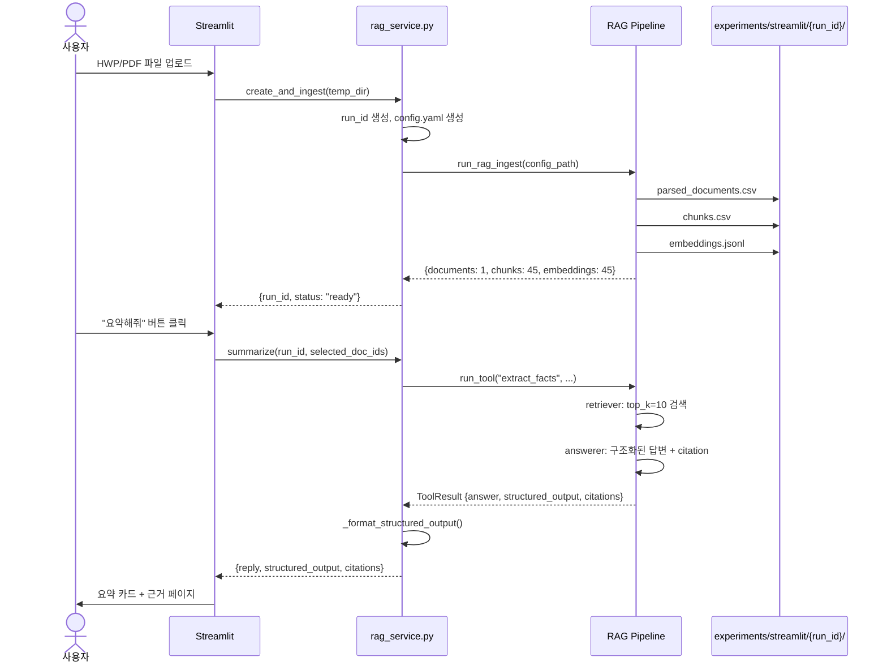
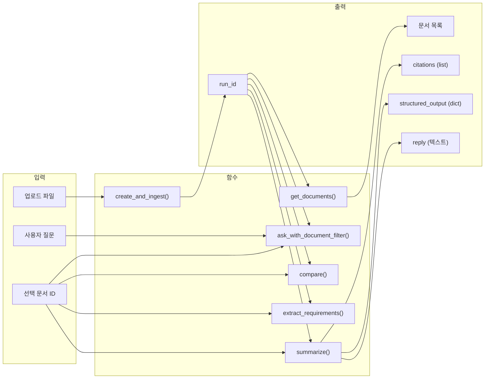
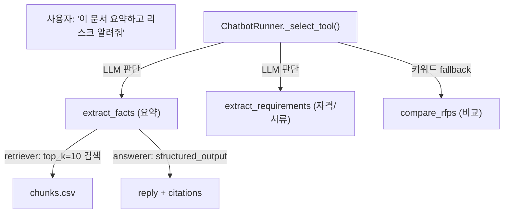

# 아키텍처 개요 — 입찰메이트 RAG 서비스

> 팀원이 코드 없이 전체 구조를 이해할 수 있도록 그림과 함께 설명합니다.
> 코드 구현 위치는 부록에 표시했습니다.

---

## 1. 전체 3계층 구조



**핵심:** UI는 `rag_service.py`만 바라본다. `src/rag/`는 import하지 않는다.

---

## 2. 데이터 흐름 — 업로드부터 응답까지



---

## 3. Config 상속 체인 — 왜 3개인가

```
streamlit.yaml (22줄)
  │  base_config: agent/agent_lplus.yaml
  │  override: loader.file_types, chatbot.enabled
  │
  ▼
agent_lplus.yaml (175줄)
  │  base_config: ../rag-baseline.yaml
  │  정의: Tool 5종, Schema 4종, 프롬프트
  │
  ▼
rag-baseline.yaml (55줄)
     정의: embedding(ollama), retriever(similarity, top_k=3),
           answerer(openai, gpt-5-mini), chunk_size(500)
```

| 계층 | 누가 건드리나 | 언제 |
|------|-------------|------|
| `rag-baseline.yaml` | Experiment Lead | 임베딩·검색·답변기 기본값 변경 |
| `agent_lplus.yaml` | Experiment Lead | Tool 추가, 프롬프트 튜닝, schema 정의 |
| `streamlit.yaml` | 자동 (코드) | `create_and_ingest()`가 paths만 동적 override |

**실험 config를 바꾸면 서비스도 자동 반영된다.** streamlit.yaml은 건드릴 필요가 없다.

---

## 4. 서비스 함수 계약 — UI가 호출하는 6개 함수



모든 함수의 응답은 동일한 스키마:

```python
{
    "reply": str,                       # 사용자에게 보여줄 텍스트
    "tool_used": str | None,            # 어떤 Tool이 실행됐는지
    "structured_output": dict | None,   # 구조화된 결과 (카드 UI용)
    "citations": [                      # 근거 목록
        {"source_path": str, "page": str, "chunk_id": str, ...}
    ],
    "status": "ok" | "not_found" | "error",
    "error": str | None
}
```

---

## 5. Tool — 챗봇 기능의 구성 단위



**Tool 하나 = retriever + answerer + prompt_template**, 전부 config에서 정의.

새 Tool 추가 방법:
```yaml
# streamlit.yaml 또는 agent_lplus.yaml
agent:
  tools:
    summarize_risks:                    # ← 이 10줄이면 새 기능 완성
      description: "RFP 문서의 리스크/독소조항을 분석합니다."
      retriever:
        top_k: 8
      answerer:
        prompt_template: |
          아래 근거에서 계약상 불리한 조항을 찾아내라.
          {context}
          질문: {question}
        temperature: 0.1
```

챗봇이 `description`을 읽고 "리스크" 키워드에 이 Tool을 자동 선택한다. 코드 변경 없음.

---

## 6. 디렉토리 구조 — 핵심만

```
프로젝트 루트/
│
├── configs/experiments/rag/       ← 실험 config (Experiment Lead 담당)
│   ├── rag-baseline.yaml          임베딩·검색·답변기 기본값
│   ├── agent/agent_lplus.yaml     Tool·Schema·프롬프트
│   └── streamlit.yaml             서비스 전용 (위 둘 상속, paths만 override)
│
├── src/rag/                       ← RAG 구현체 (건드릴 일 거의 없음)
│   ├── pipeline.py                ingest/retrieve/chat/agent 진입점
│   ├── chatbot.py                 ChatbotRunner (Tool 선택 + 실행)
│   └── tool.py                    Tool 정의 (retriever + answerer 래핑)
│
├── app/                           ← Streamlit 웹앱 ★
│   ├── services/rag_service.py    서비스 어댑터 (UI↔RAG 다리)
│   ├── views/rag_contract_demo.py 계약 검증 데모 페이지
│   └── examples/                  CLI/UI 연동 예제 (참고용)
│
├── experiments/streamlit/{run_id}/ ← 서비스 산출물 (자동 생성)
│   ├── config.yaml                streamlit.yaml 복사본 (paths override)
│   ├── raw_docs/                  업로드 원본
│   └── output/                    chunks.csv, embeddings.jsonl
│
└── docs/team/                     ← 팀 문서
    ├── rag_frontend_contract.md   UI 개발자용 계약서
    └── architecture_overview.md   이 문서
```

---

## 7. 역할별 시작점

| 역할 | 첫 번째로 볼 것 | 두 번째 |
|------|---------------|---------|
| **UI 개발자** | `rag_frontend_contract.md` → 함수 6개 + 응답 스키마 | `rag_contract_demo.py` → 실제 동작 코드 |
| **Experiment Lead** | `rag-baseline.yaml` → `agent_lplus.yaml` → Tool 구조 이해 | `configs/README.md` → 옵션별 튜닝 포인트 |
| **PM** | 이 문서 → 전체 구조 파악 | `SPRINT_PLAN.md` → 일정 |
| **Data Engineer** | `data_engineer_guide.md` | `build_internal_corpus.py` |

---

## 부록: 코드 위치 맵

| 설명 | 파일:라인 |
|------|----------|
| 서비스 함수: create_and_ingest | `app/services/rag_service.py:100` |
| 서비스 함수: summarize | `app/services/rag_service.py:459` |
| 서비스 함수: extract_requirements | `app/services/rag_service.py:469` |
| 서비스 함수: compare | `app/services/rag_service.py:482` |
| 서비스 함수: ask_with_document_filter | `app/services/rag_service.py:366` |
| 서비스 함수: run_tool (직접 Tool 실행) | `app/services/rag_service.py:415` |
| ChatbotRunner: Tool 선택 | `src/rag/chatbot.py:198` (`_select_tool`) |
| Tool 정의 | `src/rag/tool.py:41` (`Tool` dataclass) |
| Tool 실행 | `src/rag/tool.py:59` (`Tool.run`) |
| Agent 실행 진입점 | `src/rag/pipeline.py:174` (`run_rag_agent`) |
| Config 템플릿 | `configs/experiments/rag/streamlit.yaml` |
| 프론트 계약서 | `docs/team/rag_frontend_contract.md` |
| 계약 검증 데모 | `app/views/rag_contract_demo.py` |
