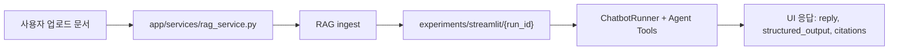

# RAG 프론트엔드 연결 계약

이 문서는 Streamlit 화면이 RAG 내부 구현을 직접 알지 않고 붙을 수 있도록 만든 연결 약속입니다. 최종 UI는 자유롭게 바꿔도 되지만, 화면에서는 `app/services/rag_service.py`의 함수만 호출하는 것을 기준으로 합니다.

## 한 줄 구조



## 화면에서 지켜야 할 원칙

- UI는 `src.rag.*`를 직접 import하지 않습니다.
- UI는 `create_and_ingest()`로 run을 만들고, 이후 `run_id`만 들고 움직입니다.
- 답변 표시는 `structured_output`을 우선 사용하고, 없으면 `reply`를 fallback으로 사용합니다.
- citation은 사용자에게 `문서명`, `페이지`, `근거 미리보기` 수준으로 보여줍니다.
- `chunk_id`, `BodyText/Section0` 같은 내부 인덱싱 값은 화면에 노출하지 않습니다.
- mock 화면은 참고용이고, 실제 RAG 연결은 이 서비스 어댑터를 기준으로 붙입니다.

## 주요 함수

| 함수 | 용도 | UI 사용 시점 |
| --- | --- | --- |
| `create_and_ingest(raw_docs_source_dir)` | 업로드된 원본 문서를 run으로 만들고 ingest 실행 | 분석 실행 버튼 |
| `get_documents(run_id)` | run 안의 문서 목록 조회 | 문서 선택 필터 |
| `summarize(run_id, selected_doc_ids=None)` | 핵심 정보 요약 | 분석 완료 직후 기본 카드 |
| `extract_requirements(run_id, selected_doc_ids=None)` | 참가 자격/제출 서류 추출 | 분석 완료 직후 기본 카드 |
| `compare(run_id, selected_doc_ids=None)` | 여러 문서 비교 | 문서 2개 이상 선택 시 |
| `ask_with_document_filter(run_id, question, selected_doc_ids=None)` | 선택 문서 범위로 챗봇 질의 | 채팅 입력 |
| `get_citation(run_id, chunk_id)` | 특정 근거 원문 조회 | citation 상세 보기 |
| `clear_chatbot(run_id=None)` | 챗봇 캐시 초기화 | run 변경 또는 새 분석 |

## 응답 형식

```python
{
    "reply": "사용자에게 보여줄 답변 문자열",
    "tool_used": "extract_facts",
    "structured_output": {
        "사업명": "...",
        "발주기관": "...",
        "사업예산": "...",
    },
    "citations": [
        {
            "source_path": "...",
            "page": "1",
            "chunk_id": "...",
        }
    ],
    "status": "ok",
    "duration_ms": 1234,
    "error": None,
}
```

## structured_output 구조

`structured_output`은 Agent Tool의 `answerer.output_schema`가 설정된 경우에만 채워집니다. 현재 Streamlit config는 `agent/agent_lplus.yaml`을 상속하므로 아래 Tool에서 구조화 결과를 기대할 수 있습니다.

| Tool | 서비스 함수 | structured_output schema |
| --- | --- | --- |
| `extract_facts` | `summarize()` | `facts_schema` |
| `extract_requirements` | `extract_requirements()` | `requirements_schema` |
| `compare_rfps` | `compare()` | `comparison_schema` |
| `decide_participation` | `run_tool(..., "decide_participation", ...)` | `decision_schema` |

### facts_schema

`summarize(run_id)` 또는 “요약/예산/기간/발주기관” 계열 질문에서 주로 사용합니다.

```python
{
    "사업명": "국가교육과정정보센터(NCIC) 시스템 운영 및 개선",
    "발주기관": "한국교육과정평가원",
    "사업예산": "명시되지 않음",
    "사업기간": "계약체결일 ~ 2024.11.15.",
    "제출마감": "명시되지 않음",
    "자격요건": [
        "입찰참가신청서 제출",
        "사업자등록증 사본 제출",
    ],
}
```

### requirements_schema

`extract_requirements(run_id)` 또는 “참가 자격/제출 서류/평가 기준” 질문에서 사용합니다.

```python
{
    "참가자격": [
        "소프트웨어사업자 신고 확인서 제출",
        "기술평가 점수 배점 한도의 85% 이상",
    ],
    "제출서류": [
        "입찰참가신청서",
        "사업자등록증 사본",
        "법인등기부등본",
    ],
    "평가기준": "기술평가와 가격평가를 합산하여 협상적격자를 선정",
}
```

### comparison_schema

`compare(run_id, selected_doc_ids)`에서 사용합니다. 여러 문서를 선택한 뒤 표나 비교 카드로 표시하기 좋습니다.

```python
{
    "문서목록": [
        "문서 A",
        "문서 B",
    ],
    "비교결과": "문서 A는 예산이 명시되어 있고, 문서 B는 제출마감 정보가 더 구체적입니다.",
}
```

### decision_schema

입찰 참여 적합도 판단 Tool에서 사용합니다. 현재 데모 UI 기본 카드에는 연결하지 않았지만, 추천/리스크 기능을 붙일 때 사용할 수 있습니다.

```python
{
    "참여여부": True,
    "근거": "보유 자격과 주요 수행 분야가 요구사항과 대체로 일치합니다.",
    "리스크": [
        "예산 규모가 커서 컨소시엄 검토 필요",
        "제출 서류 누락 시 정량평가 감점 가능",
    ],
    "제안_주의사항": "PM 경력 증빙 자료를 먼저 확인해야 합니다.",
}
```

## UI에 붙이는 방식

서비스 함수는 `reply`와 `structured_output`을 같이 반환합니다. 현재 `rag_service.py`는 `structured_output`이 있으면 이미 사람이 읽기 쉬운 문자열로 변환해서 `reply`에 넣습니다.

따라서 가장 단순한 UI는 아래처럼 붙이면 됩니다.

```python
response = summarize(run_id, selected_doc_ids)

if response["error"]:
    st.error(response["error"])
elif response["structured_output"]:
    data = response["structured_output"]
    st.metric("발주기관", data.get("발주기관", "명시되지 않음"))
    st.metric("사업예산", data.get("사업예산", "명시되지 않음"))
    st.write(data.get("자격요건", []))
else:
    st.markdown(response["reply"])
```

카드형 UI를 만들 때는 `structured_output`을 직접 쓰고, 채팅 말풍선처럼 빠르게 보여줄 때는 `reply`를 쓰면 됩니다.

```python
response = ask_with_document_filter(run_id, question, selected_doc_ids)

with st.chat_message("assistant"):
    st.markdown(response["reply"])
```

## citation 표시 방식

`citations`에는 내부 추적을 위한 `chunk_id`, `section` 등이 포함될 수 있습니다. 이 값은 개발/디버깅용이며 사용자 화면에 그대로 노출하지 않습니다.

권장 표시:

```python
for citation in response["citations"]:
    source = Path(citation.get("source_path", "")).name
    page = citation.get("page") or citation.get("page_start")
    st.caption(f"근거: {source} p.{page}")
```

권장하지 않는 표시:

```text
chunk_id: 한국교육과정평가원_..._chunk_0055
BodyText/Section0
```

## 권장 화면 흐름

### 외부 업로드 문서 분석

1. 사용자가 파일을 업로드합니다.
2. UI가 임시 디렉토리에 파일을 저장합니다.
3. `create_and_ingest(temp_dir)`를 호출합니다.
4. 성공하면 `run_id`를 session state에 저장합니다.
5. `get_documents(run_id)`로 문서 선택 목록을 만듭니다.
6. `summarize(run_id)`와 `extract_requirements(run_id)`를 호출해 기본 분석 결과를 즉시 보여줍니다.
7. 사용자가 질문하면 `ask_with_document_filter(run_id, question, selected_doc_ids)`를 호출합니다.

### 내부 문서 선택 분석

이미 ingest된 내부 RFP 문서를 대상으로 할 때는 새 ingest를 실행하지 않고 기존 내부 인덱스를 재사용합니다. `run_id`는 내부 구현 값이므로 사용자 화면에는 노출하지 않습니다.

1. UI 로딩 시 `list_runs()`로 사용 가능한 내부 인덱스를 가져옵니다.
2. 문서가 있는 최신 run을 내부적으로 선택합니다.
3. `get_documents(run_id)`로 전체 내부 문서 목록을 가져옵니다.
4. 화면에는 run 선택이 아니라 문서 선택 필터만 보여줍니다.
5. 문서를 선택하지 않으면 전체 내부 문서를 대상으로 둡니다.
6. 선택 문서가 있으면 `selected_doc_ids`로 넘깁니다.
7. `summarize(run_id, selected_doc_ids)`, `extract_requirements(run_id, selected_doc_ids)`, `compare(run_id, selected_doc_ids)`를 호출합니다.
8. 질문형 UI는 `ask_with_document_filter(run_id, question, selected_doc_ids)`를 호출합니다.

```python
internal_run = next(run for run in list_runs() if run["documents"] > 0)
run_id = internal_run["run_id"]  # 화면에는 노출하지 않는 내부 값

documents = get_documents(run_id)
selected_doc_ids = st.multiselect(
    "특정 문서만 보기",
    options=[doc["document_id"] for doc in documents],
)

response = summarize(run_id, selected_doc_ids or None)
```

## 현재 데모 위치

- 서비스 어댑터: `app/services/rag_service.py`
- 호출 예시: `app/examples/rag_contract_example.py`
- 내부 문서 선택 UI 초안: `app/examples/internal_document_summary_draft.py`
- 참고 화면: `app/views/rag_contract_demo.py`
- 실행 config: `configs/experiments/rag/streamlit.yaml`

`app.py`에는 이 예시를 연결하지 않습니다. 기존 UI 구현자는 화면 구조를 유지한 채 `app/services/rag_service.py`의 함수 계약만 가져다 붙이면 됩니다.
