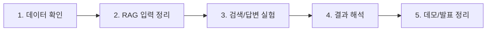

# 역할별 집중 포인트 가이드

이 문서는 팀원에게 긴 문서 목록을 모두 읽히지 않기 위한 역할별 요약입니다.

각 역할은 먼저 자기 파트만 보고, 필요한 경우에만 세부 문서로 이동합니다.

작업 흐름을 확인한 뒤에는 이 문서를 열어 각 역할이 어떤 입력을 받아 어떤 산출물을 남길지 맞춥니다.

## 전체 흐름

## 공통으로 알아야 할 5가지

| 개념 | 쉬운 설명 | 왜 중요한가 |
| --- | --- | --- |
| 원본 문서 | PDF, HWP, DOCX 같은 실제 RFP 파일 | 모든 작업의 출발점입니다. |
| chunk | 긴 문서를 검색하기 좋게 나눈 조각 | 검색 품질을 크게 좌우합니다. |
| retrieval | 질문과 관련 있는 chunk를 찾는 단계 | 답변 전에 근거를 먼저 찾습니다. |
| answer | 찾은 근거를 바탕으로 만든 답변 | 답변만 보지 말고 근거를 함께 봐야 합니다. |
| citation | 답변이 어떤 문서 조각에서 나왔는지 표시한 근거 | 발표와 검증에서 신뢰를 만듭니다. |

## Data Engineer

### 집중 질문

- 실제 문서는 어디서 가져오고 어떤 형식인가?
- 문서 안의 텍스트가 제대로 읽히는가?
- 평가 질문을 만들 만큼 답변 근거가 보이는가?
- 전처리는 검색을 방해하지 않는 최소 수준으로 끝났는가?

### 첫 작업

1. 실제 후보 문서와 파일 형식을 확인합니다.
2. 원본 데이터는 직접 수정하지 않고 보관 위치를 정합니다.
3. 문서가 loader에서 읽히는지 확인합니다.
4. `question`, `expected_answer`, `expected_chunk_ids` 형태의 평가 질문 예시를 만듭니다.
5. 읽히지 않는 문서, 깨진 문장, 누락되는 표 이미지를 기록합니다.

### 산출물

- 데이터 후보 목록
- 문서 로딩 확인 결과
- 평가 질문 CSV 초안
- 데이터 이슈 목록

### 먼저 볼 문서

- `docs/team/workflow.md`
- `docs/md/data/DATA_CONTRACT.md`
- `docs/md/rag/RAG_PIPELINE_SPEC.md`

## Experiment Lead

### 집중 질문

- 어떤 retriever 설정에서 정답 근거가 더 잘 검색되는가?
- answerer가 검색된 근거를 벗어나지 않고 답하는가?
- LangChain config에서 바꾼 조건이 산출물에 어떻게 남는가?
- evaluation 결과를 보고 다음 실험 조건을 정할 수 있는가?

### 첫 작업

1. smoke RAG pipeline을 한 번 실행합니다.
2. `retrieval_results.jsonl`에서 질문별 top-k chunk를 확인합니다.
3. `answers.jsonl`에서 답변과 citation을 확인합니다.
4. `metrics.json`과 실패 분석 CSV를 봅니다.
5. `splitter.chunk_size`, `retriever`, `answerer`, `top_k` 중 하나씩 바꿔 비교합니다.

### 먼저 바꿔볼 옵션

| 옵션 | 확인할 내용 |
| --- | --- |
| `rag.splitter.chunk_size` | 문서 조각 길이 |
| `rag.splitter.chunk_overlap` | 조각 사이의 겹침 |
| `rag.retriever.method` | similarity, keyword, semantic, hybrid 검색 방식 |
| `rag.retriever.top_k` | 답변에 참고할 근거 개수 |
| `rag.answerer.provider` | local, openai, ollama 같은 답변 생성 방식 |
| `rag.engine` | LangChain 기반 실행 엔진 사용 여부 |

### 산출물

- 실행한 LangChain config
- metric 결과
- 실패 질문 목록
- 발표에서 설명할 비교 포인트

### 먼저 볼 문서

- `docs/team/workflow.md`
- `docs/md/experiments/EXPERIMENT_GUIDE.md`
- `docs/md/overview/RAG_QUALITY_CHECKLIST.md`

## Application Engineer

### 집중 질문

- 데모 화면이나 API에서 어떤 입력을 받아야 하는가?
- 답변에는 어떤 정보가 함께 나가야 하는가?
- 사용자가 답변의 출처를 믿을 수 있게 citation을 어떻게 보여줄 것인가?
- 지금 당장 구현하지 않더라도 어떤 계약을 미리 정해야 하는가?

### 첫 작업

1. `run_rag_chat.py`의 출력 형태를 확인합니다.
2. `question`, `answer`, `citations`, `status`를 응답 형태로 봅니다.
3. citation에 `source_path`, `page`, `section`, `chunk_id`가 있는지 확인합니다.
4. 데모 후보를 notebook, FastAPI, Streamlit, Gradio 중에서 비교합니다.
5. 지금 구현할 범위와 보류할 범위를 기록합니다.

### 산출물

- RAG 입출력 예시
- 데모 방식 후보 비교
- API 보류 또는 구현 기준
- 화면에 보여줄 citation 정보 초안

### 먼저 볼 문서

- `docs/md/rag/RAG_PIPELINE_SPEC.md`
- `docs/md/overview/MODULE_ARCHITECTURE.md`
- `docs/team/workflow.md`

## Presentation Lead

### 집중 질문

- 이 프로젝트가 어떤 문제를 해결하는지 쉽게 말할 수 있는가?
- RAG 흐름을 팀원이 이해할 수 있는 말로 설명할 수 있는가?
- metric보다 먼저 보여줄 근거와 예시는 무엇인가?
- 역할별 산출물을 하나의 발표 이야기로 묶을 수 있는가?

### 첫 작업

1. 문제 상황을 한 문단으로 정리합니다.
2. RAG를 "문서 조각 찾기 + 근거 기반 답변"으로 설명합니다.
3. 실제 산출물 예시를 모읍니다.
4. 역할별 작업이 최종 발표에서 어디에 쓰이는지 연결합니다.
5. 어려운 용어 목록을 쉬운 말로 바꿉니다.

### 산출물

- 쉬운 용어집
- 발표 흐름 초안
- 예시 질문/답변/citation 화면
- 팀원에게 추가로 요청할 자료 목록

### 먼저 볼 문서

- `docs/team/kickoff.md`
- `docs/html/overview/pipeline_explainer.html`
- `docs/html/overview/module_architecture.html`

## PM

### 집중 질문

- 지금 팀원이 당장 해야 할 일이 보이는가?
- 각 역할의 산출물이 다음 역할로 넘어갈 수 있는가?
- 막힌 일이 Daily Report나 Issue로 올라오고 있는가?
- 문서가 많아도 팀원이 어디부터 보면 되는지 알 수 있는가?

### 첫 작업

1. 역할을 확정합니다.
2. `first-week.md`의 첫 주 카드를 보드로 옮깁니다.
3. 각 카드의 담당자와 완료 기준을 확인합니다.
4. Daily Report 작성 위치를 공지합니다.
5. 막힌 점과 의사결정 사항을 별도로 기록합니다.

### 산출물

- GitHub Project 보드
- 첫 주 카드 배정
- 결정 사항 로그
- 회의 후 액션 목록

### 먼저 볼 문서

- `docs/team/README.md`
- `docs/team/operations.md`
- `docs/team/first-week.md`
- `.github/ISSUE_TEMPLATE/daily_report.md`

## 설명할 때의 원칙

- 팀원에게 전체 문서 목록을 한 번에 읽으라고 하지 않습니다.
- 각 역할별로 먼저 볼 문서 2~3개만 지정합니다.
- 첫 주에는 기능 완성보다 입력, 출력, 산출물 기준을 이해하는 것을 우선합니다.
- 모르는 용어가 나오면 문서 링크보다 실제 산출물 예시로 설명합니다.
