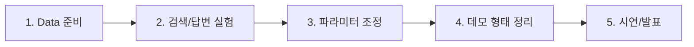

# 프로젝트 작업 흐름 기준선

이 문서는 RAG 프로젝트를 어떤 순서로 진행하고, 각 단계에서 다음 역할에게 무엇을 넘겨야 하는지 정리합니다.

목표는 세부 구현을 모두 외우게 하는 것이 아닙니다. 팀원이 자기 작업의 입력과 출력만 명확히 알고, 다음 사람이 바로 이어서 작업할 수 있게 만드는 것입니다.

## 전체 흐름



## 단계별 기준선

| 단계 | 주 담당 | 입력 | 출력 | 완료 기준 |
| --- | --- | --- | --- | --- |
| Data 준비 | Data Engineer | 원본 RFP 문서 | 로딩 가능한 문서, 평가 질문 초안, 데이터 이슈 목록 | pipeline이 문서를 읽고 chunk를 만들 수 있음 |
| 검색/답변 실험 | Experiment Lead / Model Engineer | 문서, 질문, config | retrieval 결과, answer, citation, metric | 질문별 근거 chunk와 답변을 확인할 수 있음 |
| 파라미터 조정 | Experiment Lead / Model Engineer | baseline 결과 | 비교 실험 결과, best/last 산출물, 실패 사례 | 어떤 설정이 왜 나은지 설명 가능함 |
| 데모 형태 정리 | Application Engineer | RAG 입출력 예시 | 간단한 실행 흐름, 화면/API 후보, citation 표시 방식 | 사용자가 질문을 넣고 답변 근거를 볼 수 있음 |
| 시연/발표 | Presentation Lead / PM | 실험 결과, 데모, 실패 사례 | 발표 흐름, 쉬운 용어, 결과 캡처 | 문제-방법-결과-한계를 연결해서 설명 가능함 |

## Data Engineer가 제공해야 하는 것

Data Engineer의 핵심은 모델 성능을 올리는 전처리가 아니라, **파이프라인이 읽을 수 있는 문서와 검증 가능한 질문을 준비하는 것**입니다.

### 제공 산출물

- 원본 문서 위치와 파일 형식 목록
- loader에서 읽힌 문서 수와 실패 문서 목록
- 문서별 주요 section 또는 page 정보
- 평가 질문 초안
- 질문별 기대 근거 위치
- 데이터 이슈 목록

### 다음 역할에게 넘길 때 확인할 것

| 확인 항목 | 기준 |
| --- | --- |
| 원본 보존 | 원본 파일은 직접 수정하지 않음 |
| 로딩 가능 | txt, pdf, docx, hwpx, hwp 중 지원 형식으로 읽힘 |
| chunk 가능 | 빈 문서가 아니고 검색 가능한 텍스트가 있음 |
| 평가 가능 | 최소한 질문, 기대 답변, 기대 근거 후보가 있음 |
| 이슈 기록 | 깨진 인코딩, 표 누락, 읽기 실패를 기록함 |

## Experiment Lead / Model Engineer가 진행할 것

Experiment Lead / Model Engineer의 핵심은 코드를 계속 바꾸는 것이 아니라, **config를 바꿔가며 검색과 답변 품질을 비교하는 것**입니다.

### 먼저 바꿔볼 옵션

| 옵션 | 보는 이유 |
| --- | --- |
| `rag.chunk.size` | 문서 조각 길이가 검색 품질에 주는 영향 |
| `rag.chunk.overlap` | 앞뒤 문맥을 얼마나 겹칠지 |
| `rag.retriever.method` | keyword, semantic, hybrid 후보 비교 |
| `rag.retriever.top_k` | 답변에 넣을 근거 개수 |
| `rag.answerer.mode` | extractive 답변과 LLM 답변 후보 비교 |

### 기록해야 하는 것

- 실행한 config 경로
- 사용한 데이터와 질문 세트
- retrieval 결과
- answer와 citation
- metric 결과
- 잘못 찾은 근거 또는 답변 실패 사례
- 발표에서 설명할 비교 포인트

## Application Engineer가 확인할 것

Application Engineer는 처음부터 큰 웹앱을 만들 필요가 없습니다. 먼저 RAG pipeline의 입출력 계약을 보고, 데모에서 보여줄 최소 흐름을 정리합니다.

### 최소 입출력

```json
{
  "question": "제출 마감일은 언제인가요?",
  "answer": "제출 마감일은 ... 입니다.",
  "citations": [
    {
      "source_path": "data/raw/sample.pdf",
      "page": 3,
      "chunk_id": "sample-0003"
    }
  ],
  "status": "ok"
}
```

### 결정할 것

- 질문 입력 방식
- 답변 표시 방식
- citation 표시 방식
- 실패했을 때 보여줄 메시지
- API, Streamlit, Gradio, notebook 중 어떤 데모가 현실적인지

## Presentation Lead가 모을 것

Presentation Lead는 세부 구현보다 **왜 이 프로젝트가 필요한지, 어떤 근거로 답했는지, 어디까지 검증했는지**를 보기 쉽게 정리합니다.

### 발표에 필요한 재료

- 문제 상황 한 문단
- RAG를 쉬운 말로 설명한 문장
- 실제 질문, 답변, citation 예시
- 검색 결과 화면 또는 파일 캡처
- 성공 사례와 실패 사례
- 한계와 개선 가능성

## PM이 관리할 것

PM은 모든 세부 구현을 직접 설명하기보다, 각 단계의 산출물이 다음 단계로 넘어가는지 확인합니다.

### 확인 포인트

- 각 역할의 첫 작업이 Issue로 나뉘었는지
- 산출물 경로가 README나 Issue에 남았는지
- 막힌 작업이 Daily Report 또는 회의에서 공유되는지
- 발표에 필요한 결과 캡처가 누락되지 않았는지
- PR에서 테스트 결과와 변경 이유가 확인되는지

## 이 문서의 범위

이 문서는 작업 순서와 산출물 기준선을 정의합니다.

세부 구현 방법은 다음 문서를 참고합니다.

- RAG 입출력 계약: `docs/md/rag/RAG_PIPELINE_SPEC.md`
- 데이터 형식: `docs/md/data/DATA_CONTRACT.md`
- 실험 실행: `docs/md/experiments/EXPERIMENT_GUIDE.md`
- 역할별 첫 작업: `docs/team/roles.md`
- GitHub 운영: `docs/team/operations.md`
