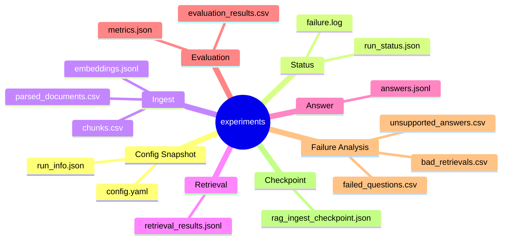

# Experiments 디렉터리

`experiments/`는 RAG 실험 실행 결과가 저장되는 기본 위치입니다.

## RAG 실험 산출물 구조



## 예시

```text
experiments/rag_langchain/
|-- config.yaml
|-- run_info.json
|-- run_status.json
|-- parsed_documents.csv
|-- chunks.csv
|-- embeddings.jsonl
|-- retrieval_results.jsonl
|-- answers.jsonl
|-- evaluation_results.csv
|-- metrics.json
|-- bad_retrievals.csv
|-- unsupported_answers.csv
|-- failed_questions.csv
|-- rag_ingest_checkpoint.json
`-- README.md
```

## 각 산출물 설명

| 파일 | 설명 |
| --- | --- |
| `config.yaml` | 실행에 사용한 config snapshot |
| `run_info.json` | 실행 시간, 환경, config 경로 |
| `run_status.json` | 각 단계 성공/실패 상태 |
| `failure.log` | 실패 시 오류 메시지 |
| `parsed_documents.csv` | 문서 loader가 읽은 원본 문서 정보 |
| `chunks.csv` | splitter가 나눈 chunk 목록 |
| `embeddings.jsonl` | chunk별 embedding 벡터 |
| `retrieval_results.jsonl` | 질문별 검색된 chunk와 score |
| `answers.jsonl` | 질문, 답변, citation, 상태 |
| `evaluation_results.csv` | 질문별 metric 평가 결과 |
| `metrics.json` | 전체 평가 지표 요약 |
| `bad_retrievals.csv` | 기대 chunk를 놓친 질문 |
| `unsupported_answers.csv` | 근거 부족 또는 citation 오답 |
| `failed_questions.csv` | 실행 중 오류 발생 질문 |
| `rag_ingest_checkpoint.json` | ingest 재개 지점 |

## 원칙

- 실험 결과는 자동 생성 산출물이므로 기본적으로 Git에 올리지 않습니다.
- 공유가 필요한 결과는 `reports/`로 요약하거나 별도 문서에 정리합니다.
- 같은 실험을 여러 번 비교할 때는 config의 `artifact_policy.run_id`를 사용합니다.
- 실험 디렉터리 이름은 바꾼 조건이 보이게 짓습니다 (예: `rag_chunk800_overlap120`).
