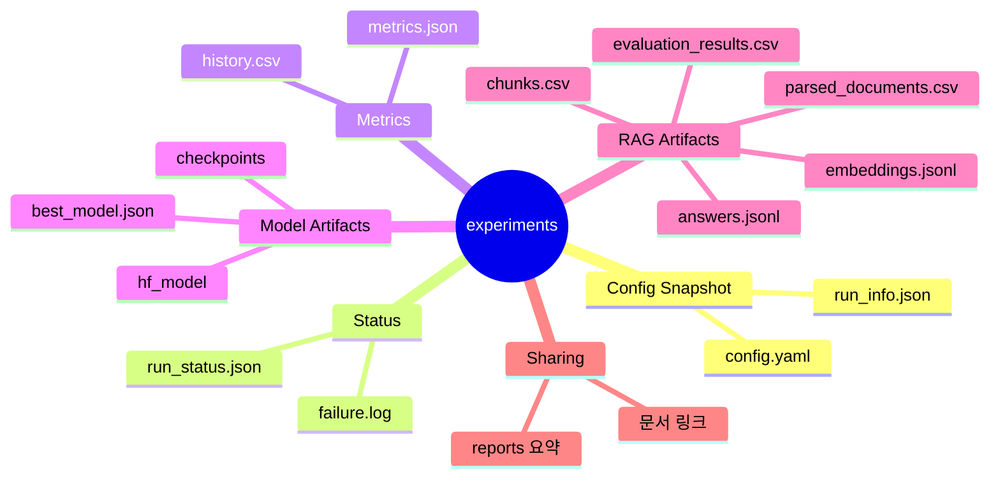

# Experiments 디렉터리

`experiments/`는 실험 실행 결과가 저장되는 기본 위치입니다.

## 실험 산출물 마인드맵



## 예시

```text
experiments/smoke_test_text/
|-- config.yaml
|-- metrics.json
|-- history.csv
|-- run_status.json
|-- run_info.json
`-- failure.log
```

## 원칙

- 실험 결과는 자동 생성 산출물이므로 기본적으로 Git에 올리지 않습니다.
- 공유가 필요한 결과는 `reports/`로 요약하거나 별도 문서에 정리합니다.
- 같은 실험을 여러 번 비교할 때는 config의 `artifact_policy.run_id`를 사용합니다.
