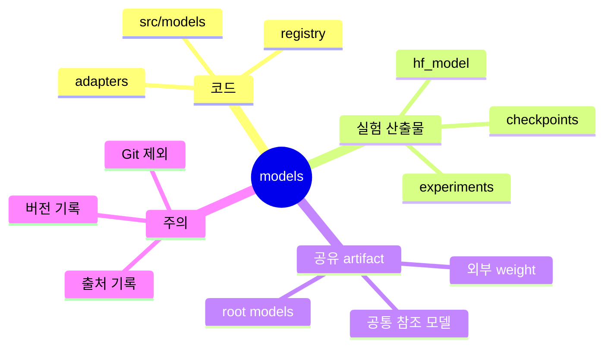

# Models 디렉터리

루트 `models/`는 팀 공통 모델 artifact를 둘 수 있는 예비 공간입니다.

## Models 위치 마인드맵



## 텍스트 구조

```text
models/
|-- .gitkeep    # 빈 디렉터리 유지
`-- README.md   # 루트 모델 artifact 사용 기준
```

코드 구현체는 `src/models/`에 있습니다.
여기에는 실제 모델 weight나 외부에서 받은 모델 파일을 둘 수 있지만, 큰 파일은 Git에 올리지 않습니다.

일반 학습 결과는 `experiments/{experiment.name}/` 아래에 저장하는 것이 기본입니다.
