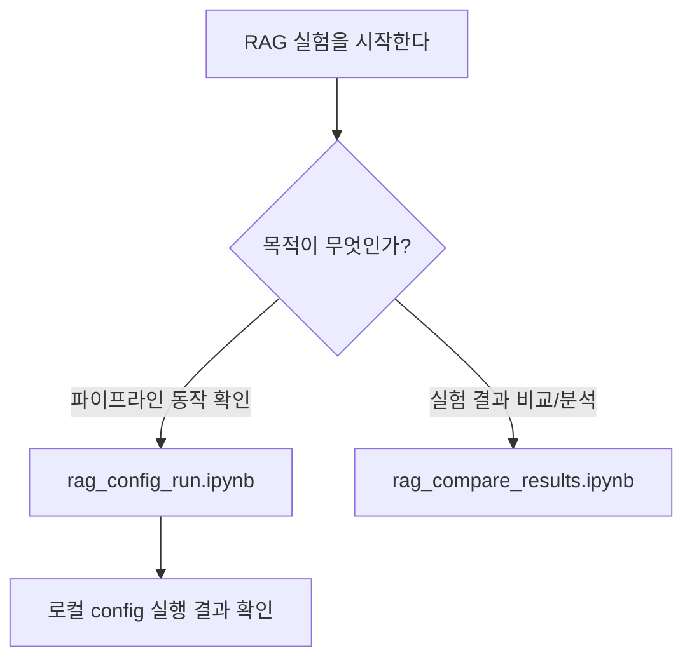

# 실험 노트북

이 디렉터리는 RAG 실험을 사람이 직접 따라가며 확인하기 위한 노트북을 둡니다.
기본 실행 환경은 로컬 Jupyter입니다. RAG config 실험은 대규모 학습을 하지 않기 때문에 Colab이나 GPU가 반드시 필요하지 않습니다.

## 구조

```text
notebooks/
|-- README.md
|-- rag/
|   |-- rag_config_run.ipynb           # 실험 실행 노트북
|   `-- rag_compare_results.ipynb      # 결과 비교/분석 노트북 (실행 X)
```

## 노트북 사용 기준

실험은 VM에서 진행하므로 별도 Colab 노트북은 사용하지 않습니다.



## 기본 노트북

`rag/rag_config_run.ipynb`를 먼저 사용합니다.

이 노트북에서 확인하는 것은 아래 흐름입니다.

- config validation
- 문서 ingest와 chunk 생성
- 단일 질문 retrieval
- 답변 생성과 citation 확인
- 평가 질문 CSV 기반 evaluate

팀원에게 파이프라인을 보여줄 때는 이 노트북을 기본 화면으로 사용합니다. 노트북 안에서는 config 하나를 선택해 `check -> ingest -> retrieve/chat -> evaluate` 명령과 산출물 확인 흐름을 보여줍니다.

retriever 비교, DOCX/HWPX fixture 점검, Colab 실행은 별도 config, 별도 노트북, 별도 Issue에서 다룹니다.

## 분석 노트북

`rag/rag_compare_results.ipynb`는 실험을 다시 돌리지 않고, 이미 `experiments/rag_*/`에 저장된 산출물만 읽어서 비교/시각화합니다.

- 실험 폴더 자동 탐색 (metrics.json이 있는 폴더만)
- 여러 실험의 metric 한 번에 비교 (grouped bar chart)
- 2개 실험 Before/After delta 비교
- retriever 방식별 성능 비교 (compare_rag_retrievers.py 결과)
- 실패 유형별 통계 + 상세 질문 확인

실험이 끝난 뒤 이 노트북을 열면 "어떤 Config가 제일 좋았는지" 한눈에 확인할 수 있습니다.

## 실험할 때 주로 바꾸는 값

RAG 실험은 epoch를 돌리는 학습 구조가 아니므로 아래 값을 바꾸면서 비교합니다.

- `paths.raw_docs_dir`: 읽을 RFP 문서가 있는 위치
- `paths.output_dir`: 실험 산출물을 남길 위치
- `rag.splitter.chunk_size`, `rag.splitter.chunk_overlap`: LangChain 엔진에서 문서를 나누는 크기와 겹침 정도
- `rag.embedding.provider`: embedding 구현체
- `rag.retriever.method`, `rag.retriever.top_k`: 검색 방식과 가져올 근거 수
- `rag.answerer.provider`: 답변 생성 방식
- `evaluation.questions_path`: 평가 질문 CSV 경로
- `backup.backup_dir`: Drive 등 외부 백업 위치

## 주의

- 노트북 출력은 커질 수 있으므로 commit 전에 불필요한 실행 결과를 정리합니다.
- 원본 데이터와 대용량 index는 Git에 올리지 않습니다.
- 노트북 사용법과 확인 기준은 [NOTEBOOK_USAGE_CHECKLIST.md](../docs/md/experiments/NOTEBOOK_USAGE_CHECKLIST.md)를 함께 봅니다.
