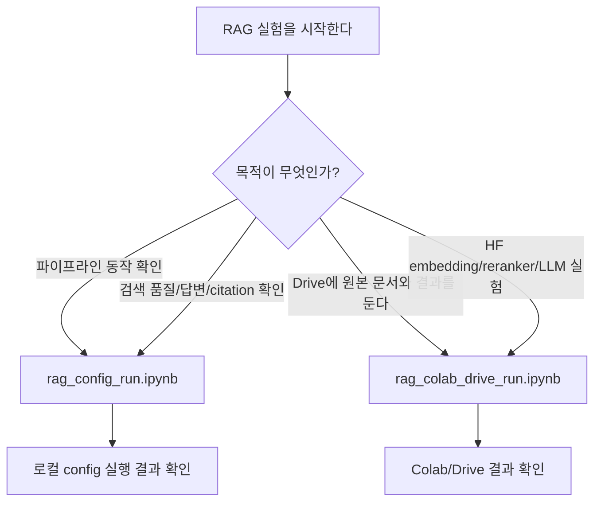

# 실험 노트북

이 디렉터리는 RAG 실험을 사람이 직접 따라가며 확인하기 위한 노트북을 둡니다.
기본 실행 환경은 로컬 Jupyter입니다. RAG config 실험은 대규모 학습을 하지 않기 때문에 Colab이나 GPU가 반드시 필요하지 않습니다.

## 구조

```text
notebooks/
|-- README.md
|-- rag/
|   |-- rag_config_run.ipynb        # 기본 RAG 실행/검증 노트북
|   `-- rag_colab_drive_run.ipynb          # Colab/Drive 실행 노트북
`-- templates/
    `-- colab_drive_run.md                 # Colab 노트북 작성용 텍스트 템플릿
```

## 노트북 사용 기준



## 기본 노트북

`rag/rag_config_run.ipynb`를 먼저 사용합니다.

이 노트북에서 확인하는 것은 아래 흐름입니다.

- config validation
- 문서 ingest와 chunk 생성
- 단일 질문 retrieval
- 답변 생성과 citation 확인
- 평가 질문 CSV 기반 evaluate
- retriever config 비교

## Colab 실행 노트북

`rag/rag_colab_drive_run.ipynb`는 Colab에서 실험을 돌릴 사람을 위한 실행 노트북입니다.
아래 상황이면 이 노트북을 사용합니다.

- 팀원이 같은 Drive 경로로 원본 문서와 산출물을 공유해야 할 때
- 로컬 환경 세팅이 불안정해서 Colab에서 재현하고 싶을 때
- HuggingFace embedding, reranker, LLM answerer처럼 다운로드와 추론 자원이 더 필요한 옵션을 실험할 때
- 실험 결과를 Drive에 자동 백업하는 흐름을 보여주고 싶을 때

CPU 기반 local provider, 작은 샘플 문서, 키워드/간단 vector 검색만 확인한다면 로컬 노트북으로 충분합니다.

텍스트 템플릿으로 먼저 흐름을 확인하고 싶다면 `templates/colab_drive_run.md`를 봅니다.

## 실험할 때 주로 바꾸는 값

RAG 실험은 epoch를 돌리는 학습 구조가 아니므로 아래 값을 바꾸면서 비교합니다.

- `paths.input_dir`: 읽을 RFP 문서가 있는 위치
- `paths.output_dir`: 실험 산출물을 남길 위치
- `rag.chunk.size`, `rag.chunk.overlap`: 문서를 나누는 크기와 겹침 정도
- `rag.embedding.provider`: embedding 구현체
- `rag.retriever.method`, `rag.retriever.top_k`: 검색 방식과 가져올 근거 수
- `rag.answerer.provider`: 답변 생성 방식
- `rag.evaluation.questions_path`: 평가 질문 CSV 경로
- `artifact_policy.backup_dir`: Drive 등 외부 백업 위치

## 주의

- 노트북 출력은 커질 수 있으므로 commit 전에 불필요한 실행 결과를 정리합니다.
- 원본 데이터와 대용량 index는 Git에 올리지 않습니다.
- 노트북 사용법과 확인 기준은 [NOTEBOOK_USAGE_CHECKLIST.md](../docs/md/experiments/NOTEBOOK_USAGE_CHECKLIST.md)를 함께 봅니다.
