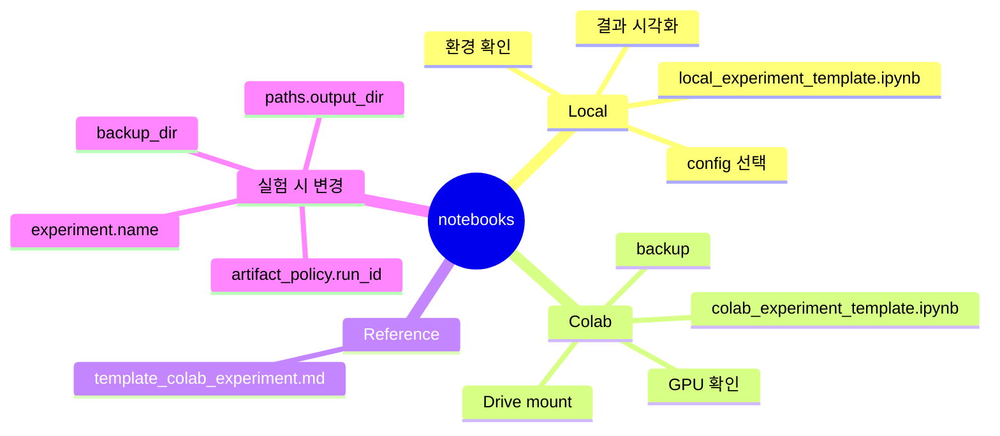

# 실험 노트북

이 폴더는 Jupyter/Colab 기반 실험을 위한 노트북 템플릿을 둡니다.

## 노트북 사용 마인드맵

## 파일

- `local_experiment_template.ipynb`: 로컬 Jupyter에서 프로젝트 루트 기준으로 실행하는 실험 템플릿
- `colab_experiment_template.ipynb`: Google Colab에서 Drive mount, repo clone, smoke test, Drive 저장 실험까지 진행하는 템플릿
- `template_colab_experiment.md`: Colab 실행 순서를 텍스트로 정리한 기존 참고 문서

## 사용 기준

- 로컬 환경이 잘 잡혀 있으면 `local_experiment_template.ipynb`를 먼저 사용합니다.
- GPU나 Drive 백업이 필요하면 `colab_experiment_template.ipynb`를 사용합니다.
- 팀원이 노트북을 복사해서 실험할 때는 `experiment.name`, `paths.output_dir`, `artifact_policy.run_id`를 바꿔 결과가 덮어써지지 않게 합니다.

## 주의

- 노트북 출력이 커질 수 있으므로 커밋 전에는 실행 결과를 정리하는 것이 좋습니다.
- Colab 노트북의 `REPO_URL`은 GitHub 원격 저장소가 준비된 뒤 실제 주소로 바꿔야 합니다.
- 실제 프로젝트 데이터는 Git에 직접 올리기보다 Drive 또는 별도 데이터 저장소를 사용합니다.
