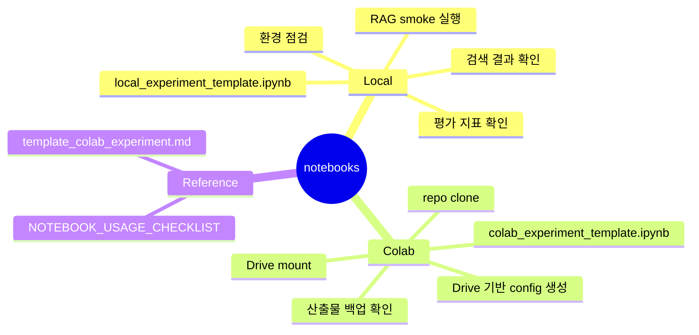

# 실험 노트북

이 디렉터리는 RAG 실험을 노트북에서 따라 실행하기 위한 템플릿을 둡니다.
기본 목표는 모델 학습이 아니라 문서 적재, 검색, 답변, citation, 평가 산출물이 config 기준으로 잘 이어지는지 확인하는 것입니다.

## 노트북 구성

## 파일

- `local_experiment_template.ipynb`: 로컬 Jupyter에서 RAG 파이프라인을 검증하는 기본 템플릿입니다.
- `colab_experiment_template.ipynb`: Google Colab에서 Drive 경로를 사용해 RAG 실험을 실행하는 템플릿입니다.
- `template_colab_experiment.md`: Colab 노트북을 만들 때 참고할 수 있는 텍스트형 실행 순서입니다.

## 실험할 때 주로 바꾸는 값

RAG 실험은 epoch를 돌리는 학습 구조가 아니므로 아래 값을 바꾸면서 비교합니다.

- `paths.input_dir`: 읽을 RFP 문서가 있는 위치
- `paths.output_dir`: 실험 산출물을 남길 위치
- `rag.chunk.size`, `rag.chunk.overlap`: 문서를 나누는 크기와 겹침 정도
- `rag.embedding.provider`: embedding 구현체
- `rag.retriever.method`, `rag.retriever.top_k`: 검색 방식과 가져올 근거 수
- `rag.answerer.provider`: 답변 생성 방식
- `rag.evaluation.questions_path`: 평가 질문 CSV 경로
- `artifact_policy.backup_dir`: Drive 등 외부 백업 위치

## 사용 기준

- 로컬 환경에서는 먼저 `local_experiment_template.ipynb`로 smoke config를 돌립니다.
- Colab에서는 `REPO_URL`과 Drive 작업 경로를 실제 프로젝트 값으로 바꾼 뒤 실행합니다.
- 노트북 출력은 커질 수 있으므로 commit 전에 불필요한 실행 결과를 정리합니다.
- 노트북 사용법과 확인 기준은 [NOTEBOOK_USAGE_CHECKLIST.md](../docs/md/experiments/NOTEBOOK_USAGE_CHECKLIST.md)를 함께 봅니다.
