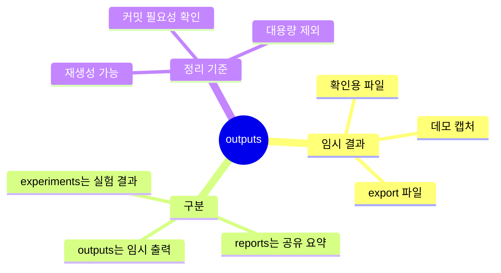

# Outputs 디렉터리

`outputs/`는 임시 출력물이나 데모용 산출물을 둘 수 있는 공간입니다.

## Outputs 마인드맵



## 텍스트 구조

```text
outputs/
|-- .gitkeep    # 빈 디렉터리 유지
`-- README.md   # 임시 출력물 사용 기준
```

반복 실험 결과는 `experiments/`를 사용하고, 팀 공유용 요약은 `reports/`를 사용합니다.
이 폴더는 주로 임시 파일, export 파일, 확인용 결과물을 둘 때 사용합니다.
