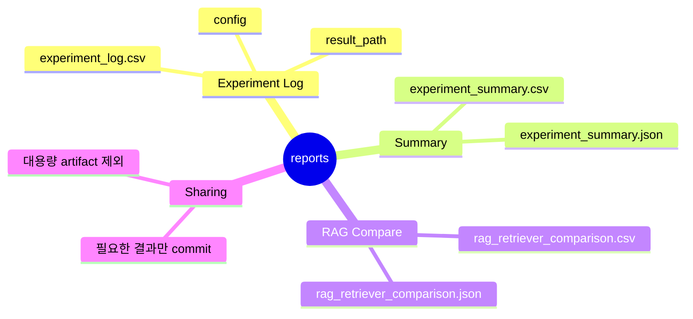

# Reports 디렉터리

`reports/`는 실험 요약과 팀 공유용 보고 자료를 두는 곳입니다.
GitHub에서 직접 쓰는 Issue, PR, Daily Report 템플릿은 `.github/`에서 관리합니다.

## Reports 마인드맵



## 파일 구조

```text
reports/
|-- experiment_log.csv              # 수동 실험 기록 CSV
|-- experiment_summary.csv          # 실험 요약 생성 결과
|-- experiment_summary.json         # 실험 요약 JSON
|-- rag_retriever_comparison.csv    # RAG retriever 비교 결과
`-- rag_retriever_comparison.json   # RAG retriever 비교 JSON
```

## 주요 파일

- `experiment_log.csv`: 사람이 직접 남기는 실험 로그
- `experiment_summary.csv`: `scripts/summarize_experiments.py`가 생성하는 실험 요약
- `rag_retriever_comparison.csv`: RAG retriever 비교 결과

생성 파일은 `.gitignore` 대상일 수 있습니다. 공유가 필요한 결과만 선별해서 commit합니다.
