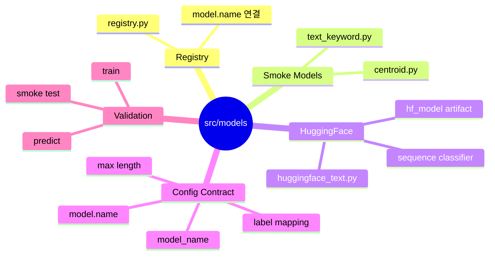

# 모델 구현

이 폴더는 모델 코드와 registry를 관리합니다.

## 모델 구조 마인드맵



```text
src/models/
|-- registry.py          # config의 model.name을 실제 모델로 연결
|-- centroid.py          # 이미지 smoke test용 가벼운 모델
|-- text_keyword.py      # 텍스트 smoke test용 가벼운 모델
|-- huggingface_text.py  # HuggingFace 텍스트 분류 adapter
`-- ...
```

## 모델 추가 순서

1. `src/models/{model_name}.py`에 모델 구현을 추가합니다.
2. 가벼운 baseline 모델이면 `src/models/registry.py`의 `build_model()`에 등록합니다.
3. config의 `model.name`으로 선택할 수 있게 합니다.
4. train/predict 입력과 출력 계약이 깨지지 않는지 smoke test로 확인합니다.

## HuggingFace 모델

`huggingface_sequence_classifier`는 config 기반으로 동작합니다. base model 이름, label mapping, max length 같은 값이 필요하기 때문에 `build_model()`에서 바로 만들지 않고 `scripts/run_train.py` 실행 중 전용 경로로 처리합니다.

예시 config:

```yaml
model:
  name: huggingface_sequence_classifier
  model_name: distilbert-base-multilingual-cased
```

학습된 weight는 `experiments/{experiment_name}/hf_model/` 아래에 저장합니다.
