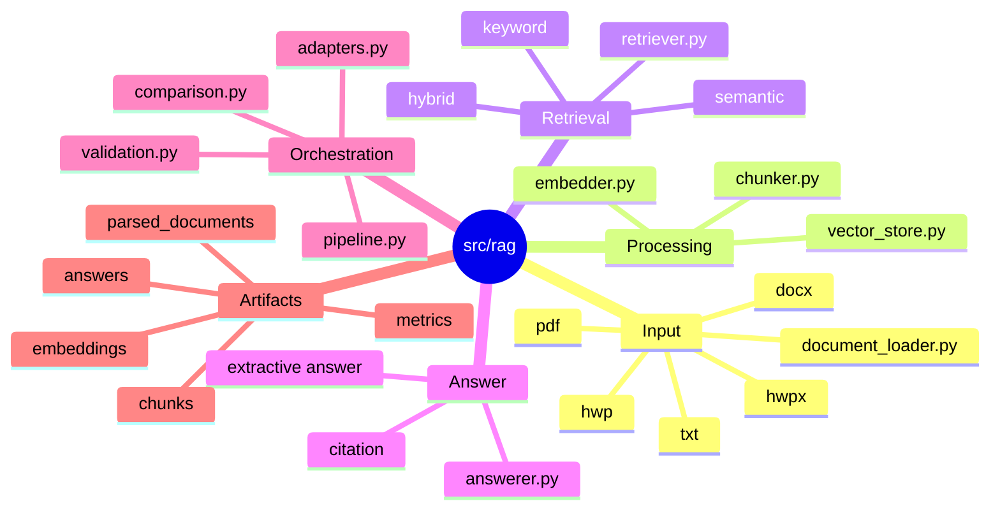

# RAG 모듈

`src/rag/`는 문서 기반 검색과 답변 파이프라인을 구현합니다.

## RAG 모듈 마인드맵



## 텍스트 구조

```text
src/rag/
|-- document_loader.py  # txt/pdf/docx/hwpx/hwp 문서 로딩
|-- chunker.py          # document row를 chunk row로 분리
|-- embedder.py         # local hashing embedding 구현
|-- vector_store.py     # vector store 기본 도구
|-- retriever.py        # keyword/semantic/hybrid 검색
|-- answerer.py         # 답변과 citation 생성
|-- adapters.py         # config 기반 구현체 선택
|-- pipeline.py         # ingest/retrieve/chat/evaluate 실행
|-- validation.py       # RAG config 계약 검증
`-- comparison.py       # retriever 비교 실행
```

## 흐름

```text
document_loader
-> chunker
-> embedding adapter
-> retriever adapter
-> answerer adapter
-> evaluation
```

## 파일 역할

- `document_loader.py`: txt/pdf/docx/hwpx/hwp 문서를 표준 document row로 변환
- `chunker.py`: document row를 검색 가능한 chunk row로 분리
- `embedder.py`: local hashing embedding 구현
- `retriever.py`: keyword 검색과 score 계산
- `answerer.py`: 검색된 chunk에서 답변과 citation 생성
- `adapters.py`: config에 맞는 embedding/retriever/answerer 구현체 선택
- `pipeline.py`: ingest, retrieve, chat, evaluation 실행
- `validation.py`: RAG config와 계약 검증
- `comparison.py`: retriever 비교 실행
- `vector_store.py`: vector store 관련 기본 도구

## 현재 구현된 옵션

- embedding: `local`, `huggingface`
- vector store: `memory`
- retriever: `keyword`, `semantic`, `hybrid`
- answerer: `extractive/local`

FAISS, Chroma, Elasticsearch, LLM answerer는 확장 계약만 잡혀 있으며, 실제 구현은 프로젝트 요구가 확정되면 추가합니다.
LLM answerer provider 후보는 `openai`, `huggingface`, `ollama`입니다.
