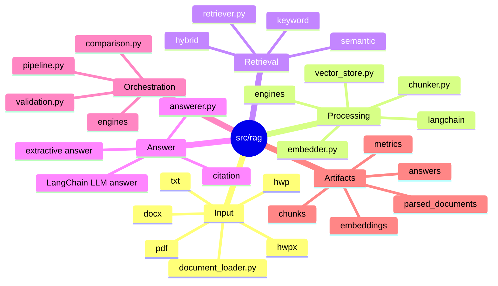

# RAG 모듈

`src/rag/`는 문서 기반 검색과 답변 파이프라인을 구현합니다.
현재 방향은 pipeline이 산출물/evaluation을 책임지고, 실제 RAG 엔진은 local 또는 LangChain 구현으로 분리하는 것입니다.

## RAG 모듈 마인드맵



## 텍스트 구조

```text
src/rag/
|-- document_loader.py  # txt/pdf/docx/hwpx/hwp 문서 로딩
|-- engines/            # local/LangChain RAG 엔진
|-- chunker.py          # local fallback chunk 분리
|-- embedder.py         # local fallback hashing embedding 구현
|-- vector_store.py     # local fallback vector store 도구
|-- retriever.py        # local keyword/semantic/hybrid 검색
|-- answerer.py         # 답변과 citation 생성
|-- adapters.py         # local fallback 구현체 선택
|-- pipeline.py         # ingest/retrieve/chat/evaluate 실행
|-- validation.py       # RAG config 계약 검증
`-- comparison.py       # retriever 비교 실행
```

## 흐름

```text
document_loader
-> rag engine
-> retrieval/answer artifact
-> evaluation
```

## LangChain 경계

LangChain은 splitter, embedding, vector store, retriever, LLM 호출을 맡는 내부 엔진으로 사용합니다.
하지만 `pipeline.py` 밖으로 LangChain `Document`, retriever result, chain output을 그대로 내보내지 않습니다.

엔진은 LangChain 결과를 항상 아래 프로젝트 표준 row로 변환한 뒤 반환합니다.

- chunk row: `chunks.csv`에 저장 가능한 dict
- retrieval row: `retrieval_results.jsonl`에 저장 가능한 dict
- answer payload: `answers.jsonl`에 저장 가능한 dict

이 경계를 유지해야 LangChain 기반 실행과 local fallback 실행을 같은 artifact/evaluation 규칙으로 비교할 수 있습니다.

## 파일 역할

- `document_loader.py`: txt/pdf/docx/hwpx/hwp 문서를 표준 document row로 변환
- `engines/local.py`: 기존 lightweight local 엔진
- `engines/langchain.py`: LangChain splitter/embedding/vector store/LLM 기반 엔진
- `chunker.py`: local fallback에서 document row를 검색 가능한 chunk row로 분리
- `embedder.py`: local fallback용 hashing embedding 구현
- `retriever.py`: local fallback용 keyword/semantic/hybrid 검색
- `answerer.py`: 검색된 chunk에서 답변과 citation 생성
- `adapters.py`: local fallback에 맞는 embedding/retriever/answerer 구현체 선택
- `pipeline.py`: ingest, retrieve, chat, evaluation 실행
- `validation.py`: RAG config와 계약 검증
- `comparison.py`: retriever 비교 실행
- `vector_store.py`: vector store 관련 기본 도구

## 현재 구현된 옵션

- engine: `local`, `langchain`
- embedding: `local`, `huggingface`, `ollama`, `openai`
- vector store: `memory`, `chroma`
- retriever: `similarity`, `keyword`, `semantic`, `hybrid`
- answerer: `extractive/local`, `llm/huggingface`, `llm/ollama`, `llm/openai`

LangChain 엔진에서는 RecursiveCharacterTextSplitter, local/HuggingFace/Ollama/OpenAI embedding, Chroma, Ollama/OpenAI answerer를 config로 선택합니다.
LangChain 패키지가 아직 설치되지 않은 환경에서도 `local` embedding, `memory` vector store, `local` answerer 조합은 dependency-free fallback으로 산출물 계약을 검증할 수 있습니다.
local 엔진은 빠른 테스트와 fallback 용도로 유지합니다.
