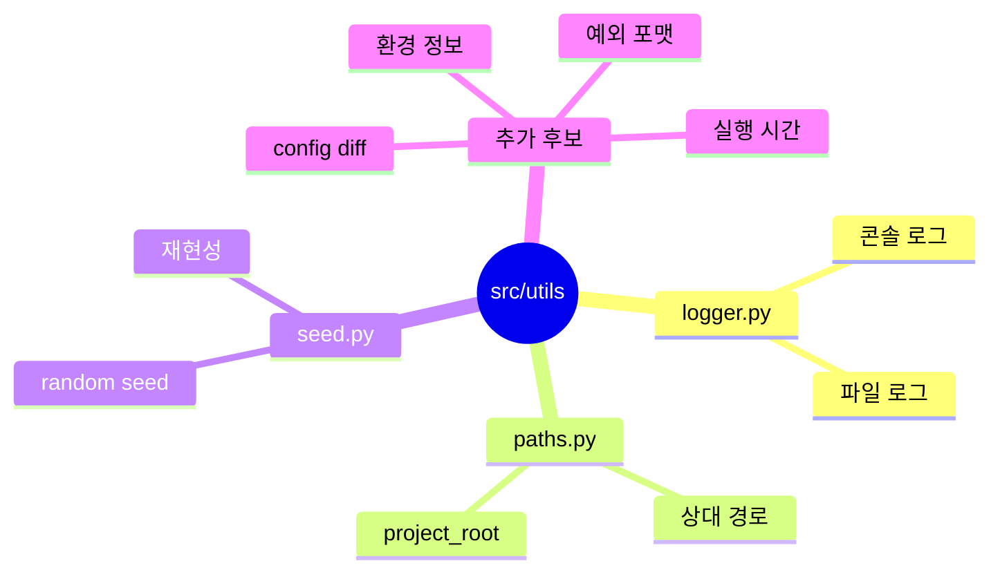

# 유틸리티

공통 기능을 모아두는 패키지입니다.

처음부터 너무 많은 것을 넣기보다는 여러 모듈에서 반복해서 쓰는 기능만 둡니다.

## Utils 마인드맵



```text
src/utils/
|-- logger.py    # 콘솔/파일 로깅 설정
|-- paths.py     # project_root 기준 경로 처리
`-- seed.py      # 재현성 seed 설정
```

추가 후보:

- config diff 기록
- 실행 시간 측정
- artifact 경로 생성
- 환경 정보 수집
- 예외 메시지 포맷팅
