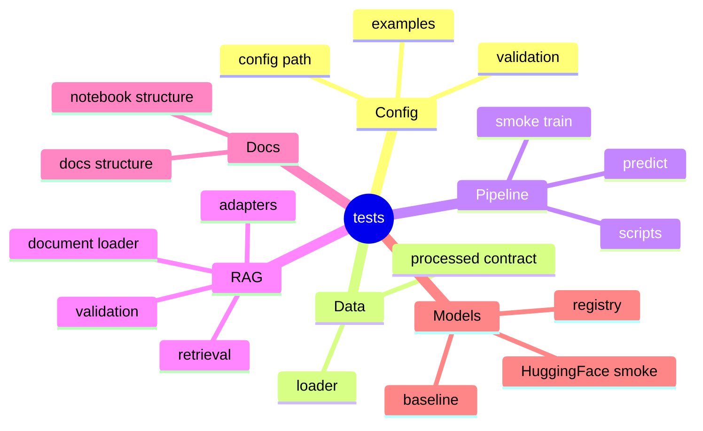

# 테스트

초기 테스트는 `pytest` 기반으로 진행합니다.

## 테스트 범위 마인드맵



## 텍스트 구조

```text
tests/
|-- test_config.py               # config 로딩과 경로 규칙
|-- test_docs_structure.py       # Markdown/HTML 문서 구조
|-- test_notebooks.py            # 노트북 템플릿 구조
|-- test_scripts.py              # 실행 스크립트 진입점
|-- test_validate_data.py        # 데이터 계약 검증
|-- test_pipeline_smoke.py       # 이미지/텍스트 smoke pipeline
|-- test_models.py               # 모델 registry와 기본 모델
|-- test_experiments.py          # 실험 요약과 artifact
|-- test_rag_document_loader.py  # RAG 문서 loader
|-- test_rag_adapters.py         # RAG adapter 선택
|-- test_rag_pipeline.py         # RAG ingest/retrieve/chat
`-- test_rag_validation.py       # RAG config validation
```

```bash
conda activate codeit-ml-pipeline
pytest
```

직접 smoke test를 확인하고 싶을 때는 아래 명령을 사용합니다.

```bash
python scripts/run_validate.py --data-dir data/processed
python scripts/run_train.py --config configs/smoke/smoke_test.yaml --project-root .
python scripts/run_predict.py --config configs/smoke/smoke_test.yaml --project-root . --input data/processed/images/red_000.ppm

python scripts/run_validate.py --data-dir data/text_processed
python scripts/run_train.py --config configs/smoke/smoke_test_text.yaml --project-root .
python scripts/run_predict.py --config configs/smoke/smoke_test_text.yaml --project-root . --input data/text_processed/sample_positive.txt
```

RAG 문서 loader 테스트는 외부 파일 없이 zip/xml 기반 DOCX/HWPX 샘플을 즉석에서 만들어 검증합니다.
