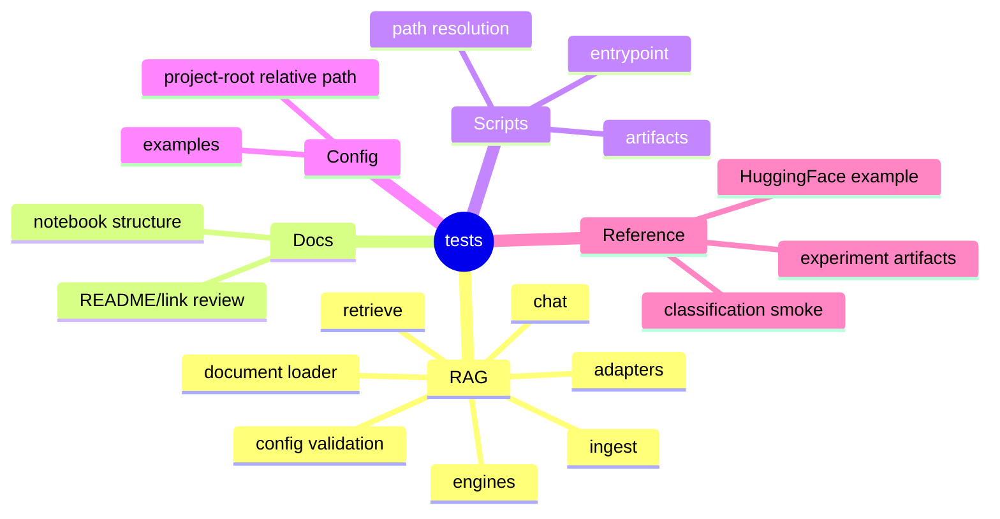

# 테스트

이 저장소의 기본 테스트 기준은 RAG 파이프라인입니다.
분류 모델과 HuggingFace fine-tuning 관련 테스트는 예전 실험 인프라를 보존하기 위한 참고 범위로 남겨둡니다.

## 테스트 범위 마인드맵



## 주요 테스트 파일

```text
tests/
|-- conftest.py                  # pytest fixtures (isolated_project 등)
|-- test_rag_validation.py       # RAG config validation
|-- test_rag_document_loader.py  # PDF/DOCX/HWPX 등 문서 loader
|-- test_rag_engines.py          # LangChain/local engine artifact 계약
|-- test_rag_pipeline.py         # ingest/retrieve/chat 흐름
|-- test_rag_adapters.py         # local fallback adapter 선택
|-- test_rag_quality_gate.py     # RAG 품질 게이트 (재현성, 계약, DOCX/HWPX E2E)
|-- test_notebooks.py            # RAG 노트북 구조
|-- test_scripts.py              # 실행 스크립트 진입점
|-- test_config.py               # config 로딩과 경로 규칙
|-- test_validate_data.py        # 데이터 validation
|-- test_models.py               # 참고용 분류 모델 테스트
|-- test_pipeline_smoke.py       # 참고용 분류 config 기반 pipeline
`-- test_experiments.py          # 참고용 실험 artifact 정책
```

## 전체 테스트

```bash
conda activate codeit-ml-pipeline
python -m pytest
```

## RAG 작업 후 우선 확인

```bash
python -m pytest \
  tests/test_rag_pipeline.py \
  tests/test_rag_validation.py \
  tests/test_rag_adapters.py
```

## 노트북 작업 후 확인

```bash
python -m pytest tests/test_notebooks.py
```

## 직접 RAG 실행

```bash
python scripts/check_rag_pipeline.py \
  --project-root . \
  --config configs/experiments/rag/rag_langchain.yaml

python scripts/run_rag_ingest.py \
  --project-root . \
  --config configs/experiments/rag/rag_langchain.yaml

python scripts/run_rag_retrieve.py \
  --project-root . \
  --config configs/experiments/rag/rag_langchain.yaml \
  --question "제안 마감일은 언제인가?"

python scripts/run_rag_chat.py \
  --project-root . \
  --config configs/experiments/rag/rag_langchain.yaml \
  --question "입찰 참가 자격은 무엇인가?"
```

## 확인 관점

- 원본 데이터는 수정하지 않고 chunk와 index 산출물이 별도로 남는가?
- retrieval 결과에 문서명, chunk id, score가 남는가?
- 답변에 citation이 함께 남는가?
- 실패 상황에서 failure artifact가 남는가?
- config를 바꿨을 때 코드 수정 없이 실험 조건이 바뀌는가?
